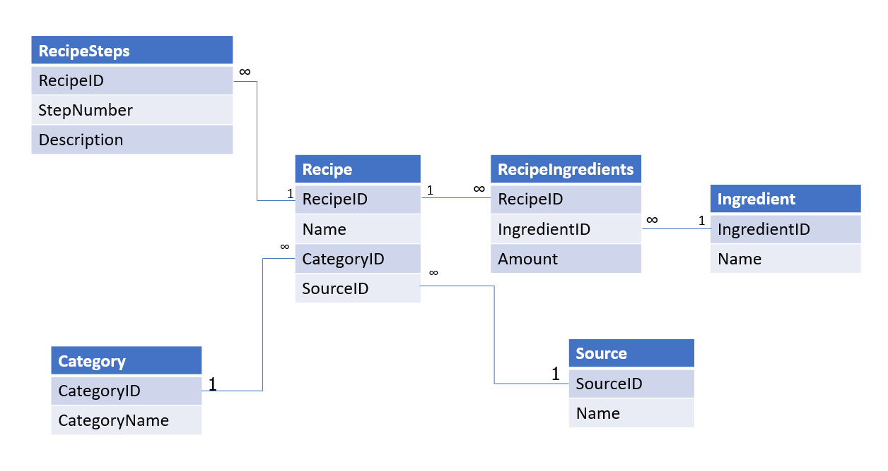

# Summative Assessment: Cooking by the Book - KEY

## Introduction

In this module, we examined what it takes to be able to read data and write about data - the fundamental skill known as data literacy.

In this final assessment, we will be bringing it all together. There is a theme around food.

Please complete your answers in a document file. These are the document instructions. You will submit your assignment separately.

## Part 1: Data vs metadata vs information

### Prompt

Using a restaurant menu as an example, describe the difference between data, metadata, and information. Provide examples of each.

### Answer

For example:

- Data: Mediterranean - it's a thing. But what does this represent? Without context, it's merely data.
- Metadata: Cuisine - this could be the attribute of a cooking style. Metadata describes data.
- Information: Mediterranean is a category of cuisine that we are including in our international cookbook. - This gives context to the data above and ties in the metadata reference. Now we know what "Mediterranean" represents and is no longer just data.

## Part 2: Exploring Biases while Gathering Data

### Prompt

You have been tasked with going to your local neighborhoods to get recipes for your cookbook. How might cognitive and statistical bias appear? Please provide at least two ideas per bias.

### Answer

Answers will be varied.

Cognitive Bias potential answer:
- Some people may love recipes because they grew up with them even if they aren't universally considered good recipes
- Just being asked to provide a recipe may result in the people you ask thinking they have a good recipe to share
- Neighbors may not think their recipes are very good so they won't want to share them and be embarrassed

Statistical Bias potential answer:
- You may only go to the neighborhood closest to you, and that won't represent the whole population
- You may only talk to neighbors you've met before because you're uncomfortable talking to strangers
- You may only receive a few responses because you go door-to-door during the day, and most people are at work

## Part 3: Questioning Data

### Prompt

Suppose you want to open up a ramen restaurant. You happened to find data from a guy who rates ramen. Is this a good idea to use his data to determine whether to open up your own ramen restaurant? What other pieces of information would you want to consider for opening a ramen restaurant? 

### Answer

- Where is The Ramen Rater located? Is this where I would open a restaurant?
- This is one guy's opinion - how could we open a restaurant on one person's opinion?
- What are the demographics for the area I am targeting?
- How do I make my ramen affordable for those in the area?
- Do people even eat ramen here? Or did I find a bad spot to consider ramen?

As long as the learner can show that they can question data - that's the point of this exercise.

## Part 4: Data Modeling

### Prompt

Create an ERD in second normal form for a cookbook with the following information:

- A cookbook contains many recipes made up of ingredients and steps. 
- We need to track the ingredients and steps for a recipe.
- A recipe may have a source, such as the 1944 Good Housekeeping Cookbook.
- We need to know what recipes have which ingredients.
- Each recipe belongs to a single category.
- We need to see all the recipes in a category.

### Answer

You should see something similar to this:

