# Lesson: Visualization Types

## Introduction

Data can be overwhelming in its raw form.  However, there are ways to tell the data's story without overwhelming the decision-makers.  

In this lesson, we will introduce different visualization types and explain when to apply them.

## Learning Outcomes

By the end of this lesson, you will be able to:

1. Explain the importance of using visualizations. 
1. Define common terms associated with data visualizations. 
1. Differentiate qualitative and quantitative data. 
1. Discuss how infographics can help express data as information. 

## The Importance of Visualizations

As business decision-makers are handed more and more data, they need to be aware of what they are given. Frequently, there are spreadsheets of data to be filtered and analyzed. Sometimes, these spreadsheets inundate us with data, relevant or otherwise. Presenting data in a different format may alleviate that overwhelmed feeling.

Spreadsheets are okay for showing raw data, though analyzing the data and presenting specific visualizations may make it easier for those who need the data for decisions.

Qualitative and quantitative data are measured differently and should be presented differently, with visualizations that tell the story of the data.

Charts, graphs, plots, diagrams, and tables are just some of the many visualization options available for data storytelling.

## Data Visualization Terms

Some terminology is used interchangeably. To sort through these visualization types:

- A **chart** is a representation that uses shapes and symbols to represent data. It is typically used for showing breakdowns of categorical data.
- A **graph** is a representation that uses lines to show data as a result of a function or data that is continuous. Graphs are typically used to compare at least two quantitative columns.
- A **plot** is a representation that uses points and lines to represent data, typically comparing at least two quantitative columns. Graphs are examples of plots.
- A **diagram** is a representation as a graphic. Diagrams include charts, graphs, plots, maps, and other graphic representations.
- A **table** is a representation of raw data before analysis and can be simplified to present quantitative data. The table representation presents data using rows and columns.

## Qualitative Data

Qualitative data is data of a non-numeric value. This is data that is observed, recorded, sorted, and analyzed manually. These are some visualizations that can assist with presenting qualitative data.

### Wordles or Word Clouds

A **wordle** - also known as a **word cloud** - shows common words in text fields. Consider this wordle that shows common words used in a women's clothing e-commerce review database.

Wordles show words commonly used in reviews. This can be used in advertising to try to win over clients with words.

### Timelines

Timelines are a visualization to show stories that happen over time. Common timeline topics include histories - such as the history of a company and its evolution over time. Timelines typically include information with times - years, dates, or even specific timestamps - and with this information presented in chronological order.

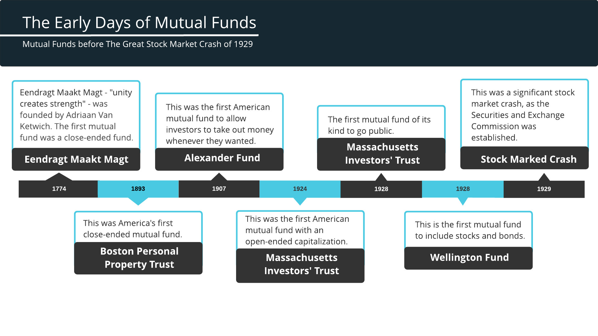

### Flow charts

Flow charts are used to visualize a process. They show steps taken in a process, identifying decision points and demonstrating how multiple folks may be involved in a process.

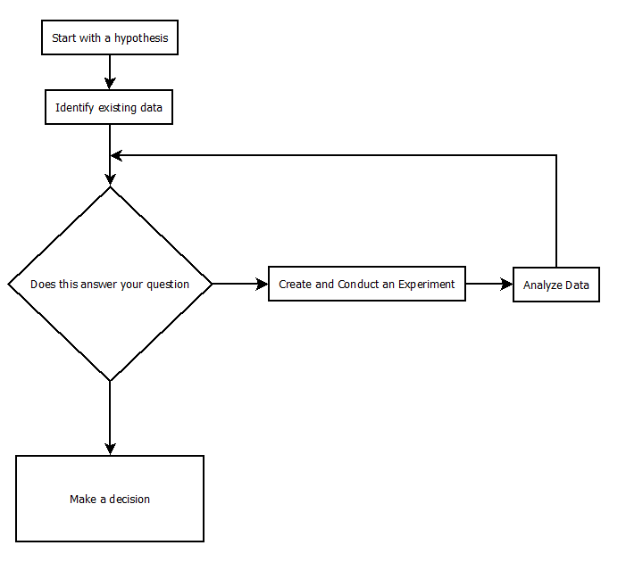

### Mind maps

Mind maps are a way to gather related ideas. This is commonly used when talking about concepts and trying to brainstorm ideas around the concepts. A mind map starts with a single concept, and then as people participate in a brainstorming exercise, branches evolve from the central concept.

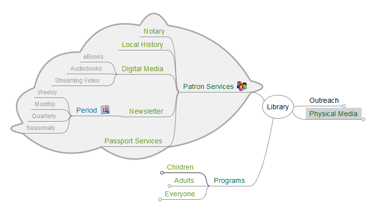

## Quantitative Data

Quantitative data is data of a numeric value - be it in the data type of the value or the fact that the value can be quantified by calculations such as averages, sums, and counts. This is data that is measured and quantifiable. These are some visualizations that can assist with presenting quantitative data.

### Bar Graphs

Bar graphs are used to show categorical breakdowns. They can be rendered with vertical bars or horizontal bars.

This is an example of a horizontal bar chart showing the cuisines counts in the user reviews dataset.

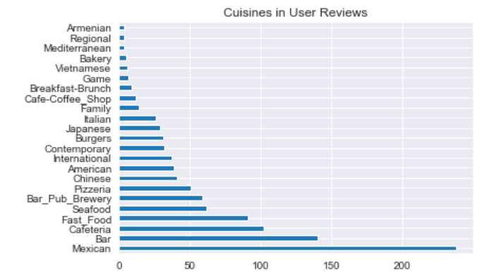

Here is the same data, in a vertical bar chart:

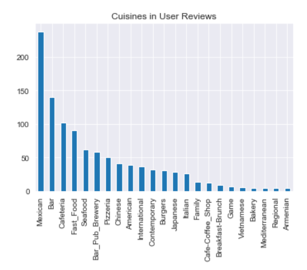

### Line Graphs

When it comes to showing trends over time, line graphs are commonly used.

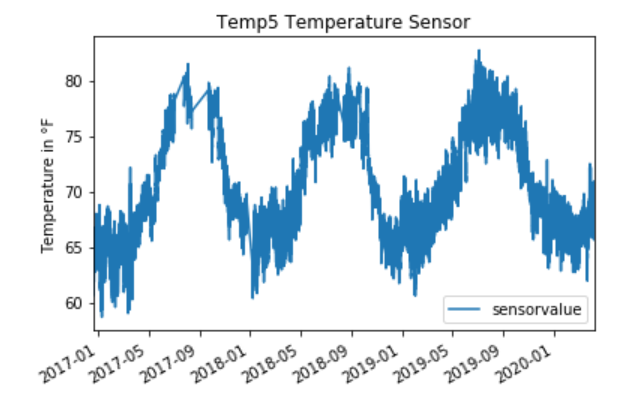

### Scatter Plots

Scatter plots are used to compare two columns and observe any correlation. Sometimes, a trend line is included in a scatterplot to help identify any correlation.

Scatter plots can be used for more than two columns if there are similarly related columns in the comparison. In the following example, we have a scatter plot that shows the relationship of MPG (City) and MPG (Highway) versus the weight of a vehicle.

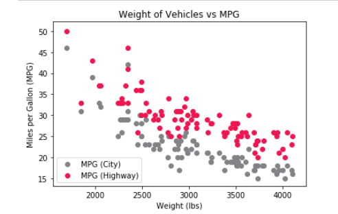

With multiple series, there may be multiple trendlines, one per series.

### Box Plots

Box plots are good for seeing the distribution of values for bins - groups - of data. Sometimes called box-and-whiskers, these plots are identified with the following features:

- A box is used to show the heavy distribution of values.
- Whiskers come out of the box and extend to the lowest and highest of values.
- Called out values are the lowest value, lower quartile, median, upper quartile, and highest value.
- Outliers are noted with diamonds.

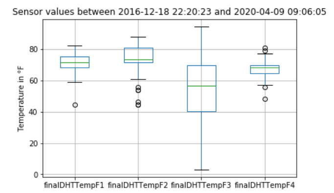

### Histograms

Histograms are used for seeing the actual density of values in a dataset, which may give insights into tendencies.

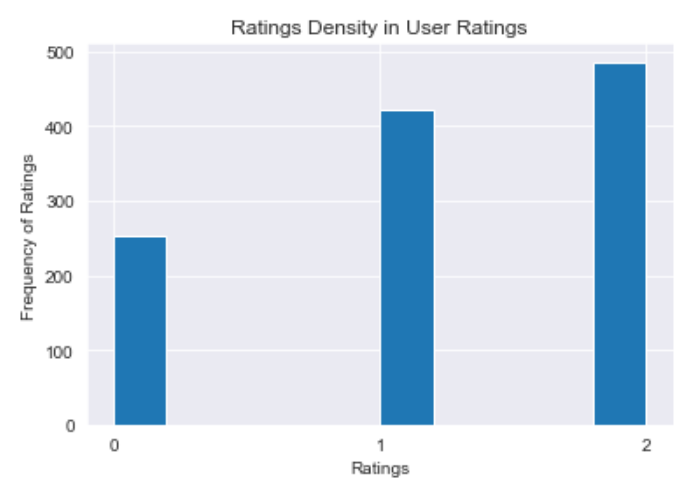

When looking at numbers, histograms are good for showing normal distributions, outliers, and trends.

### Kernel Density Estimation (KDE) Charts

Kernel Density Estimation (KDE) Charts are **estimates** - guesses - of responses based on a calculation related to histograms. The KDE chart to go with the user rating histogram is seen below.

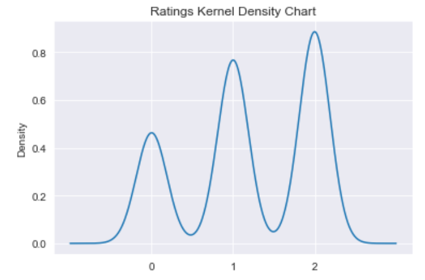

### Pie Charts

Pie charts are used to represent percentages, also known as a parts-of-a-whole visualization. While they are commonly used, pie charts are also commonly abused. In the next lesson, we will explain the use cases for pie charts and more alternatives to pie charts.

### Venn Diagrams

Venn diagrams are used to show where data groups intersect. This can be used to deduce relationships or non-relationships between groups of data. Venn diagrams use circles to represent the groups.

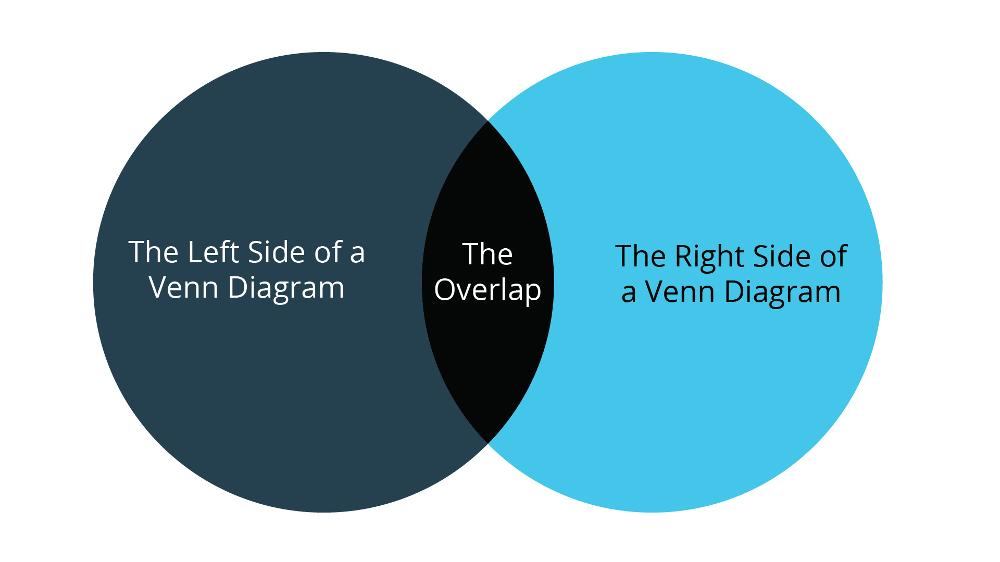

### Maps

Geographic data is best represented with maps. When working with geographic data, make sure you understand what you may be focused on in terms of area. For example, if you are looking at the 911 calls for Detroit, you may want a map focused on the Detroit area, as shown below:

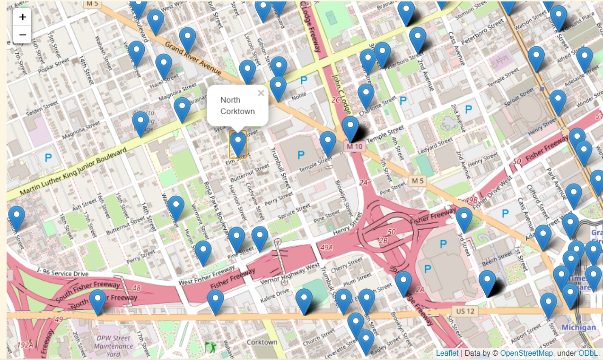

If you are dealing with a global scope, such as showing where all the large airports are in the world, you may need a global view. This could involve a flattened representation of the globe or even a 3D model of the globe.

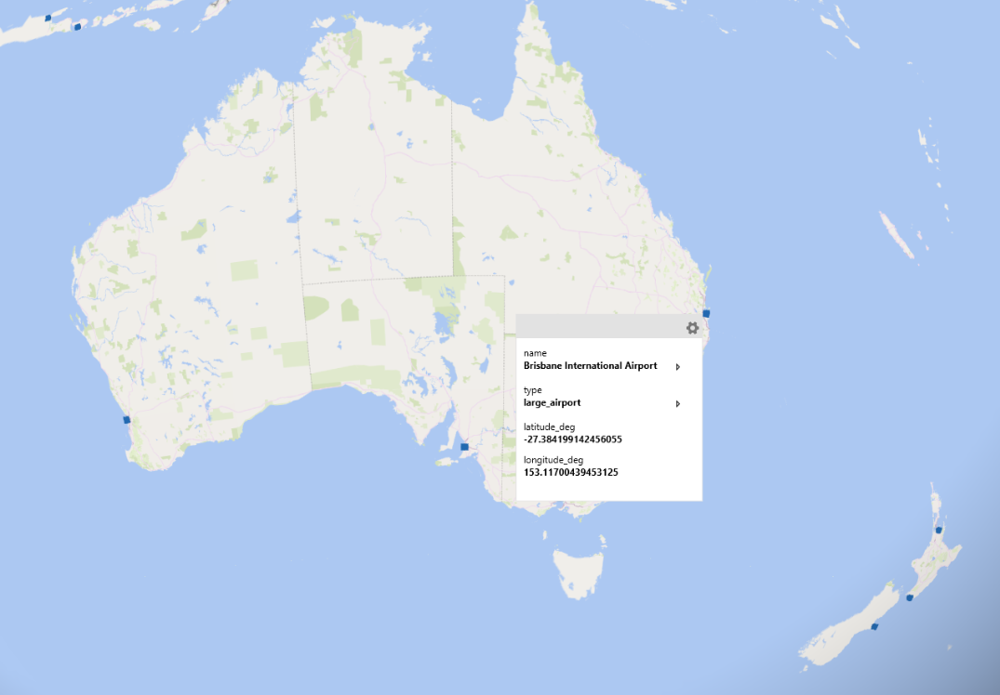

## Conveying the Big Picture with Infographics

Infographics convey the whole story with a series of visualizations, typically a mix of both quantitative and qualitative visualizations. These are the ultimate visualization tool for telling a story. Specifically, infographics are made up of images, charts, diagrams, and texts to give an overview of a topic. You may not have time to consume a 50-page report, though you may have time to consume an infographic of the synopsis of that report. Points are made in short, concise blocks of text, with images used to help draw the picture.

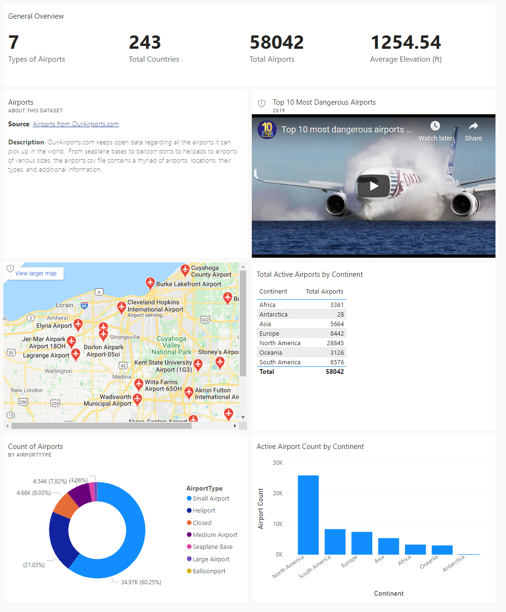

Dashboards give a high overview of a situation and may include things such as images, text, visualizations, video, and streaming data.

## Conclusion

Raw data is the start of a story, and visualizations are great storytellers.  Choose the correct visualization, and the information is presented in a way that supports decision-making. Choose the wrong visualization, and decision-makers will be overwhelmed and possibly confused.  Now, you'll be able to present data in a way that makes sense for your audience. 
