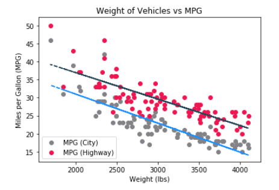
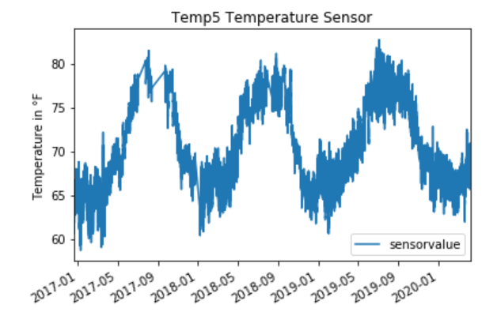
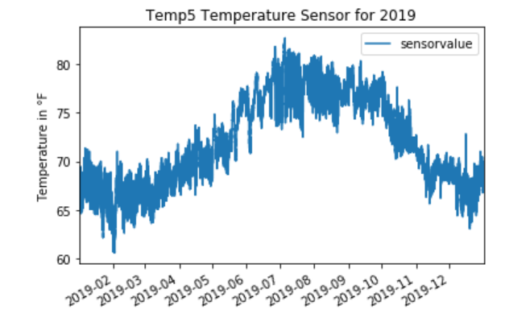
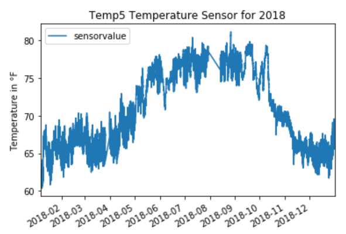

# Lesson: Identifying Trends

## Introduction

When looking at data, it is common to evaluate values over time.  

In this lesson, we will talk about trends, patterns, and why it is important to watch for them.

## Learning Outcomes

By the end of this lesson, you will be able to:

1. Differentiate between trends and patterns. 
2. Explain why trends and patterns matter. 
3. Identify how correlation relates to trends. 
4. Explain common reasons for trends or patterns. 

## Trends and Patterns

A **trend** is the direction that data changes over time. If data is trending positively, its trend is called an **uptrend**. If data is trending negatively, its trend is called a **downtrend**. If there is no trend, a trendless period of time is also known as a **range**.

In finance, it is common to trade in the direction of the trend in hopes of profiting from that trend's continuation. There is the concept of the contrarian investor, which is someone who trades against the trends.

Trendlines are created on visualizations between high points and low points. The direction of the trend is determined by the slope of the trendline.

In this example, we look at two series - groups of data - plotted against a common variable. There are two trendlines, one for each series, so that you can see how the lines trend against a linear trendline.

A **pattern** is seen when there is repetition in the lines. Patterns can happen within trends and also in trendless times. A pattern can be made up of a series of trends, where sales go up in a seasonal period - such as products geared around certain holidays (such as holiday decorations) or tools that are geared for certain seasons (such as snow blowers and shovels in the winter) - and then sales trend downwards when getting away from the seasonal period, only to trend upwards again when seasonality happens. Patterns tend to show cyclical behaviors over time. 

In this example, we are looking at an indoor temperature sensor from January 2017 through April 2020. Looking at this, we can see when the seasons change, as the seasons get hotter, the temperature sensor reading goes up, and as the seasons get cooler, the temperature sensor reading goes down.

### Timeliness of Patterns and Trends

If we looked at that same data for a full year, we could see trends, but a pattern is hard to establish.

We could look at this data for the previous year to see if the trends follow a similar pattern.

You may notice that they both start around the 60s, swing up to around 80, and eventually go back down to the 60s.

When working with data over time, it may help to look for trends in smaller timelines. However, having the full timeline allows you to see a possible pattern.

When identifying trends and patterns, it is key to pay attention to the axis related to time. Trends and patterns may differ when looking at them in the short term versus the long-term. You may need to zoom in to closer amounts of time to get a better understanding of the immediate situation. To get a better understanding of the long-term situation, you may need to zoom out to longer amounts of time. Keep in mind that the timeline is crucial for understanding trends and patterns - without that context, the meaning of the trend or pattern is lost.

## Why Trends and Patterns Matter

Trends and patterns matter for many reasons. They give you an insight of successes or failures. They may identify cyclical purchasing patterns from your customers. They can show when demand is high for a service - such as needing landscaping in warmer weather and plowing when it snows. Trends and patterns matter because they give insight to a timeline of events, a timeline that may be crucial in your decision-making.

## Correlation and Trends

Some folks confuse trendlines with correlation, so we want to make this clear. Correlation is the relationship between two independent variables. Trendlines appear on correlation charts and graphs in order to help establish what type of correlation may exist. Uptrends - be it a straight line (linear) or a curving line (curvilinear) sloping upwards - indicate a positive correlation. Downtrends - liner or curvilinear lines sloping downwards - indicate a negative correlation. However, a trendline does not always indicate a correlation.

Trends are not necessarily correlation unless they are being investigated as a suspected correlation between variables. For example, watching a single column trend over time, a trendline may appear to show the direction of the trend, but because there is only one column being observed, there is a trend but not a correlation.

## Reasons for Trends or Patterns

While trends and patterns happen, there are some common reasons to explain them.

### Seasonality

Whether a product or service is in season or out of season may indicate a particular trend or a pattern of trends.

Consider chimney sweeps cleaning chimneys before the cold weather comes in. Ice cream companies ramp up for sales when the hot weather is coming. Haunted houses run around Halloween, yet they won't run all year. Pencil suppliers may be boosting pencil manufacturing to ramp up for school supplies sales. Rakes are seen in stores more towards late winter and late summer, as trees shed their leaves and need to be picked up.

There are various reasons for seasonality. The main things to consider for seasonality are:

- Holidays, anniversaries, birthdays, and other special days
- Natural seasons - winter, spring, summer, and autumn (fall)
- Financial seasons - quarterly sales, end-of-year sales

### Supply and Demand

When supply can't keep with demand or when there is not enough demand for a supply, trends will be seen. 

### Media

The media can explain some reasons for trends. Using persuasive language with the right timing in front of the audience can instigate a trend. News around a topic could influence a trend as well.

Suppose your company is traded on the stock exchange. Today also happens to be the day that your company has some big news - perhaps an acquisition or merger or hiring a big name to help the company grow. The timing of delivering that news will impact your stock prices. Look at the graph afterward and see how the data trends from before your announcement, during your announcement, immediately after your announcement, and a longer period of time after your announcement. 

Another example of the media influencing trends is via social media. A well-known author recently came out with some views that did not align with some of their readers nor with some of the actors of the movie rendition of those books. This negative publicity, in addition to their latest book showing their twisted controversial views, is causing the author to lose a good part of their audience. Book sales and movie views may be trending downwards because of the negative publicity.

## Conclusion

Trendlines help us see whether something is trending positively, negatively, or isn't trending at all. When evaluating the correlation between columns, trendlines can be used to indicate if there is a positive or a negative correlation. Patterns can help identify when services or goods are in demand and when that demand changes. Patterns and trends can be used to identify good news and bad news for a company. It's important to pay attention to the patterns and trends and understand where your business came from, where it is today, and where it may be going in the future.
