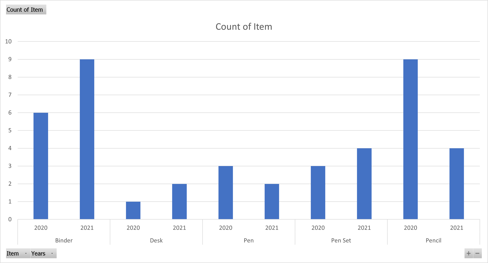
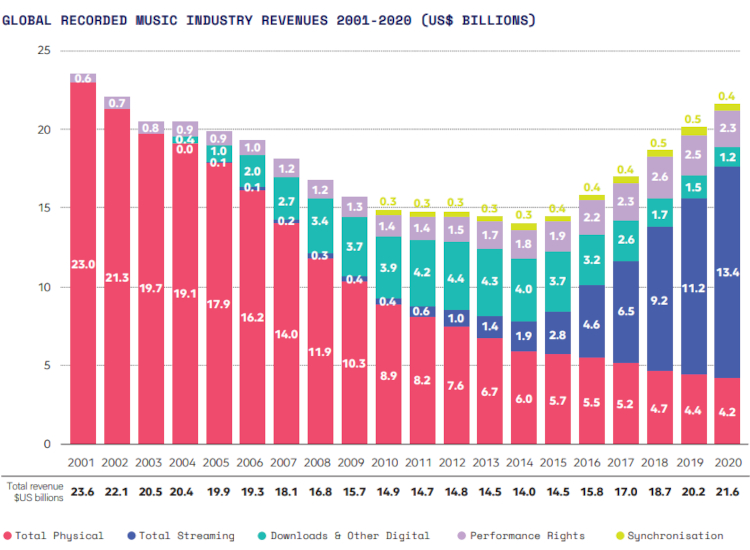
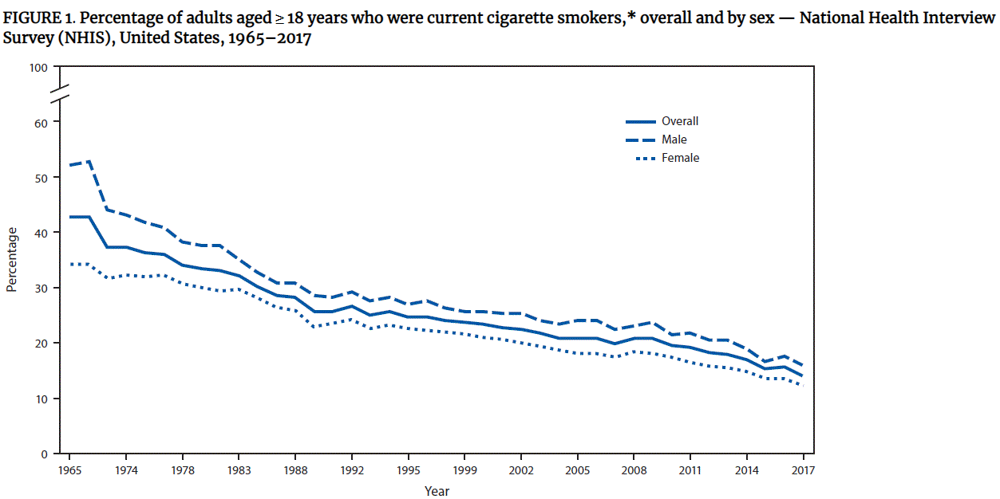
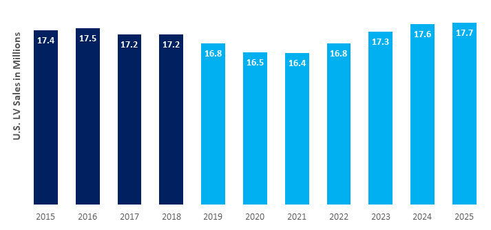

# Exercise: What's Trending?

## Introduction

Trends and patterns can be used to identify everything from success and failures to customer purchasing habits to predictions for future resource needs. But, can you pick out a positive trend vs. a negative trend or identify when a trend becomes a pattern? Let's find out. You will work individually to analyze data visualizations and determine if a trend (or trends) is present, whether that trend is positive or negative, and if that trend predicts a pattern.

## Part 1: Your Data

Review the data below:
 <!--- resource generated in-house using fake data from contextures.com-->
 <!-- image sourced from researchgate.com -->
 <!-- sourced from edmtunes.com -->
 <!-- sourced from CDC.gov -->
 <!-- sourced from https://www.cargroup.org/u-s-light-vehicle-sales-expected-to-take-a-dip-in-2019/-->

## Part 2: Questions

Answer the following questions for each data set/visualization.
1. Is there enough information presented to determine whether this data represents a trend?
1. If so, are those trends positive or negative?
1. Is there enough information here to determine if there is a pattern?
1. If so, what is the pattern?

## Part 3: Discussion

We'll come back together as a class and discuss your findings. Be prepared to defend your decision if another classmate disagrees!
