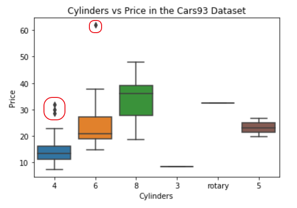
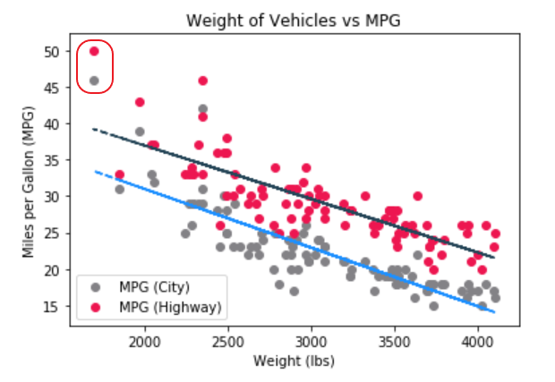
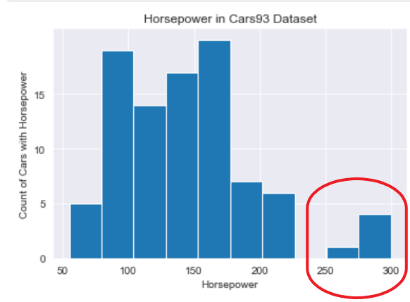
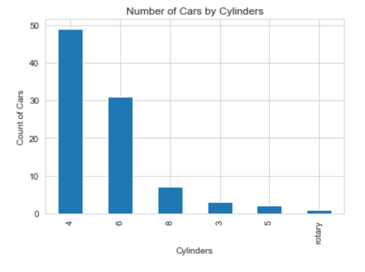

# Lesson: Understanding Outliers

## Introduction

Looking at tabular data, you may see values outside of the expected range. Looking at graphs, you may notice dots outside of the primary set of data. Sometimes those dots and values result from human error, but sometimes they are significant data points that you should consider when evaluating your data.  

In this lesson, we discuss outliers.

## Learning Outcomes

By the end of this lesson, you will be able to:

1. Define outlier. 
2. Identify outliers in a table. 
3. Discuss the significance of outliers. 

## What is an Outlier?

When you look at graphs and charts, you may notice points that stand out away from their group. For example, consider this box plot below, where the bulk of the data values are in the boxes, the general range of high and low values are indicated by the whiskers, and there are other values indicated by dots. Those dots in the last group are known as **outliers**, data that is outside of the expected normal range. This is an example of a box plot with outliers from the Cars93 dataset.

On a scatter plot, outliers are also recognized by the way they stand out from their group. Consider this scatter plot of the weight of vehicles vs MPG. Notice how the trendlines are around 40MPG and 35MPG, trending downward. Also, notice the points at around 1600 lbs and 46 and 50 MPG. Those stand out far from the rest of the points.

A histogram can also be used to show a distribution of values. When looking at a histogram, watch to see if the values make sense based on the expected outcomes.

In this example of the distribution of horsepower in the dataset - seeing how many cars rate for each value of horsepower, we see a gap before 250. This gap is where the end of normal distribution happens. The values greater than 250 are considered outliers.

Outliers typically identify what are known as **edge cases** - rare cases of what can happen in an experiment that might be overlooked or not considered important.

## Finding Outliers on a Table

In visualizations, you can see outliers standing on their own. In a sea of numbers in a spreadsheet, it may be harder. However, it isn't impossible.

Outliers are outside a normal range. Sorting numeric values by smallest or largest will give you an idea of the range of values.

Let's explore the data for the scatter plot of weight of vehicles vs MPG. If we sort by weight from lowest to highest, our outliers should appear in the first record. The first few rows are:

<table>
  <caption>Weight of Vehicles vs MPG
  <thead>
    <tr>
      <th>MPG.highway</th>
      <th>MPG.city</th>
      <th>Weight</th>
    </tr>
  </thead>
  <tbody>
    <tr>
      <td>50</td>
      <td>46</td>
      <td>1695</td>
    </tr>
    <tr>
      <td>33</td>
      <td>31</td>
      <td>1845</td>
    </tr>
    <tr>
      <td>43</td>
      <td>39</td>
      <td>1965</td>
    </tr>
    <tr>
      <td>37</td>
      <td>33</td>
      <td>2045</td>
    </tr>
    <tr>
      <td>37</td>
      <td>32</td>
      <td>2055</td>
    </tr>
  </tbody>
</table>

## What Can Outliers Mean?

Outliers show what can happen in an experiment outside of the expected results. As these are exceptions to the norm, some decision-makers will drop the outlier from their data - especially if this is due to human error in entering data and cannot be determined what it should be.

Outliers can impact assumptions made by an experiment. If the outlier does not impact the overall results, outliers can be dropped with it noted that the outlier doesn't change the impact.

If the outlier does impact the overall results, do not ignore or disvalue the outlier. When the outlier impacts the overall results, it is crucial to look further into the data to see what could have happened and why it happened.

Let's go back to our miles per gallon and weight table. The outlier in the first set stands out on the scatter plot. Let's look at that data further to see why it could have such a high MPG and such a low weight.

<table>
  <thead>
    <tr>
      <th>Manufacturer</th>
      <th>Model</th>      
      <th>MPG.city</th>
      <th>MPG.highway</th>
      <th>Weight</th>
    </tr>
  </thead>
  <tbody>
    <tr>
      <td>Geo</td>
      <td>Metro</td>
      <td>46</td>
      <td>50</td>
      <td>1695</td>
    </tr>
  </tbody>
</table>

In this case, it makes sense to leave it in - this isn't an outlier based on human data error. This is an outlier due to the car itself. It is part of the representation and is not an exception.

Another example in the Cars93 dataset is around the number of cylinders. Consider this bar graph, which shows the distribution of cylinders for the cars in the dataset.

Most cars in this dataset have 4 cylinders. Most cylinders values are numeric. What is the car that has "rotary" for its value? We have filtered our data table to learn more about this anomaly:

<table>
  <thead>
    <tr>
      <th>Manufacturer</th>
      <th>Model</th>  
      <th>Cylinders</th>
    </tr>
  </thead>
  <tbody>
    <tr>
      <td>Mazda</td>
      <td>RX-7</td>
      <td>rotary</td>
    </tr>
  </tbody>
</table>

What does this anomaly mean? This means that not all cars in Cars93 have engines with cylinders. Upon further research - which sometimes you need to do to answer your questions - the Mazda RX-7 is a sports car with a rotary engine, whereas the other cars have radial engines. However, did this have to be recorded as "rotary"? Do rotary engines have cylinders? Further research shows that rotary engines do have cylinders. Perhaps the one creating the dataset did not have the number available when they added this record in. This is something to consider when looking at data - why did the outlier get recorded that way?

Some anomalies can be explained and don't necessarily impact the outcomes. Some anomalies cause further questioning and experiments. Understanding the outlier will help you make a decision based on whether that outlier is part of representation or if it is a representation of the exception. If it is part of the representation, the outlier impacts the results. If it is a representation of the exception, it indicates that there could be answers of "What other outcomes are possible?" and these may need to be examined further.

## Conclusion

Outliers can happen in experiments. Whether you are presented with tabular data or visualizations, you have ways to identify outliers in that data.  It's up to you to question those outliers so you can better understand if they contain important information or are just white noise.  Outliers can happen, and what you do with that information is determined by how well you can question and interpret your data.
