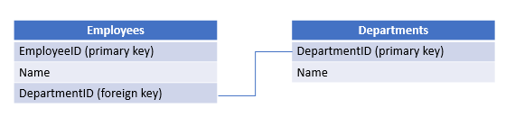
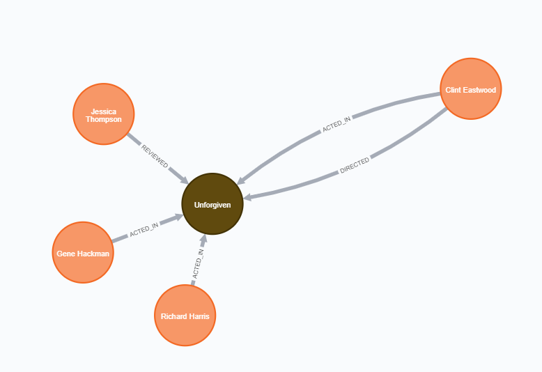

# Lesson: Database Types

## Introduction

Data is stored in a collection called a database or a data store.  This collection is organized in a way to be retrieved by a computer.  There are two main types of databases - relational databases and non-relational databases. 

In this lesson, we will explore the two main types of databases and how they differ. 

## Learning Outcomes

By the end of this lesson, you will be able to:

1. Identify the parts of a relational database management system.
1. Identify the four main types of non-relational databases. 

## Relational Database Management Systems

A relational database is a collection of data items that have predefined relationships. That data is often presented in tables and stored in relational database management systems (RDBMS). Tables are made up of rows and columns. Many tables have a column explicitly used for holding a row's identifier, usually stored as an integer or unique identifier. 

That row identifying column is known as the **primary key**. 

If a table has a field related to a primary key of another table, then that field is known as a **foreign key**.

Consider the following example between employees and departments.



An employee table contains an EmployeeID field as the primary key - the row identifier for the Employees table. The employee table also includes the employee's name as well as a DepartmentID field. The DepartmentID field is marked as a foreign key, as it is related to the primary key of the Departments table.

The Departments table has a DepartmentID field as its primary key and a name field.

Now, why do we need primary key fields? Companies can reorganize their business structure, and there may be changes to department names when they reorganize. If we left the department name on the employee table, we'd have to update every spot where the old department name was with the new department name. By putting departments in their table and using IDs, we only have to update one record on the Departments table when `Quality Assurance` renames to `Quality Control.`

Relational data is queried using a variant of a language known as Structured Query Language (SQL).

> SQL is commonly known by its abbreviation. The abbreviation is pronounced as Ess-cue-el or Sequel.

Relational databases are seen in online transaction processing (OLTP) applications. From online banking to eCommerce to vacation rental reservations and many others, relational data is seen in many industries.

## Non-Relational Data

When data relationships are more challenging to determine or do not lend themselves to tables, they are grouped in a data classification known as non-relational data. Non-relational data is also known as NoSQL (Not Only SQL) data. Data in this category doesn't fit nicely in a table - that would be like putting a square peg in a round hole.

Non-relational data may be stored in specialized databases, depending on the nature of the data and its use. There are four common databases to know in the non-relational world:

- Key-value stores
- Document databases
- Column stores
- Graph databases

### Key-value Stores

Key value stores are used when associating a value to a single key. When thinking about key-value stores, think of dictionaries. As a dictionary has a term and definitions, the term is the identifier, the **key**, and the definition is the **value**. 

Sample key-value store data: Agricultural abbreviations

| Key      | Value |
| ----------- | ----------- |
| FFA      | Future Farmers of America       |
| USDA      | US Department of Agriculture       |
| FDA    | Food and Drug Administration      |
| CSA     | Community Supported Agriculture       |

This key-value pair approach is common in program configurations and system settings.

### Document Databases

Document databases are used for storing documents. Standard document data encodings include XML, JSON, and YAML. These are used for storing and retrieving them as objects rather than separate fields.  Document databases operate similar to key-value stores in that each document has a key, and the document is the value.

Below is a sample JSON snippet that may be stored in a document database:

```json
{
  "colors": [
    {
      "color": "DodgerBlue",
      "code": {
        "rgba": [30,144,255,1],
        "hex": "#1E90FF"
      }
    },
    {
      "color": "LemonChiffon",
      "code": {
        "rgba": [255,250,205,1],
        "hex": "#FFFACD"
      }
    }
  ]
}
```

Here is a sample XML snippet that may be stored in a document database:

```xml
<Contestants>
  <Contestant>
    <Name>Team Liquid</Name>
    <Game>Starcraft</Game>
  </Contestant>
  <Contestant>
    <Name>Evil Geniuses</Name>
    <Game>Rocket League</Game>
  </Contestant>
  <Contestant>
    <Name>Newbee</Name>
    <Game>League of Legends</Game>
  </Contestant>
  <Contestant>
    <Name>Fnatic</Name>
    <Game>League of Legends</Game>
  </Contestant>
</Contestants>
```
Many document databases are stored in the cloud, allowing for scalability in storage and resource. The cloud provider handles the hardware demands in this setup.

### Column Stores

Column stores - as the name suggests - store data in columns. So each column from our table could be stored in its own column in a column store. A record identifier links the columns. As this stores a minimal amount of data, this allows for more efficient queries.


A sample column store may look like this:

| ID      | Sport |
| ----------- | ----------- |
| 24      | baseball       |
| 25      | soccer     |
| 26    | cricket      |
| 27     | jai alai       |


### Graph Databases

Graph databases are used for exploring relationships.  Suppose you want to see how business connections know each other.  Maybe you are wondering which of your friends prefer a particular music genre. Graph databases are used to show how vertices (people, places, things) relate based on their edges (relationships). 

The following visualization shows the various relationships tracked for a person and whether they were a director, writer, producer, reviewer, or actor for a specific film.

"


## Conclusion

There are various ways to store data and relationships.  In this lesson, we focused on relational data, as it is the most common form of data seen in most workplaces.  In the next lesson, we will look at how to read tabular data.
