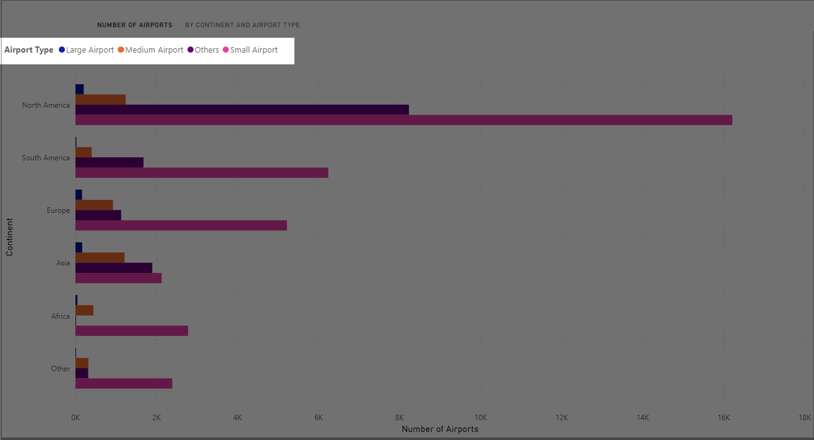
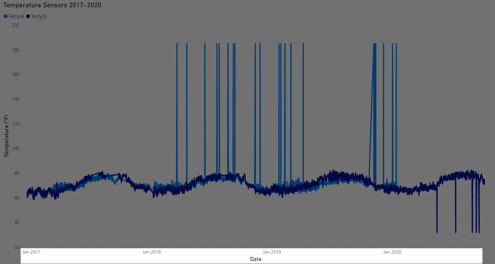

# Lesson: Questioning Data

## Introduction

When you are presented with data, you should question everything. Questions can lead to answers that can lead to a more informed decision.  

In this lesson, we will offer examples of questions you should use to determine if the data you have in front of you is the correct data to use. We'll also discuss how outliers impact data and provide solutions you can implement when you're faced with too much data. 

## Learning Outcomes

By the end of this lesson, you will be able to:

1. Ask meaningful questions when presented with data. 
2. Explain outliers. 
3. Discuss solutions for how to handle too much data. 

## Questions to Ask When Presented with Data

When presented with data, you will want to understand the data's story as best as you can to help make a well-informed decision. These are some of the things to consider.

### Source

Where the data comes from should be the first question. Where did this data come from? Who provided it? How did they get this data? Is this data from a recognized, reputable source?

Visualizations in this lesson use [the Cars93 dataset from Kaggle](https://www.kaggle.com/anand0427/cars93).  This dataset is common in data studies, as it was [developed to be used in teaching data](http://jse.amstat.org/v1n1/datasets.lock.html).  It contains rows about vehicles from 1993.  

> [Kaggle](https://www.kaggle.com) is a website used in data analysis, data science, and machine learning. They have datasets that can be used for practicing data analysis, data science skills, and machine learning. They also have notebooks - formerly known as Kaggle Kernels - where people have analyzed data and made notes of their findings. Be sure to check all licensing before using their data for your own projects.

### Timeliness

What periods of time does the data represent? How are these time periods related to the decision being made? When presented with sales charts, consider the following questions:

- Are these regular periods of sales? 
- Are these seasonal sales? 
- Are there holidays being celebrated that could impact sales? 

### Actionable

Let's say you were presented a report that showed overstocked inventory due to a manager keying in the wrong amount of products. Suppose you are a furniture company, and a store manager ordered 50 dining chairs instead of 30 dining chairs. Now there is a surplus of chairs. Is there a call to action there?

This requires a little more than just taking the report at its face value. If you have a surplus of inventory, now you have a problem of needing to sell the inventory while it's still profitable. However, you may not have known about the surplus if it weren't for that report.

What if that report included a graph to show that your sales were quicker to completion whenever you had flash sales? Including this information could make the presentation more actionable because it points out the problem and offers a solution for the problem.

When looking at reports and visualizations, make note of any possible calls to action.

### Filters

Has the data been presented in its raw form? Or has this data been filtered from another data source? What filtering has been applied? If the data has been filtered, why? 

If there is any filtering, it should be noted in the titles or subtitles of the visualizations. However, for many reasons, this information may be omitted. Therefore, it is critical to ask if filters are applied since the filters may impact the decision you're being asked to make.

Let's look at an example where we may want to filter our data.  In this example, we are using the Cars93 dataset mentioned above in the Source section.  We have a bar graph to show the number of vehicles, grouped by their number of cylinders.


As the graph shows, the group of cylinders with the most cars are 4-cylinder cars. Let's filter this data to learn more about 4-cylinder cars, specifically looking to see if there is a relationship between the miles per gallon (MPG) and the weight.

To provide enough context for our viewers that this data is filtered, we specifically called out "4-Cylinder Vehicles" in the title of this scatter plot for Weight of 4-Cylinder Vehicles vs MPG.


If the chart title does not give enough information to indicate that data has been filtered and you suspect that you are looking at filtered data, ask the person who supplied the chart if the chart is looking at filtered data. If that person is unsure whether the data is filtered, encourage them to find out. You do not want to make a decision thinking you're looking at the whole picture when the visualization you are looking at is filtered and doesn't indicate the filtering.

### NULL Values

Data analysts and data scientists can get you data details such as how many values in a column are not NULL. The output below shows what a data analyst or data scientist might get when checking the details for [the Goodbooks 10k dataset](https://www.kaggle.com/zygmunt/goodbooks-10k).

```
isbn             9300 non-null object
isbn13            9415 non-null float64
authors           10000 non-null object
original_publication_year  9979 non-null float64
original_title        9415 non-null object
title            10000 non-null object
language_code        8916 non-null object
```

As some columns have NULL values, the columns may be empty on purpose, result from a data entry error, or can be missing for other reasons. Questioning the presence of NULL values may identify whether a column is relevant to your research or whether data may be missing..

## Outliers

Sometimes, when looking at visualizations, you may see data that stands out - possibly higher or lower than the expected range. Values that fall outside an expected range are called **outliers**. 

In the following example, we are comparing prices for cars in the Cars93 dataset versus their prices. The boxplot below shows that 4-cylinder cars in the Cars93 dataset vary between $5,000-$25,000. However, the boxplot also shows 3 dots above that range around $30,000. Those may be seen as **outliers** as they are not within the general range.


On the boxplot, 6-cylinder cars also show an outlier. The average price for a 6-cylinder car from the Cars93 dataset is in the range of about $15,000 to $40,000. However, there is one 6-cylinder over $60,000. Since that vehicle is not within the general range, it is considered an outlier as well. 

### Why Outliers Happen

Outliers happen for many reasons. Sometimes, outliers are an indication that an outcome wasn't anticipated when an experiment was run. These outcomes typically happen for very specific conditions. When outcomes happen under very specific conditions and were not part of the anticipated outcomes, these cases are known as **edge cases**. 

Outliers may also happen due to human error. If the data involves a human entering data, they can easily mistype a value, which could be seen as an outlier. If you can identify why the outlier happened, that will give you insight as to if you should consider the outlier as relevant to your decision. We will explore outliers more in our data visualizations module.

### Visualizations to Identify Outliers

Some visualizations make it easy to identify outliers. Two visualizations that show outliers well are **box plots** and **bar graphs**. If you are presented these, you can see outliers and question those.

#### Box Plots

A **box plot** is a representation of a comparison between two variables. There are boxes where there are a concentration of values. There are dots that can make it easier to identify outliers. Consider the following box plot of the number of cylinders of a car versus the price:


The dots above 4 suggest that there are 4-cylinder cars in a price range around $30,000. However, most 4-cylinder cars fall within a range - indicated by the edges of the lines off the boxes - between $5,000 and $25,000, with the bulk of the values falling where the box is drawn - between $11,000 and $15,000.

#### Bar Graphs

How many cars are there for each cylinder count? We can use a bar graph to show counts of categorical data - in this case, the number of cars for each of the number of cylinders.


In this case, looking at the values, a car has the value of "rotary." This is different compared to the rest of the cylinder values, which are numeric. This difference makes the "rotary" cylinder an outlier.

## When There's Too Much Data

What happens when you see too much data? Are you overwhelmed by the presentation? Is there data in this data set that is not relevant? Are there columns that do not make sense? If this is the case, then consider eliminating columns that are not necessary for decision-making. 

Filter your dataset to make it more manageable. If that isn't enough, you may need to consider having the data presented a different way. There are many visualizations to help tell the data story without being overwhelmed by a "death by numbers" presentation - too many numbers and not enough of a clear story in the presentation.

### Scales, Ranges, Categories, and Bins

Pay close attention to axes and groupings in a visualization. The grouping of data - categories and bins - can make or break a decision.  When presented with groups, make sure to understand how data has been grouped and question whether the data you are looking for is accurately represented by the groups.

#### Example: Airports by Continent and Type

Consider the following bar graph showing airports grouped by continent and then by type:


How are the continents grouped?


The continents are grouped as follows: North America, South America, Eurpose, Asia, Africa, and Other. What is grouped in Other?  In this case, Antarctica and Oceania are part of the Other category, though you have no way of knowing that based on this presentation.

How are airport types grouped?



This chart groups them as Large Airport, Medium Airport, Small Airport, and Others.  What is in Others?  What if we were studying non-large and non-medium airports - such as Small Airport, seaplane bases, heliports, and balloonports?  In a case like that, we would want to see those details rather than having seaplane bases, heliports, and balloonports grouped in Others.  Be aware that sometimes, the data you might be looking for could get lumped into the Other category.  Crucial details can be lost if there is an Other category and the data appears missing.  You may have to ask for more details about Other to understand what is going on.

#### Example: Temperature Analysis Over Time

Let's look at another example and question the visualization.  Consider this line graph that shows temperatures recorded for two temperature sensors - Temp4 and Temp5 - over a period of 2017-2020.


When presented with numbers and numerical trends, make sure you understand the following:

* Date and time ranges - Are these yearly, quarterly, monthly, weekly, or some other aggregation?
* Units of measure - What units are being used?  If no units are declared, are there ways to infer what is assumed to be the unit of measure? 

In our temperature sensors chart, notice the Temperature axis.


The temperature axis is represented in degrees Fahrenheit, as noticed in the y-axis label.  The y-axis - the vertical axis - starts at 20 and increments by 20 up to 180.

In our temperature sensors chart, notice the Date axis.



The x-axis - the horizontal axis - has the dates.  It starts with January 2017 and ends some time after January 2020.  Based on the looks, that could be a full year of 2020, but the ending date is not called out, so it would be a guess.  You may need to ask about the end dates for times when they aren't explicitly stated.

### Descriptive Labels and Units

Along with the categories and bins, you need to consider the units of measurement. Are the axes labeled in units? Pounds or kilograms? Celsius, Fahrenheit, or Kelvin? Thousands, millions, or billions? In addition to labeling the visualization with units, make sure that the units, along with the categories or bins, make sense for the presentation.

When it comes to labeling, you want to make sure to:
- Include a title that describes the representation.
- Make a note of relevant time spans or filters in the label. If you are presented a line graph - used to show how values trend over time, pay close attention to how date and time ranges are grouped.
- Include a **legend** - a guide to identifying series or groups of data - to clarify representations.


### Trends and Patterns

Are data trending positively by moving in an upwards direction? Are data trending negatively by moving in a downwards direction? Is there a plateau in the trends? 


Do you see patterns in the data? Could the data be cyclical or seasonal?

### Actionable

Can this data be presented in an actionable way?  What are the actions that can be taken based on this data presentation?

## Conclusion
In this lesson, we explored what questions should be asked when presented with data.  You will get a chance to think through questions in the following exercise.
