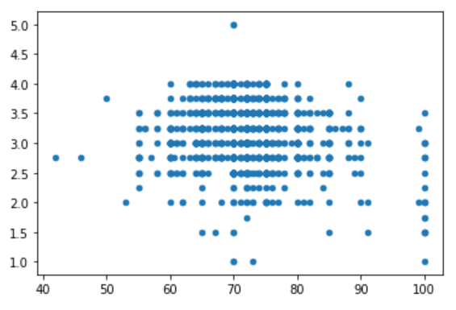
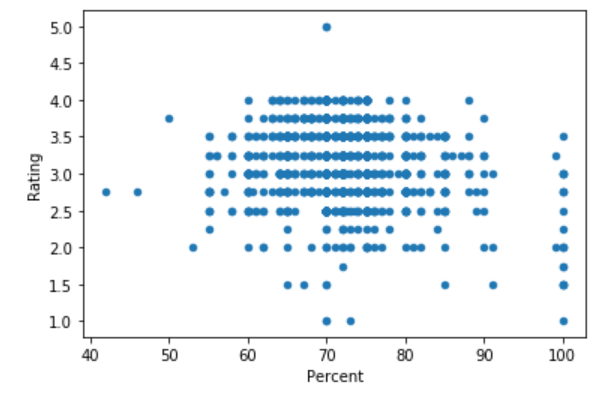
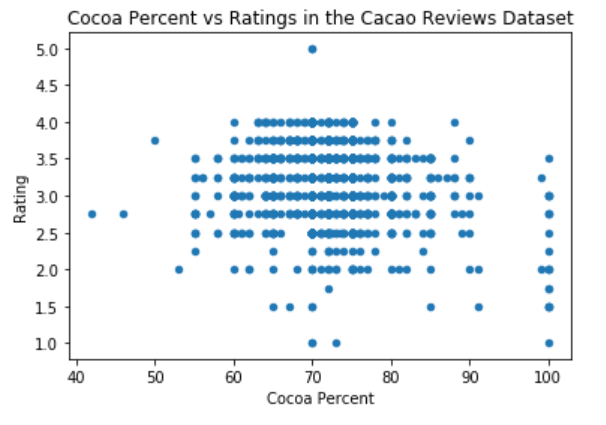
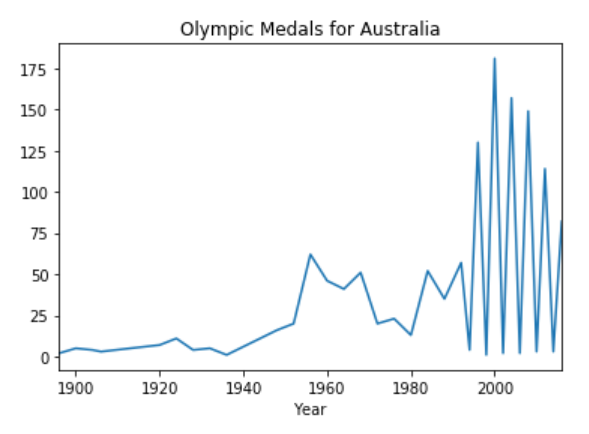

# Questioning Data: Exercise

## Introduction

When presented data or visualizations, you should have an instinct to question the data.

## Goals

- Question unlabeled presentations.
- Check relevant data.

## Exercise 

### Sample Data 1

- What does this scatterplot represent?  
- The axes don't start at 0, 0.  With the x-axis labels starting at 40 and the y-axis labels starting at 1.0 - rather than starting at 0,0 - what insights can you gather from the axes' starting points?

- What questions do you have?

#### Possible Questions

* With the axes starting at a different point, the learner should be able to point out that there are no data points between 0, 0 and where the axes start.

* The learner should point out that there are no titles for the x and y axes, and there is also no title.  
* They may identify that the source of this is unknown.
* There is a huge lack of context, so it is hard to know what this represents.

### Sample Data 1 with Labeled Axes

- The axes are labeled, but there still is not enough context here.  What exactly does this represent?
- Is this number of ratings of a test versus the percent scores on a test?
- What questions do you have?

#### Possible Questions

* The learner should think about that last question - what are the percent and ratings representing?
* This should cause the learner to question the source.

### Sample Data 1 with Labels and Title

- This is the relationship of cocoa percent vs the rating.  This is from [the Chocolate Bar Ratings dataset](https://www.kaggle.com/rtatman/chocolate-bar-ratings) on Kaggle.

- What do you notice about this data and the relationship between cocoa percent and rating?

#### Possible Questions

* Now that labels and source are included, the learner should be able to frame a 
  response that includes the source and shows that there seems to be no relationship.

### Sample Data 2

A line graph can be used to show how things trend over time.  The following line graph shows the Olympic medals for Australia over the years.

- What questions do you have when presented with this data?

#### Possible Questions

* Which medals are included? 
  * Is this just gold medals? 
  * Is this gold, silver, and bronze medals?

- Why is the y-axis not labeled?
- What are the actual date ranges?  
- Could that be included in the title?
- When did Australia start participating in the Olympics?

The learner should demonstrate curiosity with the presented values.