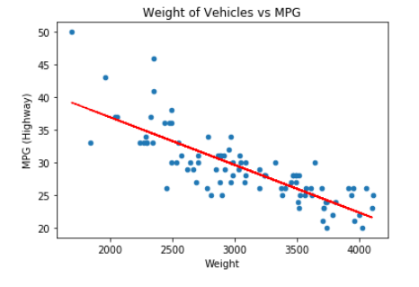
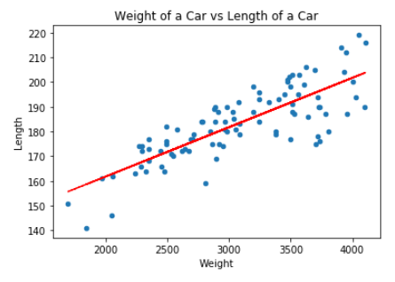
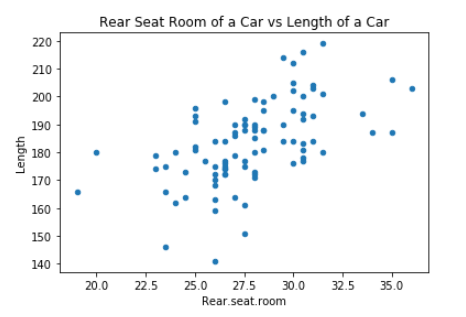
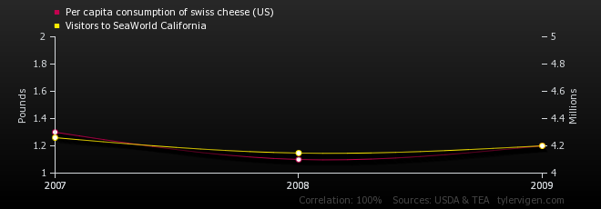

# Lesson: Correlation and Causation

## Introduction

When investigating data to see if variables are related, correlation and causation are considered.  Whether the data values trend simultaneously in a related fashion or if one of the variables causes another to happen or to exist, these relationships can give us more insight into the stories of our data.  However, just because data values seem to trend in a related fashion, that relationship does not guarantee that one variable impacts another variable.  As many data professionals say, "correlation does not imply causation."

This lesson explains correlation and causation, presents the case for discerning each independently, and provides criteria you can use to prove causation. 

## Learning Outcomes

By the end of this lesson, you will be able to:

1. Differentiate between correlation and causation.
1. Explain why correlation does not imply causation. 
1. Assess the criteria necessary to prove causation. 

## Correlation and Causation

When questioning data, you may also wonder about relationships between data. You may see visualizations that may show relationships between columns. But just because columns seem to follow certain patterns does not necessarily guarantee a cause-and-effect relationship between the columns. It could be a cause-and-effect relationship, or it could be a coincidence. Let's look at correlation and causation and why "correlation does not imply causation."

### Correlation

Correlation shows commonalities between columns or attributes or variables regarding their values and whether the values change together. It shows if there is an association between two variables. In statistics, this can be calculated and identified by a value called the **correlation coefficient**. When investigating the correlation between at least two columns, there will be one of the following outcomes:

* **Positive correlation** - If a particular value increases, the related value increases. The correlation coefficient is close to 1.0.
* **Negative correlation** - If a particular value increases, the related value decreases. The correlation coefficient is close to -1.0.
* **No correlation** - There is no relation between the columns. The correlation coefficient is near 0.

When columns behave in a related way, people may jump to the assumption that they are related by cause-and-effect - "If one variable changes, it must be what's causing the correlated variable to change." This is not always true though. There is a reason why you will hear statisticians, data scientists, and other data professionals say that "correlation does not imply causation."

Correlation indicates that there "might" be a relationship between variables. Ice cream might sell well when sunglasses sell well. Hot drinks might sell better on cold days. Heavier cars might have worse miles per gallon. These are all statements of correlation - where the "might" suggests that there could be a relationship there or it could be coincidence or possibly a shared different factor.

Correlations are represented with **scatter plots** - visualizations that show points (observations) between two columns. Once the observations are plotted, trends can be identified with a line that connects as many plots as possible, known as a trend line. In terms of correlation, if the trend line is sloping upwards - as it does with the weight of the car versus the length of the car, it is a positive correlation. If the trend line is sloping downwards - as it is with the weight of vehicles versus the miles per gallon, it is a negative correlation. If there is no easy way to connect the plots, there may be no correlation.

Consider the weight of a car - does the weight of the car impact miles per gallon?

As the weight of the care increases, the miles per gallon (highway) decreases. This is known as a negative correlation - as one value increases, the other value decreases.

Is there a relationship between the weight of a car and the length of a car? Consider the following scatter plot:

As the weight increases, the length also increases. This is known as a positive correlation - as one value increases, the other value increases.

Is there a relationship between the length of the car and the rear seat room? We can create a scatter plot to see if there is a relationship:

While it looks like it might be trending upwards, creating that trend line with a correlation calculation comes up with an error, making it hard to tell if there really is a relationship. In this case, there is no correlation.

Creating the trend lines revolves around calculating the correlation coefficient and other calculations related to **regression analysis** - statistical analysis between variables. We will not get into the specific calculation for correlation in this course; however, be aware that data analysts, engineers, and scientists are the ones who create these visualizations with the calculations used for establishing the trend lines. They can use tools such as Excel and Jupyter Notebook to create those visualizations and use functionality in those tools to calculate the trend lines.

### Causation

**Causation** shows relationships related to cause-and-effect. Another term for causation is **causality**. When we think once an event might have led to another, we ask the following questions: Why did this happen? When does this happen? Did the previous event cause the current event?

Do sunglasses sales impact ice cream sales? While they both may trend similarly, they do not impact each other. They both may trend similarly because of a shared factor - they may both trend well on sunny days. However, we cannot say that there is a causation between sunglasses sales and ice cream sales.

Do hot drinks cause cold weather? Think about when you drink hot drinks - is it always cold outside?  If you are a Starbucks fan and are drinking your pumpkin spice latte in Northeast Ohio in August - this is summertime, you know that the hot pumpkin spice lattes can still be had on hot summer days. So hot drinks, while correlated to cold weather, do not cause cold weather. However, does cold weather impact hot drinks? This might be a more logical experiment to test for causation.

## Correlation Does Not Imply Causation

Although columns are correlated, there may not be a relationship that suggests one causes another. Consider this combination from [Spurious Correlations](http://www.tylervigen.com/spurious-correlations) - the per capita consumption of swiss cheese (US) versus the Visitors to SeaWorld California.

Source: [tylervigen.com](http://tylervigen.com/view_correlation?id=28630), used under [CC BY 4.0](https://creativecommons.org/licenses/by/4.0/)

This chart shows that the per capita consumption of swiss cheese in the US trended similarly to the visitors to SeaWorld California between 2007 and 2009. It might help to see the data laid out to see how the data changed over the years.

<table>
  <thead>
    <tr>
      <th></th>
      <th>2007</th>
      <th>2008</th>
      <th>2009</th>
    </tr>
  </thead>
  <tbody>
    <tr>
      <td>Per capita consumption of swiss cheese (US) Pounds (USDA)</td>
      <td>1.3</td>
      <td>1.1</td>
      <td>1.2</td>
    </tr>
    <tr>
      <td>Visitors to SeaWorld California Millions (TEA)</td>
      <td>4.26</td>
      <td>4.147</td>
      <td>4.2</td>
    </tr>
  </tbody>
</table>
Is Swiss cheese luring visitors to SeaWorld California? Or is there something about SeaWorld California that is causing more US consumption of swiss cheese? Do these questions seem unlikely? While there is a correlation between the data, there may not be a cause-and-effect relationship between the variables. This is an example of "correlation does not imply causation."

There are many factors in addition to correlation that needs to be considered before causation can be established.

## Proving Causation

Causation means that the relationship is proven to be related, with one of the variables responsible for the behavior or even the existence of the other variable. It is determined based on experimentation, observations, and data analysis.

Quantitative data can be processed via statistics. Qualitative data can be analyzed and visualized in other ways. By forming a hypothesis, running a solid experiment, and analyzing the observations, causation can possibly be proven, though experimentation is not enough on its own to prove causation.

There are other criteria to consider as well. Sir Austin Bradford Hill proposed these criteria in his study [The Environment and Disease: Association or Causation](https://www.ncbi.nlm.nih.gov/pmc/articles/PMC1898525/). While he proposed this in the epidemiology context, we can apply these criteria to other topics as well.

Consider the following causation that we are going to explore:

Suppose you have an hourly wage job. The more hours you work, the more money you will make. The fewer hours you work, the less money you will make. The amount of hours you work directly impacts the paycheck.

<table>
  <thead>
    <tr>
      <th>Criterion</th>
      <th>Notes</th>
      <th>Example</th>
    </tr>
  </thead>
  <tbody>
    <tr>
      <td>Strength</td>
      <td>How strong is the association between the two variables? A strong correlation is one of many criteria to consider before determining causation.</td>
      <td>When the hours of work increase, the wages increase. When the hours of work decrease, the wages decrease. If the hours of work stay consistent, the wages stay consistent. This is a strong relationship.</td>    
    </tr>
    <tr>
      <td>Consistency</td>
      <td>How often is this association observed? Does it happen with different people? Different places? Different circumstances? Can others replicate the suspected cause-and-effect relationship?</td>
      <td>Whether this is your hourly wage or someone else's is hourly wage, the more you work the more money you will make. This is fairly consistent across hourly jobs.</td>    
    </tr>
    <tr>
      <td>Specificity</td>
      <td>Causation can be better determined when the associated is more specific than less specific. The more specific the columns are related, the easier it will be to determine causation; whereas the more general the columns are related, the harder it will be to determine causation.</td>
      <td>In our example, we are specifically focusing on hourly wages. If we had supposed work in general, this causation would be harder to determine because salaried wages are not handled similarly. Since we specifically called out hourly wages, it is easier to see the relationship between work and earned wages.</td>    
    </tr>
    <tr>
      <td>Temporality</td>
      <td>Which variable came first? What are you really testing? Does the timing matter between these variables? If so, identify which variable impacts the other variable. Which variable is the cause? Which variable is the effect?</td>
      <td>The timing for these variables matters. The amount of earned wages is dependent on the amount of work done. The work comes first and is the cause. The payment comes after the fact. It is the effect based on the work.</td>    
    </tr>
    <tr>
      <td>Plausibility</td>
      <td>How plausible is your cause-and-effect scenario? How reasonable is this situation? How probable is it?</td>
      <td>The situation of higher earned wages with more hourly work is reasonable and expected.</td>
    </tr>
    <tr>
      <td>Coherence</td>
      <td>The interpretation of data should not strongly conflict with what is already known. The findings should be coherent with existing information.</td>
      <td>We have not found any examples of where the wage stays consistent, when an hourly employee works more, they make less wages. We have also not found any examples of where the wage stays consistent, when an hourly employee works less, they make more wages. Our findings are coherent with what is happening with other hourly jobs.</td>    
    </tr>
    <tr>
      <td>Experiment</td>
      <td>Having a hypothesis and experimenting can help to show causation, though care must be taken in making sure the sampling is fair and non-biased.</td>
      <td>To test the relationship between hourly wages, working more or less, and the earned wages changing respective to the number of hours worked, we can look at this across different departments within a company or even across various industries. Regardless of industry, as an hourly employee works more or less, their earned wages will increase or decrease, respectively.</td>    
    </tr>
    <tr>
      <td>Analogy</td>
      <td>Sometimes, it is helpful to make analogies between the things you are trying to explore and related situations. The analogies may be relevant for establishing causation.</td>
      <td>In this example, the causation is apparent. Another example could be explaining why a part in manufacturing is slow to review in quality control. If it is hard to show the causation - perhaps a part's design is extremely intricate - it may make sense to create an analogy to another intricately designed part that was known to be slow for review in quality control.</td>    
    </tr>
  </tbody>
</table>

## Conclusion

When questioning data, keep in mind that correlation and causation are types of relationships between columns.  While they may be correlated, the correlation does not guarantee a cause-and-effect relationship between the columns.  You will get more practice with correlation and causation in the next exercise.
