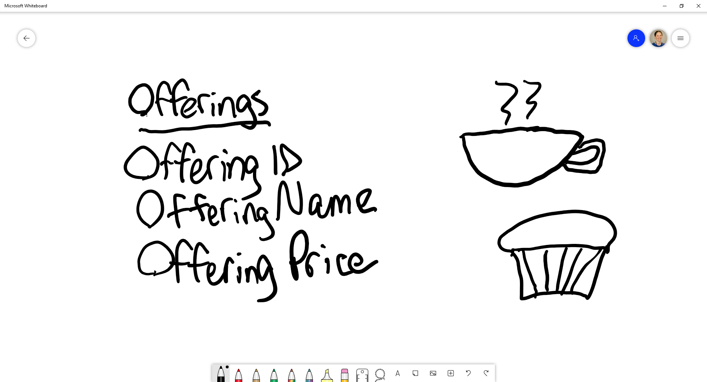
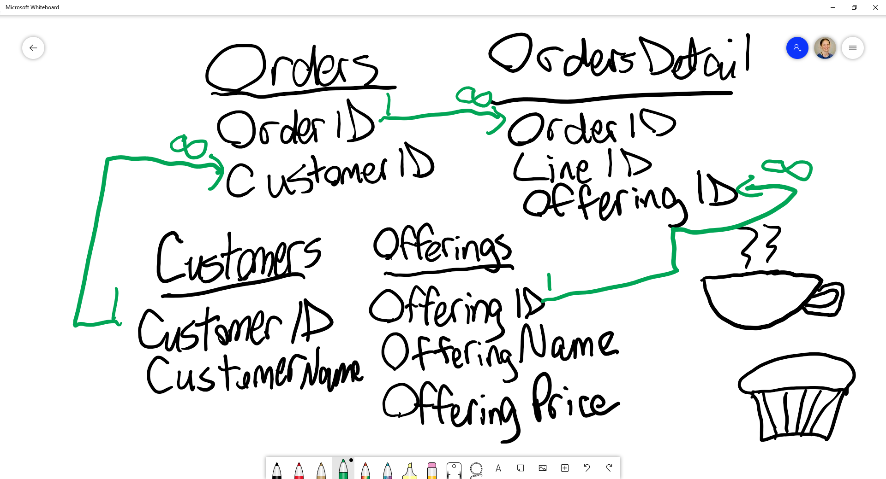
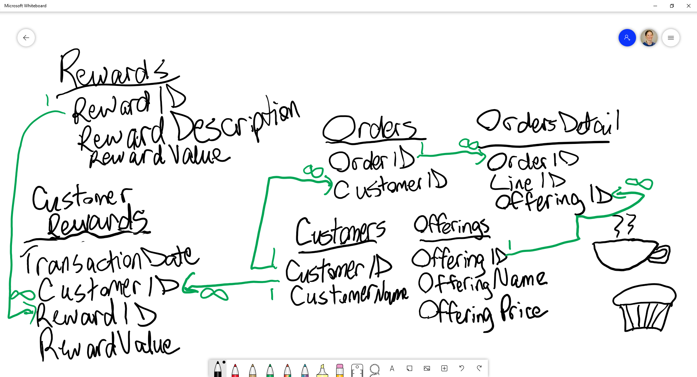

# Exercise: Data Relationships

## Introduction

You have decided to retire from your job to open your own café. Coffees, teas, Italian sodas, muffins, scones may be some of the offerings in your café. In this exercise, we will leave the thinking to you and would like to see your representations of the data relationships.

```
This has been delivered in multiple ways, and whiteboarding in teams of 2-3 works really well.  This key has whiteboard images as well as notes of what to watch for.
```

## Goals
- Show an understanding of creating entities with attributes.
- Build relationships between entities with an Entity Relationship Diagram (ERD).

## Part 1. The Menu

You are in the planning process for your menu of offerings. Create an ERD for your menu of offerings.



```
Things to watch out for:

- Can the learner break out attributes for an entity?
- Can they identify that an offering at a minimum should have an ID and a name?
- Would it make sense to include price?  (This is included specifically as a conversation point.  There could be justifications for the price going on another table.)
```


## Part 2. The Customers and their Orders

You want to keep track of customers and their orders of these offerings. Expand your ERD to include customers and orders.



```
Things to watch out for:

- How do the learners handle situations when multiple entities are involved?
- What fields should be included?  Order Date?  What data type should Order Date be - just a date?  Timestamp?  

Ask questions about why they broke pieces up, even if they seem logical to you.  Let the learners put their thoughts out in their words to either confirm their understanding or show a break in reasoning.
```


## Part 3. Rewards System (Stretch goal)

You notice that some customers are coming in frequently, and you would like to reward them for their loyalty. Expand your ERD to include a rewards system.



```
Things to watch out for:

- How do the learners handle situations with multiple entities?
- How did the rewards system get incorporated into the design?
- Are these static rewards?  Are they time-sensitive?
- Where do the reward points get stored?  Does it make sense to include them on Rewards, CustomerRewards, or maybe both?

Listen to their reasoning to gauge understanding of their design and if they understand the materials.
```