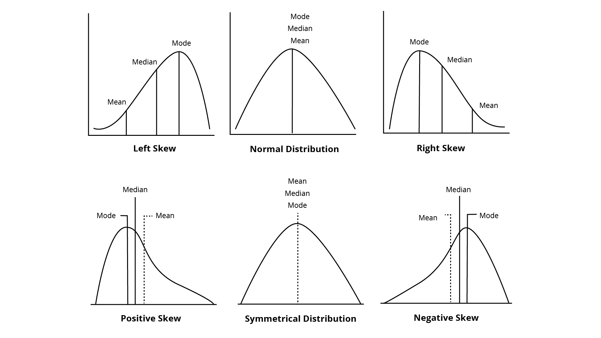

# Lesson: Measures of Central Tendencies

## Introduction
Descriptive statistics gives us a way to describe or summarize features of our sample data quantitatively.  Coupled with quick visualizations, we can use descriptive statistics to gain a meaningful understanding of our sample data quickly. 

In this lesson, we will cover the foundations of descriptive statistics: measures of central tendencies (mean, meadian, mode, and skewing).

## Learning Outcomes

By the end of this lesson, you will be able to:

1. Identify the mean in a data set. 
2. Identify the median in a data set. 
3. Identify the mode in a data set. 
4. Explain skewness. 

## Mean, Median, and Mode

Measures of central tendencies give you an idea of the most "normal" or representative data for a sample allowing you to better understand your data. The three most used measures of central tendency are mean, median, and mode. 

The **mean** is the average.  Take the sum of all of the data elements and divide by the total number of items. 

The **median** is the middle position.  To find the medium arrange the numbers from smallest to largest. If the set has an odd number of items, the middle value is the median. If the set has an even number of items, the median is the average of the two middle values.

The **mode** is the highest frequency count in the data set.  If two or more data elements equal the highest frequency, the data is considered bi or multimodal. 

Individually, each of the central tendencies gives a little information about the data we have.  Together, the central measures tendencies weave a much larger story.

#### Visualizing Central Tendencies with a Distribution Curve
##### Skewness and Kurtosis

In a **symmetrical distribution**,  the mean, mode, and median are all equal.  The above curve is called a **normal curve** and is also known as the Gaussian distribution. The normal curve pattern appears in multitudes of data sets and is an important distribution data can have.  Most inferential statistics derive from the normal curve. 

Examples of Normal data: 

* height in a species
* birth weight in a species
* IQ
* income distribution in an economy
* shoe size
* student grades in a course

**Right Skewed** or Positive Skewness
In a right-skewed data set, the mode and median are less than the mean or to the right of the peak ( which is the mode).  The mean will also be to the right of the median.

To put this in perspective, consider the NBA.  Star players make a tremendous amount more than their Teammates.  If you graph NBA player salaries, some will appear almost off the scale to the right making the mean greater than its position in the normal curve.

**Left Skewed** or negative skewing.
In a right-skewed data set, the mode and median are more than the mean or to the left of the peak(which is the mode).  The mean will also be to the left of the median.

A classic example of left-skewed data is the age of death in industrialized countries.  People die in many age groups, but the data clusters around 80. The mode is roughly 80, and the median value will be closer to 80. The mean will be to the left of the peak.

## Conclusion

You'll rarely be working with arbitrary data sets.  Instead, we usually combine these statistics on 1 column of data in Excel, a field in a database, or a similar list. 
