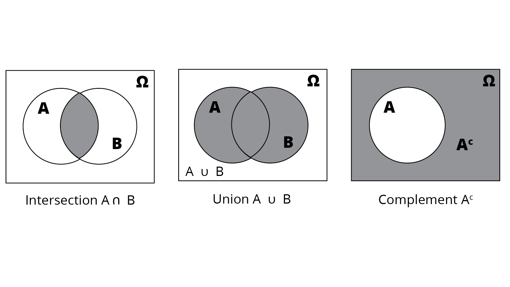
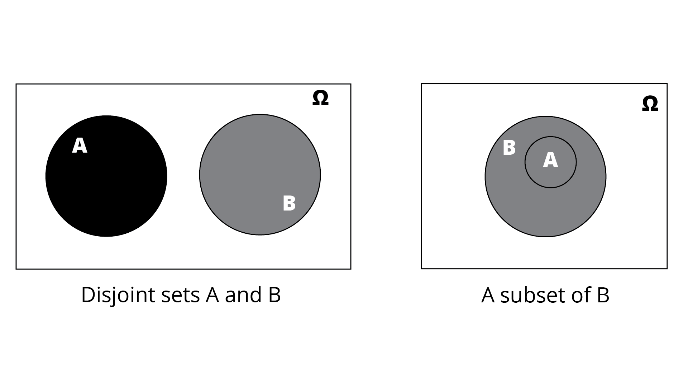

# Lesson: Introduction to Probability

## Introduction

In our daily lives, we frequently encounter situations whose outcomes are affected by randomness, which means we must sometimes make decisions under uncertainty. For example, let's say it takes you 20 minutes to walk to campus and 10 minutes to drive, but if you drive, you could be forced to spend up to 20 additional minutes looking for parking. Which would you prefer? What if the weather forecast predicted a 10% chance of rain? How about a 40% chance of rain?

Probability is the study of random events. It formally establishes mathematical rules for quantifying and drawing inferences from such events. Its applications are ubiquitous in the modern world, as randomness plays an inextricable role in things ranging from financial markets and the insurance industry to nuclear physics and evolutionary biology. This lesson introduces some of the fundamental ideas of probability, which will be a key building block as you continue to hone your data literacy.

## Learning Outcomes

By the end of this lesson, you will be able to:

1. Explain sample spaces and events.
2. Use set notation and Venn diagrams to describe sample spaces and events.
3. Identify the probability of an event.
4. Explain the concept of conditional probability.
5. Calculate Bayes' theorem.
6. Define independence of events.

## Sample Spaces

The sample space of an experiment or random trial is the set of all possible outcomes or results of that experiment.

To explore the basic concepts of probability, let's start with some simple examples of random experiments. Two that are likely familiar to most people are flipping a coin and rolling a die.

A coin has two sides: heads (H) and tails (T). We assume for the sake of example that a coin is equally likely to land on either side, and a coin cannot land on its edge. Therefore, the set of all possible outcomes, or the __sample space__, is {H, T} for this experiment. The conventional notation for the sample space of an experiment is the Greek letter Ω (capital omega). Since a sample space is a set, recall that a set is unordered and that an element can appear at most once in a set, even if it appears more than once in the description. This means that {b, a, a, d, c} = {a, b, c, d}.

A standard die has six sides: 1, 2, 3, 4, 5, and 6. Therefore, the sample space is {1, 2, 3, 4, 5, 6}. Again, in this experiment, each outcome is equally likely.

What if we combined the experiments? Suppose we first flipped a coin, then separately rolled a die. How many outcomes could we obtain? Since the coin flip has no influence on the die roll, there are six possible outcomes if we get heads, and six if we get tails. The sample space for this combined experiment would therefore consist of 12 elements: {(H, 1), (H, 2), (H, 3), (H, 4), (H, 5), (H, 6), (T, 1), (T, 2), (T, 3), (T, 4), (T, 5), (T, 6)}

In more complex experiments with more possible outcomes, it may not be feasible to write out the whole sample space. It is even possible for sample spaces to be infinitely large. However, the concept of a sample space remains the same. It is simply the set of all possible outcomes.

## Events

An event is a set of outcomes of an experiment to which a probability is assigned. 

What if, instead of individual outcomes, we wish to look at groups of outcomes? Let's say you're rolling a die as part of a board game, and you need to roll a 5 or 6 to win, and otherwise you would lose. It would then make sense to consider the set {1, 2, 3, 4} and the set {5, 6} separately. This leads to the idea of an __event__, which is simply any subset of the sample space. In this case, we can let L = {1, 2, 3, 4} be the event that you lose the game and W = {5, 6} be the event that you win the game.

It is important to note that events do not necessarily have more than one element. In the example above, if you needed to roll exactly a 6 to win (i.e., a 5 wouldn't be enough), we could define L = {1, 2, 3, 4, 5} and W = {6}. It is perfectly okay for an event to consist of only a single outcome. In fact, if you're already familiar with the concept of a subset, you may know that the empty set, denoted {} or ∅, would be considered an event, as well as the entire sample space Ω itself.

### Venn Diagrams and Sets

Since events are sets, we can perform the usual set operations on them, such as taking unions, intersections, and complements. A useful tool to illustrate set operations is the __Venn diagram__, which uses circles or ellipses to represent sets.

__Intersection__: the intersection of two or more events is the set of outcomes included in each event. In a Venn diagram, this is indicated by the overlapping region of two or more sets.

__Union__: the union of two or more events is the set of outcomes included in any of the events. In a Venn diagram, this is indicated by the regions contained within any of the sets.

__Complement__: the complement of an event with respect to a sample space Ω is the set of outcomes in Ω not included in the event. In a Venn diagram, this is indicated by the region outside of the set.

Lastly, we examine two special relationships between sets.

We refer to events as __disjoint__ or __mutually exclusive__ when they have no outcomes in common. This can be seen in a Venn diagram when two sets have no overlap, such as with A and B in the left picture below.

On the other hand, what's the most overlap two events could have? That would occur if one was wholly contained within the other. In the right picture below, we see that the set A is entirely within the set B. We say that A is a __subset__ of B.

## Probability

The __probability__ of an event expresses how likely it is to occur. Probabilities are defined from 0 (impossible to occur) to 1 (certain to occur). The notation for the probability of an event E is P(E). For example, with a die roll, let E = {2, 4, 6} be the event that you roll an even number. In this case, P(E) = 0.5, since E includes three of the six possible outcomes, and each outcome is equally likely.

### Conditional Probability

What's the probability that a randomly selected person in the United States has a college degree? We can look up demographic information and find out. But what if we also knew that person's income was in the top 1%? Would that change your answer? Sociological research shows that wealthier people are more likely to hold college degrees, so it seems reasonable for that additional knowledge to affect the probability at hand.

Sometimes when we consider an event, outside information may affect the probability of the event. In the example above, we first looked at the probability of a randomly selected US resident having a college degree, and then we considered that probability on the condition that the person's income was in the top 1%. The __conditional probability__ is this new probability after taking into account the additional information, or condition.

Let's consider another example. Suppose our experiment consists of flipping a coin three times. What's the probability of getting exactly two heads? Our sample space is {HHH, HHT, HTH, THH, TTH, THT, HTT, TTT}, so if we count the outcomes with exactly two heads, we see that there are three: HHT, HTH, and THH. This makes the probability 3/8, or 0.375.

But suppose we've now done the first flip, and it landed on tails. What's the probability of getting two heads now, given that we've already gotten tails on the first flip?

We can see from the sample space that there are four outcomes that start with a T: THH, TTH, THT, and TTT. Of these, only one has two heads: THH. This makes the conditional probability given that our first flip was tails 1/4, or 0.25.

The notation is as follows. The unconditional probability P(exactly 2 heads) = 0.375. But if we know that our first result was tails, we then say that the conditional probability __P(exactly 2 heads | first flip is tails)__ (read "the probability of exactly two heads given that the first flip is tails") is 0.25.

It is important to note that the order of conditioning matters. P(A | B) does not, in general, equal P(B | A). We can see this in the example above. If we reverse the order of conditioning and try to calculate P(first flip is tails | exactly 2 heads), we must first look at the outcomes with exactly two heads again: HHT, HTH, and THH. Of these, only THH starts with tails. This makes this conditional probability 1/3, or about 0.33. Note the difference from the previous paragraph!

### Bayes' Theorem

If P(A | B) isn't the same as P(B | A), is there a way to figure out one if we have the other? This is what __Bayes' theorem__ allows us to do. It can be difficult to grasp if we immediately jump to the equation, so let's build up to it conceptually.

Let's think about what P(A | B) represents. This is the probability that A happens given that B happens. We are assuming that B is already guaranteed. But what if we want to know the unconditional probability that A and B both happen? That is, the probability with no other assumptions or outside information. Since P(A | B) already takes B for granted, we can multiply by P(B) to adjust for that. Think of this product P(B) * P(A | B) as representing a chain of events: first we consider the probability that B happens, then we consider the probability that A happens given that B has happened. Recall from earlier in this lesson that this is the __intersection__, represented by A∩B.

In equation form, this can be expressed as P(B) * P(A | B) = P(A∩B).

However, A∩B = B∩A, so P(A∩B) = P(B∩A). Following the equation we derived above and flipping the sets, we see that P(B∩A) = P(A) * P(B | A).

This leads to a chain of equality: P(B) * P(A | B) = P(A∩B) = P(B∩A) = P(A) * P(B | A), or, if we take out the two middle terms, __P(B) * P(A | B) = P(A) * P(B | A)__. This is Bayes' theorem.

This means that if we know one conditional probability, and we want to find the other, we can use elementary algebra to solve for the one we need in terms of the other conditional probability.

This leads to the following: P(A | B) = P(A) * P(B | A) / P(B). You may have seen Bayes' theorem presented in this form or another similar one. They are all equivalent, which you can verify with algebra.

Let's make this more concrete with an example. Again, consider the experiment above: flipping a coin three times. Our sample space is {HHH, HHT, HTH, THH, TTH, THT, HTT, TTT}. Let's define A as the event that we get exactly two heads, and B as the event that the first coin lands on tails.

P(A) = 3/8

P(B) = 4/8 = 1/2

P(A | B) = 1/4

P(B | A) = 1/3

Plugging these values into Bayes' theorem, we can verify that (1/2) * (1/4) = (3/8) * (1/3).

### Independence

It can also be the case that two or more events don't affect each other. For example, if you recall our earlier discussion of the gambler's fallacy, you know that the result of a die roll has no effect on future rolls because the die has no memory. For example, if you're rolling a die several times, we would write P(second roll is a 6 | first roll is a 6) = P(second roll is a 6) = 1/6, or about 0.167. The condition makes no difference because the first roll has no effect on the second. In this case, the conditional probability is equal to the unconditional probability. We say that these two events are __independent__.

## Conclusion

We've now reviewed some of the basic concepts of probability. Probability involves quantifying uncertainty, and one way to study it is through random experiments, such as coin flips and die rolls. We use sample spaces and events to describe outcomes from these experiments. Conditional probability and independence concepts allow us to build upon those basics and expand our probabilistic intuition. 
