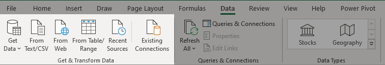
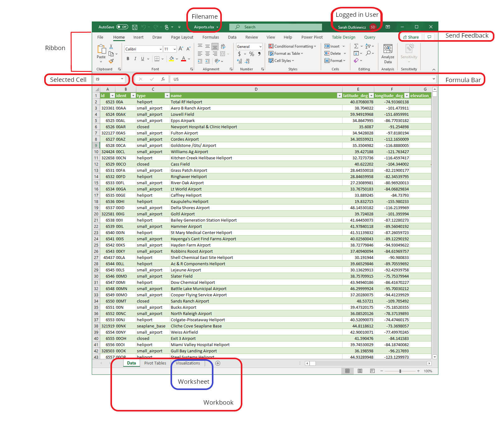
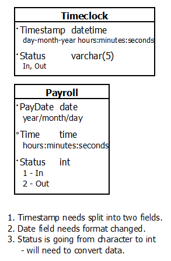
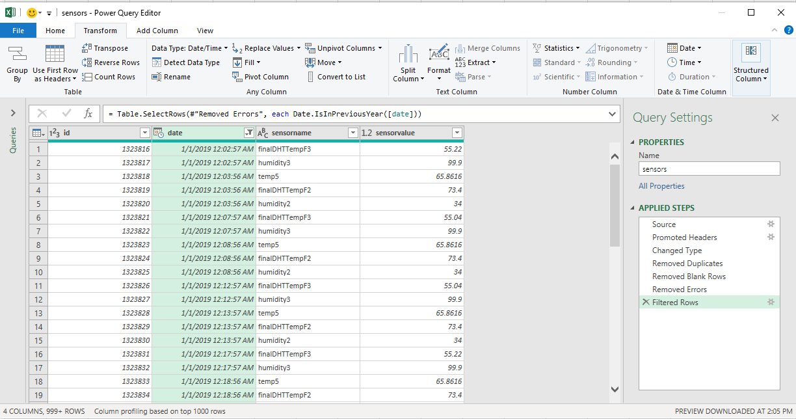

# Lesson: Excel for Data Analysts

## Introduction

Data, data everywhere... spreadsheets for days... this is an Excel-lent role for data analysts. Excel is Microsoft's spreadsheet-based application. It allows for workbooks of spreadsheets to be created, maintained, and shared. A data analyst can use Excel for cleaning data, transforming data, and importing data. In this lesson, we will get a high level overview of Excel and how it can be used in the extract-transform-load (ETL) process.

## Learning Outcomes

By the end of this lesson, you will be able to:

1. Explain some of the functions a data analyst could perform using Excel.
2. Define ETL.
3. Identify the stages of ETL.
4. Describe Get & Transform and how it relates to ETL.

## What is Excel?

Excel is a spreadsheet-based application that is part of the Microsoft Office environment. It is available on multiple platforms - including mobile applications for Android and iPhone through Microsoft Office Mobile, desktop via Microsoft Office and M365 licensing, and cloud. Excel Online is the web interface for running Excel in a web browser. Excel has many uses - from presenting tabular data to cleaning and transforming data to presenting data in various ways including pivot tables, graphs, charts, and other visualizations.

## Why Excel for Data Analysts?

Data analysis involves working with tables of data, sorting, filtering, and identifying trends. Sometimes, data analysts are creating visualizations to present data to stakeholders for decision-making. Before visualizations can be created, data needs to be imported, cleaned, and transformed. However, the path of import-clean-transform is not the optimal way, as you import unnecessary data and then remove it. 

Excel has a pathway known as **Get & Transform** - also known as **Power Query** - that allows us to query our data ahead of time, cleanse the data, transform the data, then load the data. This Get & Transform pathway allows us to work with large datasets - millions of records to 10s of millions and even 100s of millions of records - and select subsets of those large datasets to work with in Excel. Get & Transform is accessed via the Data ribbon in Excel.

## Examples in this Module

In our examples, we will be using a dataset that contains temperature and humidity sensor data that has over two million records spanning 2016-2020. Excel can only load just over one million records, so it cannot load the entire dataset. However, for our lessons, we will be working with a subset of the data - the 2019 records. In our exercises, you will be able to apply these skills to another subset of this data.

## Anatomy of the Excel Workspace

Before we get in too deep, let's look at a few terms related to Excel.

There are a few visual cues to let you know which file is loaded and which user is logged in. The **filename** appears at the top of the title bar, near the middle of the screen. Closer towards the right, you can see the **logged-in user**. While looking to the right, we have also highlighted the tools for **send feedback**, which sends feedback to the Microsoft Excel team.

The **ribbon** appears below the title bar. This contains the ribbon titles - File, Home, Insert, Draw, Page Layout, Formulas, Data, Review, View, Help, Power Pivot, Table Design, and Query. This also contains other relevant ribbon titles, depending on what is selected.

Below the ribbon, to the left, is the **selected cell**. This is helpful if you are working on a sheet with multiple columns and cannot tell which cell is selected. In our screenshot, the cell selected - I9 - does not appear in the displayed columns.

Next to the selected cell indicator is **the formula bar**. This is used for entering formulas to work with calculations, matches, and other functions used in creating formulas. We will explore formulas throughout this module.

At the bottom of the Excel window, you will notice tabs. Each individual tab is a **worksheet**, and the collection of worksheets is known as a **workbook**.

## Extract-Transform-Load (ETL)

Something common when working with data is moving - also known as **shipping** - data from one system to another. For example, timekeeping information may be logged in one system but the payroll information is in another system. If you are logging time in the timekeeping system, you don't want to have double entry where the user has to log into both a timekeeping system and a payroll system. That becomes a painful user experience for the employees. Instead, have them clock into the timekeeping system and copy that data to the payroll system using an ETL process:

* **Extract** the data from the timekeeping system.
* **Transform** the data from the timekeeping system format to the payroll system format.
* **Load** the transformed data into the payroll system.

Let's look at these stages individually.

### Extracting Data

When sharing data between systems, it is important to identify **the source of truth** - typically the system where the data originates. If your employees are clocking time in a project work system, then its source of truth should be where they are clocking in. When you import it into a payroll system, the hours are imported, but if there are disputes on times, those need to be resolved with the source of truth.

Once the source of truth is identified, the next thing is to identify how to extract the necessary data from the system. Some applications may have export functionality baked into admin screens. Some systems may write their data to files or database systems and those systems may have ways to export data - such as a SQL Server backend with the ability to extract data using the SQL Import/Export Data tool. Some applications may have Application Programming Interfaces (APIs) that programmers can use to extract the data. Some applications may be web-based and also have APIs to pull the data from their websites or servers.

Common formats for extracted data include comma-delimited files (CSVs), tab-delimited files, fixed format files (typically documented in the application's help files), XML, and JSON.

Extracting data is the Get part of Get & Transform.

### Transforming Data

Once the data has been extracted, then it must be prepared to be loaded in another system - in our example, the payroll system. This is the Transform part of Get & Transform.

#### Data Cleaning

When framed in the mindset of ETL, data cleaning is part of data transformation. Cleaning data involves removing unnecessary duplicate records, removing blank records, standardizing data responses, and setting data types on columns. This can all be done within the Power Query editor in Excel.

The order of these things matters. Clean the data first, so that you can get rid of unnecessary data and transform only the records you need.

#### Data Mapping

**Data mapping** is the process of identifying fields in the source and matching them with fields in the destination. During this process, data types are identified in both systems and notes are made as to how to transform them from one system to go into another system.

For example, timestamps may be a string in the timekeeping system but may need to be a date in the payroll system. Perhaps the dates are stored in the timekeeping system as a timestamp - so one field that includes both date and time - and the payroll system may require the timestamp to be broken up into a date field and a time field. The timekeeping system may store dates in day-month-year format - such as 31-01-2020, whereas the payroll system may store dates in year/month/day format - such as 2020/01/31. 

Fields such as yes/no or true/false in one system may be stored as 1/0 in another system. One system may have First Name and Last Name stored in separate fields, whereas the other system may just have a single name field. Consistent data is a beautiful thing, as consistent data makes it easy to work across a dataset. So when shipping data from one system to another, the data must be transformed from the source formatting in way to be consistent with the destination data.

Going through a data mapping exercise will create the outline of steps to build in the Transform stage of Get & Transform.

### Loading Data

Once the data is cleaned and transformed, the last part of ETL is the L - loading the data into the destination system. How does that happen? It depends on the system. Some systems have a way to import data through an admin interface. Some may need data pushed to their back end via an API - this is done typically in programming. Some may have database systems that they use that allow us to use other tools for loading - such as the SQL Server Import/Export Data tool. Depending on the system, you may need to go back to the vendor to see how to import data into their system.

## Automating ETL in Excel

During the Get & Transform process in Excel, transformations are stored in steps and translated to a language known as <a href="https://docs.microsoft.com/en-us/powerquery-m/">Power Query M formula language</a>. This language is used in Excel, Power BI, and SQL Server Analysis Services. These queries can be edited through an Advanced Editor in Excel, though most of the things you need to do can be accessed through buttons along the ribbons in the Power Query Editor. Power Query M queries can be saved in ODC (Office Database Connection) files, which makes it easy to reuse the script for things such as processes with daily file updates.

## Conclusion

Excel is more than just a spreadsheet application. It allows for workbooks of spreadsheets to be created, maintained, and shared. A data analyst can use Excel for cleaning data, transforming data, and importing data. In this lesson, we laid out a high level overview of Excel and how it can be used in the extract-transform-load (ETL) process. In the next lessons, you will be using Get & Transform to do some ETL in Excel.
