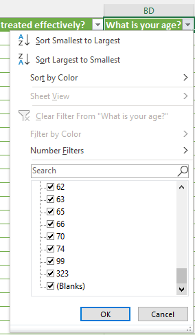
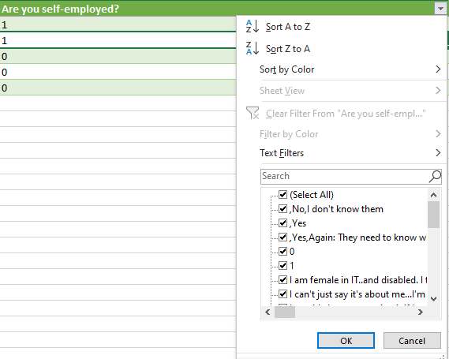

# Lesson: Cleaning Data with Excel

## Introduction

Many times, when working with data, you may find yourself dealing with data that needs to be transformed or cleaned before it can be used. There are many pain points when working with raw data, from data not being delimited properly to free-form text issues and inconsistent responses to missing data and blank rows. In this lesson, we will go through a dataset that may have these issues and clean it up.

## Learning Outcomes

By the end of this lesson, you will be able to:

1. Understand the pain points of raw data.
2. Identify cleaning assistance included in Excel.
3. Discuss why it isn't as simple as clicking a button and the dangers of trusting a single click.

## Getting Data

In this lesson, we will be working with the 2016 tech survey raw data from the Open Sourcing Mental Illness LTD - commonly known as OSMI. Their data from their surveys over the year is available at: https://osmihelp.org/research. Many of their datasets, including the 2016 dataset, are licensed with the [Creative Commons Attribution - ShareAlike 4.0 International license](https://creativecommons.org/licenses/by-sa/4.0/).

For this lesson:

1. Download [the raw 2016 OSMI survey data](https://www.kaggle.com/osmi/mental-health-in-tech-2016).
2. Extract the CSV file from the downloaded ZIP file.
3. Open Excel.
4. Select **Open**.
5. Open the CSV file you extracted in step 2.

## Working with Raw Data

**Raw data** is data that is unprocessed. It is gathered and then stored to be processed. Raw data includes temperature sensor data from a cold room as in the WideWorldImporter database, survey data, and sales transactions.

Many factors make raw data challenging to use. If humans are providing data, these are some of the issues you may see:

- Typos
- Inconsistent responses
- Missing responses - especially if someone skips a question
- Breaks in escaping - created when text responses are not properly escaped for the data format

## Scanning for Data Pain Points

There are many ways to identify pain points in data within Excel.

When scanning through a data set, look at where answers don't line up. For example, the answers to "What is your age?" look at standardized ages. However, there are other responses, such as "323", which should be outside the range of possible human age:

Another way to scan through responses is by filtering the data set. If there are headers in the first row, that makes it easier for filtering. To filter a column in Excel:

1. Select the **Data** ribbon.
2. In the Sort & Filter section, click the **Filter** button. This button will toggle arrows in the header row to allow you to filter each column.
3. Click an arrow in a header to see values detected in the column. Let's look at the other responses included for "What is your age?"

Some responses in addition to 0 and 1 include:

- `323`

Commas or other delimiters at the beginning of a field indicate something wrong with the delimited value. The record may have the delimiter used in a field and not appropriately escaped for storage.

We also have answers that do not seem relevant to the question, which indicates that a delimiter may be off somewhere.

Let's look at how we can use the Get & Transform process in Excel to alleviate some of these issues possibly.

Close the CSV file that you opened in Excel for this lesson.

## Get & Transform in Excel

The Get & Transform process in Excel allows us to look at the data, transform it, and import only the necessary data. Since we have identified our source as the CSV file, we have the "Get" part of Get & Transform ready. We can use the Transform part to clean the data, which uses the Power Query editor.

1. Create a new workbook in Excel.
2. We want to import from mental-health-in-tech-2016_20161114.csv. On the Data Ribbon, click **From Text/CSV** in the Get & Transform Data section.
3. Select mental-health-in-tech-2016_20161114.csv and click **Import**.
4. In the mental-health-in-tech-2016_20161114.csv dialog, click **Transform Data**.

## Transforming the Data, in Terms of Cleaning

When you click the **Transform Data** button, the Power Query Editor loads. As cleaning and transforming are connected in the Transform phase of Get & Transform, you can do a lot of things in Power Query. We want to focus on operations related explicitly to cleaning for this lesson. These are the things we want to do:

- Remove any duplicates.
- Remove any blank rows.
- Remove any errors.
- Filter the rows for 2019 data.
- Load to your workbook.
- Save the workbook.

### Removing Duplicate Data

Duplicate data can happen for various reasons - from a human entering data incorrectly to a hiccup in the process that caused an incident to be reported twice. It can appear as though more observations took place than did. The repeated data takes up more resources - memory, CPU, storage space - unless the system you are working with is optimized to handle duplicated data.

Ideally, you want to remove duplicated data from a dataset to ensure accurate data representation. However, we should understand why duplicate data exists. Sometimes, it makes sense to remove duplicate data based on bogus survey responses. Sometimes, though, responses may be critical because of the observation capturing a representative of the survey population, so remove duplicate data in a group process like this only if you are confident that the data should be removed. Otherwise, consider removing duplicates on a case-by-case basis.

To remove duplicate data:

1. Select the column(s) and/or row(s) - the range - where you want to filter out duplicates. To impact the whole dataset, we will select all of our columns. You can do this manually or use Ctrl+A to select all cells.
2. Go to the Home ribbon in the Power Query Editor.
3. Select **Remove Rows**.
4. Select **Remove Duplicates**.

### Removing Blank Rows

Sometimes, when exporting data from a system, the system may include blank lines in its data export files. These can typically be removed safely, as no data is included in the row.

To remove blank rows:

1. Select the range where you want to remove blank rows. To impact the whole dataset, we will select all of our columns. You can do this manually or use Ctrl+A to select all cells.
2. Go to the Home ribbon in the Power Query Editor.
3. Select **Remove Rows**.
4. Select **Remove Blank Rows**.

### Removing Errors

When importing data, Power Query may sometimes struggle with importing a column's values. The word `Error` will appear in the cell where this happens. Sometimes, that column with an error may be required, which are null values. Consider the source of the error (by double-clicking on the word error) and then use that to decide whether it is important data that should be cleaned or if the records with those errors can be removed.

To remove errors:

1. Select the range to remove errors.
2. Go to the Home ribbon in the Power Query Editor.
3. Select **Remove Rows**.
4. Select **Remove Errors**.

### Replacing Errors

When Errors appear, it may be a matter of assigning a default value to them to clean them. We can use Replace Errors to deal with these errors.

1. Select the range to apply to.
2. In the Power Query Editor, Select the **Transform** ribbon.
3. In the Any Column section, on Replace Values, click the down arrow next to it and select **Replace Errors**.
4. In the Replace Errors dialog, we will leave the value blank to replace our Error-values with empty strings.
5. Click **OK**.

## Loading Cleaned Data

To load the cleaned data into Excel, on the Home ribbon within the Power Query Editor, click **Close & Load**. Once the data is loaded, save the workbook.

### Identifying Duplicate Data once Loaded

Duplicate data may be hard to spot. Thankfully, Excel has conditional formatting and shows us where duplicates exist. To check our data for duplicates:

1. Highlight the data you want to check. We want it to check uniqueness across the rows. So we have selected all of our data.
2. In Excel, Select the **Home** ribbon.
3. In the Styles section, click on **Conditional Formatting**.
4. In the menu that appears, click on **Highlight Cell Rules**.
5. In the submenu, click on **Duplicate Values**.
6. In the Duplicate Values dialog, format cells that contain **Duplicate** values with an option on how to format the duplicates. The default value is **Light Red Fill with Dark Red Text**.
7. Click **OK**.

If you do this, the OSMI survey lights up, and most records are highlighted.

The question then should be, "Why are all of my data points coming up as duplicates?" In this particular example, the OSMI survey data includes questions and answers, though it doesn't have a unique identifier for a survey response. If we choose to remove duplicate data in this case, we could lose survey responses and observations on the mental health in tech.

## Conclusion

In this lesson, we explored removing duplicates, removing blank rows, removing errors, replacing errors, and identifying duplicates after loading data. These are just some of the many steps provided in Power Query.
