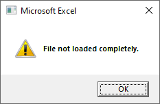
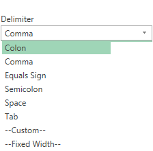
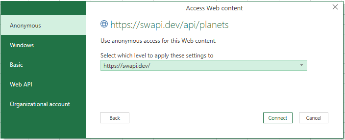

# Lesson: Importing Data with Excel

## Introduction

Data comes from a variety of sources such as transposed handwritten notes in an electronic format, timekeeping systems, payroll systems, accounting systems, tax applications, insurance services, real estate applications, legal applications, CRM applications, or ERP systems. Many business applications store their data in relational databases such as Oracle, SQL Server, Sybase, SAP, or DB2. Perhaps you are working with a web-based application and need to get data from their system via an API. In this lesson, we will look at the formats Excel supports for importing data.

## Learning Outcomes

By the end of this lesson, you will be able to:

1. Identify common sources of data in Excel.
2. Give examples of file types supported for import into Excel.
3. Describe common problems when importing data.

## Importing Data

Excel has a process known as Get & Transform, which allows us to go through the ETL process where we extract data from a source, transform the data, then load it into Excel.  In the "Get" part, you need to identify the source of data.  While you could import the data and then clean and transform it once it is imported, you are importing possibly unnecessary data and spending more time working on it rather than just working with the necessary data.  

Modern tooling in Excel makes it easier to identify the source of data and transform the data before importing it, allowing you to work with larger datasets and working with subsets within Excel. Our sensors dataset is over two million records - well above Excel's ability to display rows. If you try to import all of the data, Excel will include a message of "File not loaded completely."

Part of importing data involves identifying the source. Before you even consider using Excel to import and work with data, make sure that the data source is supported.

Excel supports the following sources:

- Files
- Databases
- SharePoint
- Azure
- OData
- Hadoop
- Salesforce
- ... and more!

Let's explore the supported formats to see what we can do.

### From Text/CSV

Excel supports a variety of file-based sources.  The most common import format is Text/CSV (comma-separated values).  While the name suggests CSVs, it supports other delimiters - including colon `:`, equals sign `=`, semicolon `;`, space, tab, custom, and fixed width.

For custom delimiters, the import dialog will display a textbox to enter a delimiter. Some files may be delimited by a pipe `|` - this would be an example of a custom delimiter.

For fixed width files, the import dialog will display a textbox with field stops. Provided the fixed width files contain single records in a single row - as opposed to single records over multiple rows, as sometimes seen in fixed width files, then this option should suffice. For example, if you have an ACH file for payroll and have a [6 record (Entry Detail/Transaction record)](https://www.regions.com/virtualdocuments/nacha_file_layout_guide.pdf), the stops might look like this:

0,2,4,12,13,30,40,55,77,79,80

In this example, those fixed width stops represent:

- 0 - Record Type
- 2 - Transaction Code
- 4 - Receiving Bank
- 12 - Check Digit
- 13 - Account Number
- 30 - Amount
- 40 - Individual ID
- 55 - Individual Name
- 77 - BLANK
- 79 - Addenda Record Indicator
- 80 - Trace Number

From delimited files to fixed formats, Excel has many text file options.

To import a file from Text/CSV:

1. Switch to the **Data** ribbon.
2. In the Get & Transform Data section, click on **From Text/CSV**.
3. Select the CSV file. Click **Import**.
4. Confirm that:
    - File Origin is the right setting.  Check the preview of the data to make sure that all the characters seem to be loading properly.
    - Delimiter is set appropriately.
    - Data Type Detection - can be set on first 200 rows, all data, or turned off.
5. Click **Load** to load the data into Excel.

This handles the Get part of Get & Transform. We will cover the Transform in lessons on cleaning and transformation.

### From File

In addition to Text/CSV, Excel supports a variety of other file formats - including XML, JSON, and PDF.  To establish a connection to files of these types:

1. Select the **Data** ribbon.
2. In the Get & Transform Data section, click on **Get Data**.
3. Select **From File**.
4. Select the format that you want to import.

### From Web

Excel supports importing data from web sources - from scraping web pages for tables to pulling data in various formats from Application Programming Interfaces (API) endpoints - website addresses that are providing data and functionality over the web from a data source.  

> APIs are ways for applications to provide access to their data.  For example, an ERP system may have endpoints for a programmer to use to get data about customers, orders, invoices, and inventory.  Data can come back in many formats, including XML and JSON.  Thankfully, you do not need programming skills to work with these formats.  Excel will handle the translation from the format to getting the data into a tabular format.  We will work with transforming those types of data in upcoming exercises.

Whether you're trying to get data from web pages or from other web sources, the process starts the same way.  To start the import from web:

1. Select the **Data** ribbon.
2. From the Get & Transform Data section, click **From Web**.
3. If you are working with a URL with many parts and need to use HTTP headers, select **Advanced**.  Otherwise, select **Basic**.  
4. There will be a prompt for authentication:

    - Anonymous - If the web page does not use credentials, use Anonymous.
    - Windows - If you use your Windows login for the web page - such as an intranet page, use Windows.
    - Basic - If the web page requires a simple username and password, use Basic.
    - Web API - If the API you are working with requires an API key for authentication, then use Web API.
    - Organizational account - If the web page requires organizational account credentials, then use the Organizational account option.  A common term associated with the Organizational account authentication option is OAuth, which is short for Organization Account authentication.

Once Excel makes the call to the web site or API, it will load the Navigator dialog, which will show what table(s) are available to load.

### From Table / Range

Excel can also bring data in from other Excel workbooks and other tables or ranges.  This is useful if you have existing Excel documents and need to run transformations on the data.  This is also useful if you have related data in existing spreadsheets and or tables want to bring them into the Excel data model for reporting purposes.

### From Azure

Excel can connect to Azure services to import data. The Azure services that are supported include Azure SQL, Azure Synapse Analytics, Azure HDInsight, Azure Blob Storage, Azure Table Storage, Azure Data Lake Storage, and Azure Data Explorer.

To establish a connection to files of this type:

1. Select the **Data** ribbon.
2. In the Get & Transform Data section, click on **Get Data**.
3. Select **From Azure**.
4. Select the service that contains the data you want to import.

### From Database

Excel can also connect to databases.  The databases that Excel supports include Access, SQL Server - database and analysis services, SAP HANA, Oracle, IBM Db2, Sybase, Teradata, MySQL, and PostGreSQL.  There may be additional downloads needed to connect to these data sources, as Excel supports these connectors but does not necessarily ship with all of the connectors it supports.  As you run into this situation, click the "Learn more" link in the dialog to learn how to download and configure the connector for use within Excel.

### Other Sources

These are not the only sources that are supported by Excel.  There are many other formats and sources supported for importing data into Excel.  Common enterprise data sources that are supported include Exchange Online, Dynamics 365, SharePoint, and Salesforce.  Excel also supports OData, Hadoop, and connections to data sources via ODBC and OLEDB.

## Common Problems with Importing Data

There are many problems that may arise when importing data.  In some files, records may span multiple rows.  Some files may have header rows or footer rows.  Sometimes, the column names are included in the first row, and sometimes they aren't included at all.  There may be rows of blank data - this commonly happens when exporting data from a legacy system that used blank rows for grouping or erroneously included blank rows.  

Another common headache with raw data is that data may not be escaped properly - this is common with delimited files that have text responses that can have the delimiter as part of its text.  

For example in the screenshot below, the answers to "What is your age?" look at standardized ages. However, there are other responses, such as "323", which should be outside the range of possible human age:

We will explore how to handle these cases in a lesson on cleaning data.

## Conclusion

In this lesson, we explored the formats supported by Excel for importing data.  We identified sources from files, databases, and online services that can be imported into Excel.  We also identified some common problems when importing data.
