# Lesson: Data Organization in Excel

## Introduction

Excel is a powerful tool used for importing data from various sources.  The chances this data will perfectly fit our business's needs as-is are incredibly low. Once we have a new dataset in Excel, it must be analyzed and organized to suit our needs better. This organization could be simply moving columns around, adding/changing headers, or manipulating/cleaning data. 

For example, part of your job may be to report on existing data. Companies have legacy systems established years or decades ago that produce clean and valid data. Odds are you have coworkers who are very familiar with that data and can offer a crash course to bring you up to speed. Or, maybe you are the expert in that line of business. Either way, familiarity with data makes the analysis and research much more straightforward.

The ultimate goal of this research is to produce reports, charts, etc., that will help our leaders make effective business decisions. However, a report is only as good as its data. So, when introducing a brand new data set, we need to thoroughly analyze and organize it before creating effective reports and visualizations. 

In this lesson, we'll explore several steps that make our data more presentable.

## Learning Outcomes

By the end of this lesson, you will be able to:

1. Search a column using VLOOKUP. 
1. Use INDEX and MATCH to extract data from a table.
1. Use LEFT, RIGHT, and MID functions to parse data from specific cells.
1. Use conditional formatting to format cells with identified criteria.
1. Perform multiple calculations using array formulas.

## Searching Tables for Values with VLOOKUP

Not all columns are created equal! In every data set, certain columns are more critical to decision-making. When dealing with large data sets, we may need to look up data in related columns. Excel provides a function called *VLOOKUP* that can help.

### Example: Snow White and the Seven Dwarfs

Hopefully, we are all familiar with this fairy tale. Snow White flees her evil stepmother, The Queen, and befriends seven dwarfs in the forest who give her shelter. What were the dwarfs' names? Luckily we have them stored in the accompanying [file](assets/files/seven-dwarfs.csv).

You should see a small table with seven rows, each representing one of the seven dwarfs. Each row contains an *ID* and a *Name* field.

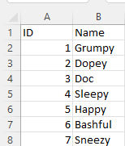

With a small table, it's easy to see all the data on one screen. We could even quickly answer the question, "How many records/dwarfs are there?". But, imagine if our data set had hundreds or thousands of rows? We will keep this example simple, but you can use the same process when working with larger data sets.

The requirement is to define a "finder" in our table to look up a dwarf by its ID. That might look something like this:

| ID   |  3  |
| --   | --- |
| Name | Doc |

The user enters the number 3, and the name "Doc" is returned by Excel, using a function called *VLOOKUP*.

### Try It! 

If you haven't done so already, import the csv file noted above into Excel. Once you have the data loaded, perform the following steps:
1. In cell D1 - Enter "ID"
2. In cell D2 - Enter "Name"
3. In cell E1 - Enter 4 (we will change this later)
4. In cell E2 - Enter the following formula:
`code>VLOOKUP(E1,Table1,2,FALSE)`

The formula entered in E2 should resolve as "Sleepy," which is correct. 4 is Sleepy's ID. Test it further by entering valid IDs from the table, and you should see the correct name returned.

So how does this work? Excel has great helper info built-in, the *Edit* function. Click into cell E2 and hit *F2* to see Edit in action. 

This brings up a pop-up with a template for the function and placeholders for each parameter. It should read something like this: 

`VLOOKUP(lookup_value,table_array,col_index_num,[ range_lookup ])`

* lookup_value: The value you want to look up. In our case, that's the ID entered in cell E1.
* table_array: The range of the data to look up should include the column you are looking up (ID/Column A) and the column you want to return (Name/Column B).
* col_index_num: The column position in the range you want to translate to (in this case, the Name column, which is the 2nd column in the range).
* range_lookup: This is an optional parameter (noted by square brackets).
     * True will provide an approximate match (default).
     * False will require an exact match. In our case, we wanted to find exact matches.

The VLOOKUP function helps compare different data sets and lookup values, similar to a join in SQL. Let's try another example. 

This time we will use the [nfl-teams.xlsx](assets/files/nfl-teams.xlsx) file. This is an Excel workbook file, so we can use the vlookup function instead of importing from csv.

In this file, you should see two tables: 
* Team Master: NFL Teams' abbreviations, franchise, and an empty *Active Since* field
* Team Founded Date: NFL Teams (franchises) and the *Active Since* field  

Your goal is to populate the *Active Since* column for Team Master with the date found in Team Founded Date. You should be able to do this with a VLOOKUP. Your instructor will provide a walkthrough once complete.

### VLOOKUP Limitations

The VLOOKUP function can only look up a value from left to right. The column containing the value you look up must be to the left of the return value column. If your data isn't structured this way, you'll need to use another technique; Index/Match.

## Using INDEX and MATCH

In addition to being a workaround for VLOOKUP limitations, INDEX and MATCH also offer flexibility when you want to perform a two-way lookup in Excel.

### INDEX Function

The INDEX function will return the value for a given range, row, column. 

Per Microsoft documentation, the syntax of the *Index* function is as follows:
`INDEX(array, row_num, [column_num])`

Explanation:

* array: the range, or table, used for the lookup
* row_num: the row number in the table (header row NOT included)
* column_num: the column number containing the field we want to retrieve

#### Example: Public University Enrollments

We'll be using the table below (Table1) for the next few examples.

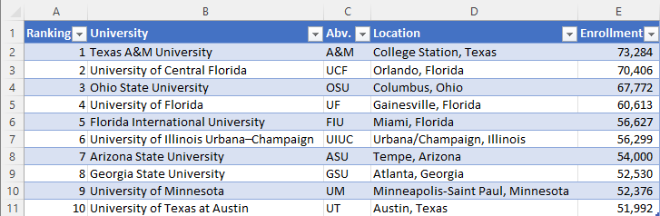   <!--sourced from https://en.wikipedia.org/wiki/List_of_United_States_public_university_campuses_by_enrollment-->

This table lists the top 10 largest public university campuses by enrollment. The key fields you'll want to focus on are University, Abv. and Enrollment.

Included in Table1 is an INDEX function example.

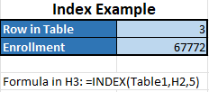

Our formula, located in cell H3, is `=INDEX(Table1,H2,5)`

* array: Table1, the name of our table
* row_num: H2, a cell reference to our value for "Row in Table"
* column_num: 5, the 5th column in our table, which holds the enrollment value

This example shows that we can change the "Row in Table" value, and the enrollment will be retrieved for that particular row.

The INDEX function is useful when retrieving a field from a table where we know the row and column numbers. But, what if we're working with a larger data set, don't know the row number, but do know more meaningful information (such as the university abbreviation)? In that case, we'll need the MATCH function. 

### MATCH Function

The MATCH function will return an item's position (row index) in a range.

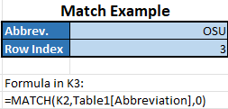

Per Microsoft documentation, the syntax of the MATCH function is as follows:
`MATCH(lookup_value, lookup_array, [match_type])`

Explanation:

* lookup_value: the value you want to match in lookup_array
* lookup_array: the range, or table, used for the lookup
* match_type: how we want to match the look_up value
     * Acceptable values are -1, 0, and 1
     * 0 denote an exact match
     * This is what you'll typically use
     * -1 and 1 will find closest matches that are greater-than-or-equal-to (-1) or less-than-or-equal-to (1) our lookup_value

Our formula, located in cell H3, is `MATCH(K2,Table1[Abbreviation],0)`

* lookup_value: K2, the cell containing the abbreviation we are searching for
* lookup_array: Table1[ Abbreviation ], the Abbreviation column from our table. This is where Excel will look to match the lookup_value.
* match_type = 0, because we are looking for an exact match

This example shows that we can change the "Abbrev" value (OSU, ASU, etc.), and the row number where that value is found will be returned.

### Combining INDEX & MATCH

Each of these functions used independently is moderately useful. They truly become helpful when we chain functions like these to answer our real question:  What is the enrollment for 'X' university? We should enter the university abbreviation and retrieve the enrollment # for that university.

#### Try It

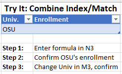

Steps are noted in the spreadsheet, but you should combine what you learned in the previous two examples to look up enrollments for a given university abbreviation.

Your instructor will provide a walkthrough once complete.

## Using LEFT, RIGHT, and MID Functions to Parse Data (Processing Strings)

The next functions will reference the [zuckerberg-name-functions](assets/files/zuckerberg-name-functions.xlsx) spreadsheet.

Mark Zuckerberg is one of the founders, and present CEO, of Facebook and he has a really long name! Processing names, and strings in general, is a critical component of data science.

Occasionally you'll be given full names, which need to be broken out into individual Last Name, First Name, and sometimes Middle Name.  

We see the following data in the Zuckerberg file:

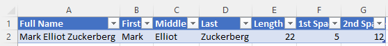

In cell A1 we have Mark's full name, but we want to break it out into first, middle, and last names. We will have to parse the full name to do that.  

*Parse* means splitting, dividing, or processing portions of one string into other strings or converting to a different data type. We want to split Mark's full name into three other strings. 

To do that, we'll use the following Excel functions:

* Left: returns the beginning characters of a string
* Mid: returns the middle characters of a string
* Right: returns the ending characters of a string

The LEFT function formula is as follows:

`left(text, [ num_chars ])`
* text: the cell, or text, that you want to capture data from
* num_chars: the number of characters to capture. All characters will be returned if this is omitted.

Cell B2 (First) contains the formula `LEFT(A2,4)` and returns the string 'Mark.'

The MID function formula is as follows:

`mid(text, start_num, num_chars)`
* text: the cell, or text, that you want to capture data from
* start_num: the starting position/index in the string to start
* num_chars: the number of characters to capture. All characters from start_num to end of the string will be returned if omitted.

Cell C2 (Middle) contains the formula `MID(A2,6,6)` and returns the string 'Elliot.'

The RIGHT function formula is as follows:

`right(text, [ num_chars ])`
* text: the cell, or text, that you want to capture data from
* num_chars: the number of characters to capture. All characters will be returned if this is omitted.

Cell D2 (Last) contains the formula `RIGHT(A2,10)` and returns the string 'Zuckerberg.'  

### Using num_char

Wherever you need num_chars in your formula, you will need to count the # of characters in the string. 

You can count the characters yourself in the Zuckerberg example because it is a single value, but the lengths can change if you are processing a list of strings. In the following examples, you may need to count the length of the string and identify where the spaces are located within the string.

Excel provides functions to help:

* LEN: returns the length of a string of text
* FIND: finds a string of text, if it exists, within another string

The LEN function formula is as follows:
`len(text)`
* text: the cell, or text, that you want to measure

Cell E2(Length) contains the formula `LEN(A2)` and returns 22, the length of Full Name.

The FIND function formula is as follows:
`find(find_text, within_text, [start_num])`

* find_text: the text string you are searching for
* within_text: the cell, or text, that you want to search
* [start_num]: the starting position to begin the search. If omitted, the search will start from the beginning. You need to specify start_num if you wish to search later in the string (such as the2nd or 3rd occurrence).

Cell F2 (1st Space) contains the formula `FIND(" ",A2)` and returns 5, where the first space occurs in the full name. Since the first name is four characters long, that's position 5.

Cell G2 (2nd Space) contains the formula `FIND(" ",A2,F2+1)`. This formula returns 12, the location of the 2nd space, between middle name and last name. This one is a little more complicated because we had to specify where the search starts. 

Note: the start_num specified is one more than the location of the first space. You'll need to add 1 to get past that first occurrence. If we specified F2, we'd get the same result as in cell F2 because the start_num character is included in the search. 

Keep in mind that this example focused on one string in one cell. All the formulas in this section can be combined to produce dynamic results in more complicated data sets.

## Conditional Formatting

It's sometimes important to highlight significant findings from your analysis when presenting data to others. Excel provides a feature called *Conditional Formatting* to highlight cells, or groups of cells, within your table or worksheet, based on conditions you specify.  

The following examples will walk you through the basics of conditional formatting.

Open the [top-sales-2021](assets/files/top-sales-2021.xlsx) spreadsheet.

* This table represents sales figures for ten fictional salespeople. 
* We have the salesperson's name, US Region (West, Midwest, South, and Northeast), 4 Quarter columns, and an overall total.

Take a minute to review the data: 

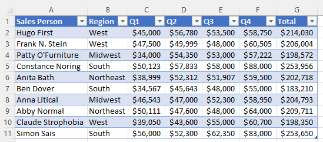 

Notice that all four regions are represented, and each salesperson's quarterly sales are relatively within a reasonable range of one another.

We'll review four scenarios and the steps to add conditional formatting to our spreadsheet.

### Scenario 1: Highlight the sales totals that are greater than $250k

1. Select range G2:G11, the data in the Total column
1. In the Home Tab, under the Styles group, click Conditional Formatting
1. Select Highlight Cells Rules, then Greater Than
1. In the Greater Than window, enter Value 250,000 and click OK
     * Two Cells should be highlighted in Red

Once you're done with this format, you can discard it using Clear Rules:

1. Select the total range if it isn't already selected
1. Under Conditional Formatting, select Clear Rules
1. Select Clear Rules from Selected Cells

Note: There are also options to clear rules from an entire table or sheet.  

### Scenario 2: Highlight the Sales Totals That Are Above the Average

1. Select Range G2:G11.
1. In the Home Tab, under the Styles group, click Conditional Formatting
1. Select Top/Bottom Rules, Above Average.
1. In the Above Average window, change the formatting color:  Green Fill with Dark Green Text
1. Click OK.
     * Three cells should be highlighted.

### Scenario 3: Find the Quarterly Sales Amounts That Are Odd Numbers

1. Clear Rules
1. Select Range: C2:F11, the data in the quarterly columns
1. In the Home Tab, under the Styles group, click Conditional Formatting 1. 1. Select New Rule
1. In the New Formatting Rule window, under Select Rule Type, select *Use a formula to determine which cells to format*
1. Under Edit the Rule Description, in the Format values where this formula is true: box, type `=ISODD(C2)`  
     * B2 is the upper-left cell in the range. Always select the upper-left value as Excel will copy the format formula to the other cells
1. Click OK. (Nothing changed. Why? We must have made a mistake!)
1. Keep your range highlighted
1. Under Conditional Formatting, select Manage Rules
     * You should see your rule formula
1. Click it and select the Edit Rule button
     * Notice that the Preview box shows "No Format Set" 
1. Click the Format button
1. In the Format Cells box, click the Fill Tab 
1. Select a background color of your choice and click OK
1. In the Edit Formatting Rule window, click OK
1. In the Conditional Formatting Rules Manager window, click OK
     * All odd values should now be highlighted

### Scenario 4: Highlight All Rows For a Region

1. Clear Rules
1. Select Range: A2:G11, the whole table minus headers.
1. In the Home Tab, under the Styles group, click Conditional Formatting 1. 1. Select New Rule
1. Select Rule Type:  Use a formula to determine which cells to format.
1. In the Format values where this formula is true, type `=$B2="South"`
1. Click the Format button.
1. In the Format Cells box, click the Fill Tab.
1. Select a background color of your choice and click OK.
1. In the New Formatting Rule window, click OK.
     * three rows should be highlighted

## Perform Multiple Calculations Using Array Formulas

Calculations are typically done within a cell and, potentially, copied to other cells to repeat the formula for data in other rows. Excel also provides ARRAY FORMULAS to do calculations on ranges of data.  

An *Array* is simply a collection of values. An array structure is commonly represented by the group encapsulated in the open and closed curly brackets, {}. You'll see these in the examples in the lesson.

We'll provide four scenarios to learn the basics of array calculations by applying them to sheets within the [array-formulas](assets/files/array-formulas.xlsx) spreadsheet.

### Scenario 1: Multi-Cell Array Formula

See the multi-cell array formula sheet, which contains a basic invoice example. Invoices typically include:
* header: information that occurs only once (Invoice #, Customer, and Invoice Total)
* detail: information that repeats (typically an invoice contains line items such as item/product, quantity, and price)

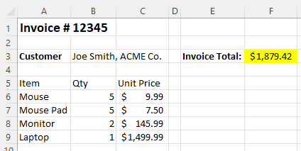

Some invoices will include a line item total for each line item, but this sheet does not. We want to calculate the *Invoice Total* as the sum of the respective item quantities multiplied by their price.

Look at the formula inside cell F3, the invoice total:
`=SUM(B6:B9*C6:C9)`

The SUM function is not new. It's one of the most common Excel functions. However, rather than summing one range of cells, we multiply one range against another. These ranges are, essentially, arrays. 

Since there is precisely the same number of values in each range, Excel will match them up one-for-one in a top-down fashion. So, the mouse quantity and unit price are multiplied, then the mouse pad, etc. Each line item's product is calculated and summed with the others, resulting in a grand Invoice Total.

This is one specific example of an array function used in a calculation, but this same approach could be used in various calculations.

### Scenario 2: Dynamic Array

*Dynamic Arrays* are arrays generated from a single function but fill a desired range.

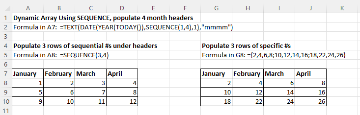 

There are two tables of data in rows seven through 10. There are four columns, one for each of the first three months of a year.  

#### Headers
These headers are generated by the formula:
`=TEXT(DATE(YEAR(TODAY()),SEQUENCE(1,4),1),"mmmm")`

Explanation:
`DATE(YEAR(TODAY()),SEQUENCE(1,4),1)`produces a four-cell range of the first day of each month of the current year. It is used as the first parameter of the TEXT function. Feel free to type it into a cell of its own and see the results for yourself.
* Text: formats values with format codes. This function accepts two arguments, value and format_text. In this case:
     * value: the results of the DATE function above
     * format_text: provides the full month names of the dates returned from the DATE function (mmmm)

This TEXT formula produces the Month headers for each of the two tables in our example.  

#### Rows

The rows are generated in two different ways:
`=SEQUENCE(3,4)` generates a three-row-by-four-column table, starting at one and incrementing by one. As you can see, this results in the given rows starting in cell A8.
`={2,4,6,8;10,12,14,16;18,22,24,26}` is a multi-dimensional array.  Commas separate the individual numbers for the cells, and the semicolon denotes the rows. You can see the results of this function in cell G8.

### Scenario 3: Count Letters

Array functions can be used to accumulate results of a range of cells. In this case, we want to count the total letters in a phrase split into cells, one word per cell. This is similar to what we saw in the Invoice example. 

"To be or not to be? That is the question." is a quote we are likely all familiar with. You can use the LEN function to determine how long a string is, but in this case, we need the sum of the lengths of 10 different cells. 

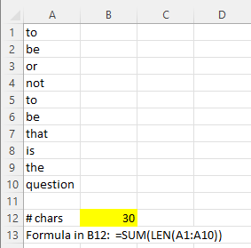

In range A1:A10, the phrase is split one word per cell. Yes, you could use the LEN function 10 times, once per row, then sum the results. We can simplify this into a straightforward array function:
`=SUM(LEN(A1:A10))`

You may notice the absence of curly brackets. In later versions of Excel, they are sometimes omitted. It's important to note that, when necessary, the curly brackets can be added with CNTL + SHIFT + ENTER (CSE). In this example, they are not required.

### Scenario 4:  Array Formula & Search/Count

In this example, we'll review how to use an array formula to count results from a survey. 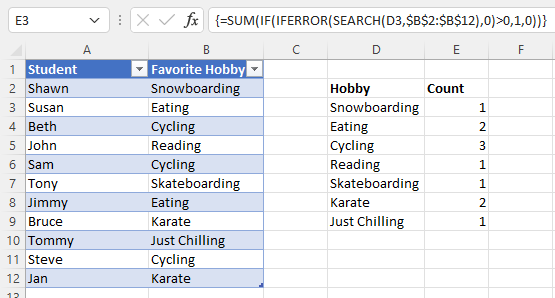 This is a simple hobbies survey where we have 11 responses to the question "What's your favorite hobby?". 

In cells A1:B12, we have a table of students and their responses. We'd like to count up the Hobby/Count table results on the right. To do this, we've identified the unique hobbies in column D and entered a formula in column E.  Here's the formula in cell E3:
`{=SUM(IF(IFERROR(SEARCH(D3,$B$2:$B$12),0)>0,1,0))}`

Note: The curly brackets are added by Excel after entering the base formula with CSE. The formula is then copied into all the remaining cells, and the reference to cell D3 is automatically adjusted for the appropriate row.

Let's break down this formula:
* Sum: the basic sum function will sum the responses for the respective hobby.
* If: the basic if function, which takes three arguments. It evaluates the IFERROR function return value and returns a one, if true, and 0, if false.
* IfError: encapsulates the SEARCH function to handle any errors and returns a 0 if an error occurs.
* Search: very similar to the FIND function; searches for a value (cell D3) over a range ($B$2:$B$12 - the range of hobby responses) and returns one if the value is found.

When you combine these nested functions, each count result searches the range for the hobby in question and sums the count over the range.

## Conclusion

In this lesson, we learned how to use Excel to organize, analyze and format data within an Excel spreadsheet. This lesson only scratches the surface of the vast power of Excel functions and formatting. Still, you should now be better equipped to use many advanced functions and formatting in Excel the next time you're asked to produce reports, charts, etc., that will help your leaders make effective business decisions.
