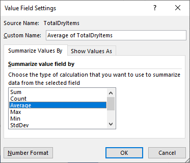

# Lesson: Creating Pivot Tables

## Introduction

When looking at data, some of the things we first look at involve the number of rows and the number of columns. Then, we may review the number of observations for each column. We may try to understand our numeric columns quantitatively and see a categorical distribution for qualitative data. In this lesson, we will look at a feature in Excel known as a pivot table used to display aggregated values for quantitative data and categorical breakdowns for qualitative data.

## Learning Outcomes

By the end of this lesson, you will be able to:

1. Explain the purposes of a pivot table.
1. Create a pivot table to show aggregated values.
1. Use a pivot table to show categorical calculations.
1. Change data from a long and skinny format to a short and wide format.

## Getting Started

This lesson is going to use data from WideWorldImporters. We are working with the Sales Invoices data for pivot tables.

To follow along:

1. Create a new Excel workbook.
1. Switch to the Data ribbon.
1. In the Get & Transform Data section, select Get Data
1. Select From Database
1. Select From SQL Server Database
1. In the Server textbox, enter the name of your server. This is localhost if you are running SQL Server on your local machine.
1. In the Database textbox, enter WideWorldImporters (optional). If you do not enter it, you will be presented with a list of all databases on localhost.
1. Expand the Advanced options to see what is listed. The "Include relationship columns" checkbox should be checked.
1. Click OK
1. If you are prompted with a SQL Server Database window, you may need to work with your instructor to determine how best to authenticate to your local SQL Server instance.
1. In the Navigator dialog, check "Select multiple items." Then select the following tables:
    * Sales.Customers
    * Sales.Invoices
    * Sales.InvoiceLines
1. Click Load

Note: Once loaded, you will see the "Queries & Connections" pane to the right, with all three tables selected listed. If you wanted to load the data from these three tables as sheets in your workbook, you would click the dropdown arrow by the load button rather than the load button itself. This lesson assumes we are utilizing the queries only, but you can load the data into sheets and create queries if you like.

## Merging Queries

There are inherent relationships between the three tables we use, as we saw in the "Connecting Tables with JOINs" lesson from the Relational Data module.

We loaded three tables' data:  Customers, Invoices, InvoiceLines. If you analyzed these tables and associated fields, you would see:
a customer can have an invoice or multiple invoices, and
each invoice will have, likely, multiple invoice lines.

These relationships are identified by a Foreign Key to Primary Key relationship in SQL. Excel can merge data between tables, nearly identical to a SQL JOIN.

Here's a visual representation of this relationship:

If you were working with "dirty data," you may need to merge data from different files/sources. You could merge the data using Get & Transform if you had two CSV files. Select Combine Queries and Merge from the Get Data drop-down menu. Your instructor can walk you through this if it's of interest.

## The Purpose of Pivot Tables

A **pivot table** is a table used to take long data - read from top-down - to wide format - read from left to right. Consider the following long table, read from the top down.

With a pivot table, we can flip the table to see the years side-by-side in a horizontal orientation. This is that same table data in wide form, read from left to right.

Pivot tables are used in viewing summarized values for various groupings - such as chronological data grouped by year, quarter, month, and date.   They can be used to show counts of categorical data. Pivot tables can be used when investigating correlation and other relationships across multiple columns.

## Creating a Pivot Table

To create a new pivot table:

1. In Excel, make sure you are on the Insert ribbon
1. Click the arrow under PivotTable
1. Select From Data Model - This will allow data access in all three previously loaded tables.
1. Specify where to create the new pivot table. We are going with New Worksheet.
1. Click OK

This will create a new worksheet with a blank pivot table.

Suppose we want to see the number of dry items versus the number of chiller items sold over the years. We can use a pivot table to show the sums of the dry and chiller items and group them by year.

1. Click on the new pivot table we just created to ensure that it is selected
1. Drag the field name "InvoiceDate" from Sales.Invoices in the PivotTable Fields list to the Rows section at the bottom of the PivotTable Fields pane
1. Right-click on the "TotalDryItems" field from Sales.Invoices in the PivotTable Fields list
1. Click Add to Values

You can choose to drag fields down to the box or right-click the fields and send them to their respective sections - filters, row labels, column labels, and values.

Knowing this, add the "TotalChillerItems" from Sales.Invoices to the Values section.

Your table will look like this:

|Row Labels|Sum of TotalDryItems|Sum of TotalChillerItems|
|--- |--- |--- |
|2013|60968|0|
|2014|65941|0|
|2015|71898|0|
|2016|28422|1036|

This pivot table shows us that chiller items were added in 2016, with total dry items increasing over the years and a much smaller number in 2016. We do not have a full year's worth of data in 2016 to compare against 2013, 2014, or 2015.

### Drilling Through Date Data

We used a date field in our pivot table (when we dragged Invoice Date to the Rows section). So, it included the breakdowns for year, quarter, month, and date. Our pivot table shows us the yearly summary. However, next to the years, there is a button with a plus sign. We can use that to navigate deeper into our date groupings. You may hear the phrase "drill through" or "drill down ."Think of going through a large category and navigating to a smaller subset of that category whenever you hear these phrases.

If you click the plus sign next to 2016, this will drill down to the quarter breakdown for 2016. We can see that we have the first two quarters of data for 2016 and that the first quarter sold more total items.

<table>
    <thead>
        <tr>
            <th>Row Labels</th>
            <th>Sum of TotalDryItems</th>
            <th>Sum of TotalChillerItems</th>
        </tr>
    </thead>
    <tbody>
        <tr>
            <td>2016 
            &nbsp;&nbsp;&nbsp;&nbsp;&nbsp;Qtr1</td>
            <td> 16589</td>
            <td> 595</td>
        </tr>
        <tr>
            <td>&nbsp;&nbsp;&nbsp;&nbsp;&nbsp;Qtr2</td>
            <td>11833</td>
            <td>441</td>
        </tr>
    </tbody>
</table>

We could drill further down into the month and then even further into the invoice date to see how the dry items and chiller items counts differ for each of those groupings.

### Filters Section

Adding fields to the Filters section allows you to filter your pivot table on them by selecting values from the filter that appears above the table.

1. Within the PivotTable Fields pane, under Sales.Customers, right-click on the CustomerName field
1. Click on Add to Report Filter

Notice that this moves "CustomerName" to the Filters section and adds a dropdown above the pivot table to allow filtering. Since you are filtering the values, the report will aggregate based on the selected filters.

Suppose we want to see all Tailspin Toys' dry and chiller items in the pivot table.

1. In the CustomerName filter, click the dropdown to see the options
1. Check Select Multiple Items
1. In the search box which shows "Search CustomerName," type Tailspin Toys (This will filter the customer names to show only those that contain "Tailspin Toys.")
1. Check All to add all Tailspin Toys to the filtered 

Here are the Tailspin Toys' numbers for 2016:

<table>
    <thead>
        <tr>
            <th>Row Labels</th>
            <th>Sum of TotalDryItems</th>
            <th>Sum of TotalChillerItems</th>
        </tr>
    </thead>
    <tbody>
        <tr>
            <td>2016 
            &nbsp;&nbsp;&nbsp;&nbsp;&nbsp;Qtr1</td>
            <td> 5158</td>
            <td> 178</td>
        </tr>
        <tr>
            <td>&nbsp;&nbsp;&nbsp;&nbsp;&nbsp;Qtr2</td>
            <td>3576</td>
            <td>141</td>
        </tr>
    </tbody>
</table>

### Changing the Aggregate Value

When you drag fields down to the Values section, Excel will automatically assign the values to be aggregated via the SUM. To change the aggregate to another function:

1. Click the down arrow next to the value in the Values section
1. Select Value Field Settings
1. In the Value Field Settings dialog, select Average

    

1. Click OK

## Flipping Data to Wide

Now that we have a comparison in place, we may consider flipping how our data appears from long and skinny - which is more noticeable if you drill down to the invoice date - to short and wide. Pivot tables make it easy to pivot or rotate our data.

1. Move the "InvoiceDate" fields from Rows to Columns. 
1. Move the summarized Values from Columns to Rows.

Since this can get unwieldy and require a lot of scrolling, our example is only moving the "InvoiceDate (Year)" field and removing the Quarter, Month, and InvoiceDate fields.

The table of dry items and chiller items for Tailspin Toys' accounts will now look something like this:

|Values|2013|2014|2015|2016|GrandTotal|
|--- |--- |--- |--- |--- |--- |
|Sum of TotalChillerItems|0|0|0|319|319|
|Sum of TotalDryItems|20203|20845|22148|8734|71930|

So our pivot tables can contain long, skinny, short, wide data and can be rotated to the other presentation orientation if needed.

## Using Slicers

We can also use a feature of Excel known as slicers. A slicer allows us to filter our data in our reports. We can create a slicer with a single field or multiple fields. 

Suppose we filter by customer name and see slices based on their delivery postal codes, as some customers may have deliveries sent to multiple postal codes.

To add a Slicer:

1. Select your pivot table
1. Switch to the Insert ribbon
1. In the Filters section, click Slicer
1. Check "DeliveryPostalCode" on Sales.Customer so that we can select slices on the delivery postal code.
1. Click OK

To filter your pivot table, select a postal code in the slicer. Use `Ctrl+Click` to select multiple postal codes.

## Conclusion

When looking at data, some of the things we first look at involve the number of rows and the number of columns. Then, we may look at the number of observations for each column. Finally, we may try to understand our numeric columns quantitatively. Pivot tables allow us to present and aggregate data in various ways, in wide and long table formats.
