# Crowdfunding Campaign Analysis Project

## Background
Welcome to the Crowdfunding Campaign Analysis Project! In the past decade, crowdfunding platforms like Kickstarter and Indiegogo have revolutionized the way ideas get funded, enabling everyone from independent creators to famous celebrities to turn their visions into reality. The surge in popularity of these platforms has led to an incredibly diverse array of projects seeking funding, ranging from innovative tech products to unique artistic endeavors.

However, the path to crowdfunding success is not straightforward. While some projects soar past their funding goals, others struggle to gain traction. Understanding what contributes to a project's success or failure in such a dynamic and competitive environment is crucial, especially for organizations and individuals looking to launch their own crowdfunding campaigns.

This project focuses on dissecting and analyzing a database of 1,000 sample projects from these crowdfunding platforms. Our objective is to delve deep into this dataset to unearth hidden trends, patterns, and insights that can demystify the elements of successful crowdfunding campaigns. By meticulously organizing and scrutinizing various aspects of these projects — such as funding goals, campaign duration, project categories, and backer count — we aim to uncover potential strategies or commonalities that can be the key to success. Let's dive into the data and discover what it takes to turn a crowdfunding dream into a reality!
## Table of Contents
1. [Objective](#objective)
2. [Data](#data)
3. [Data Preparation and Visualization](#data-preparation-and-visualization)
4. [Crowdfunding Goal Analysis](#crowdfunding-goal-analysis)
5. [Statistical Analysis](#statistical-analysis)
6. [Crowdfunding Campaign Insights](#crowdfunding-campaign-insights)

## Objective
In this analysis, we aim to answer the following key questions:

1. Given, the provided data, what are three conclusions that we can draw about crowdfunding campaigns?

2. What are some limitations of this dataset?

3. What are some other possible tables and/or graphs that we could create, and what additional value would they provide?

4. Does the mean or the median provide a better summary of the data when assessing the number of campaign backers?

5. Is there more variability in the number of backers among successful or unsuccessful campaigns, and what might this indicate about the nature of crowdfunding success?

The subsequent sections will explore the data to provide insights into the questions. 

## Data
This project utilizes a specially curated dataset titled `CrowdfundingBook.xlsx`, provided by edX Boot Camps LLC. The dataset is designed for educational purposes, offering a unique opportunity to explore the dynamics of crowdfunding campaigns. A brief description of each column is provided in the table below: 
| Column Name             | Description |
|-------------------------|-------------|
| `id`                    | A unique identifier for each entry in the dataset. |
| `name`                  | The name of the project or entity associated with the crowdfunding campaign. |
| `blurb`                 | A brief description or summary of the project or campaign. |
| `goal`                  | The financial goal set for the crowdfunding campaign. |
| `pledged`               | The amount of money that has been pledged to the campaign. |
| `outcome`               | The status of the campaign, indicating whether it was successful, failed, etc. |
| `backers_count`         | The number of backers who have supported the campaign. |
| `country`               | The country where the campaign originated. |
| `currency`              | The type of currency in which the campaign's financial goal and pledges are denominated. |
| `launched_at`           | The timestamp for when the campaign was launched. |
| `deadline`              | The deadline or end date for the campaign. |
| `staff_pick`            | A Boolean value indicating whether the campaign was featured as a staff pick. |
| `spotlight`             | A Boolean value indicating whether the campaign was highlighted in a spotlight feature. |
| `category & sub-category` | The main category and sub-category classification of the campaign. |
## Data Preparation and Visualization 
For the first part of our analysis, we will apply conditional formatting to the `outcome` column. This process will visually differentiate each campaign based on its status - whether it's live, successful, failed, or canceled. Here's how to execute this:

1. **Selecting the Column**: First, select all of column F, where the campaign outcomes are listed.

2. **Accessing Conditional Formatting**: Navigate to the Home ribbon in Excel and click on `Conditional Formatting`. From there, choose `New Rule` and select the `Classic` style for the formatting.

3. **Creating Specific Rules**: We will set up four distinct rules under the `Format only cells that contain` option, each targeting `Specific Text` containing certain keywords. The rules are as follows:

	* **Live Campaigns**: Cells that contain the word `live` will be formatted with a light blue background and dark blue text. This color scheme is indicative of ongoing or active campaigns.

	* **Successful Campaigns**: For cells containing `successful`, a light green background with dark green text will be applied. This represents the accomplishment of the campaign goals.

	* **Failed Campaigns**: Cells marked `failed` will be highlighted with a light red background and dark red text. This coloring denotes that the campaign did not achieve its intended targets.

	* **Canceled Campaigns**: For campaigns labeled as `canceled`, a light yellow background with dark yellow text will be used. This highlights campaigns that have been discontinued or aborted.


Next, we will create a new column called `Percent Funded` to the left of the outcome column that uses a formula to find out how much money a campaign made relative to its initial funding goal. The formula to be used is as follows:
```excel
=E2/D2*100
```
Ensure the column is formatted as a Number with no decimal places. Then we will use conditional formatting to fill each cell in the Percent Funded column according to a three-color scale. The scale should start at 0 with a dark shade of red, and it should transition to green at 100 and blue at 200. 


Now, let's create a new column called `Average Donation` that uses a formula to find how much each project backer paid on average. The formula to be applied is as follows:
```excel
=E3/H3
```
Format the column as a Number with two decimal places and modify cell I1 to 0 to prevent errors in the formula, as division by zero is not permissible.

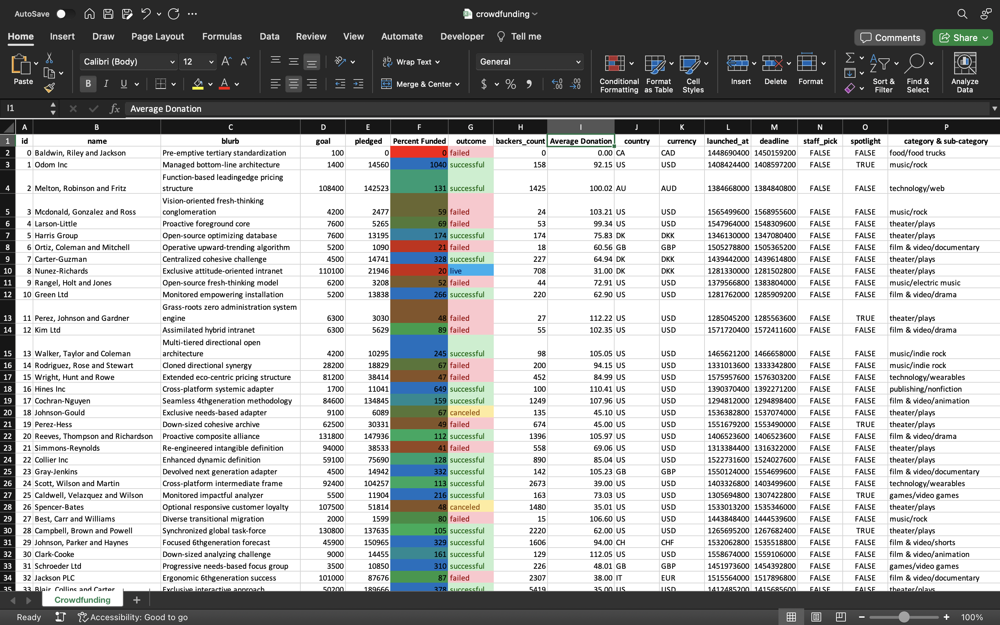

Then, create two new columns, one called `Parent Category` and another called `Sub-Category`, that uses formulas to split the `Category and Sub-Category` column into the two new, separate columns. The formula for Parent Category is as follows: 
```excel 
=LEFT(P2,SEARCH("/",P2)-1)
```
For Sub-Category, use this formula: 
```excel
=RIGHT(P2,LEN(P2)-SEARCH("/",P2))
```

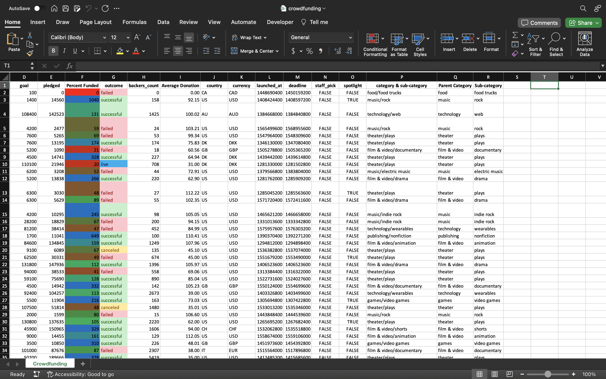

Now, let's create a new worksheet named `Category` and insert a pivot table to analyze the initial worksheet. This pivot table will quantify the number of campaigns that were successful, failed, canceled, or are currently live, categorized by **category**. Begin by selecting any cell within the Crowdfunding worksheet, then navigate to the Insert tab and select Pivot Table. Add this pivot table to the `Category` worksheet. Subsequently, drag `Parent Category` to the rows, `outcome` to the columns and values section, and `country` to the filter section.

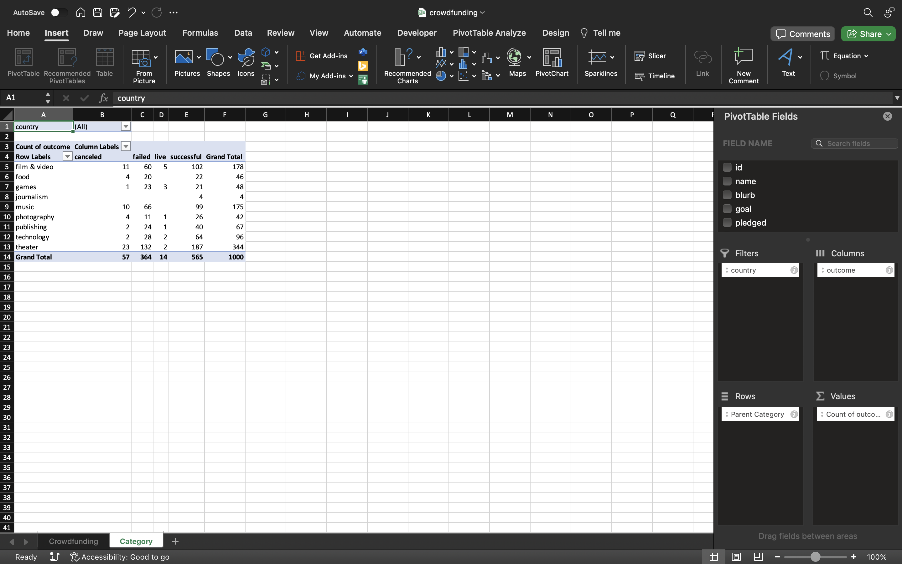

Then, create a stacked-column pivot chart with a country filter, based on the table we have created. Begin by selecting any cell within the pivot table. Then, navigate to the `Insert` tab and select `PivotChart`. After inserting the chart, change the chart type to a stacked-column chart


Next, lets create a new worksheet titled `Sub-Category` with a pivot table that analyzes the initial worksheet to count how many campaigns were successful, failed, or canceled, or are currently live per **sub-category**. Insert a new Pivot Table on the Sub-Category worksheet and drag `Sub-category` to the rows, `outcome` to the columns and values section, and `country` and `Parent Category` to the filter section. 

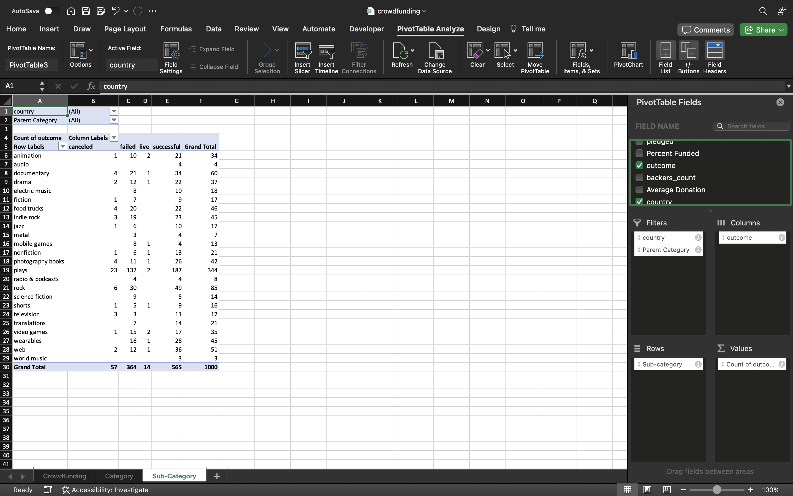

Then, create a stacked-column pivot chart that can be filtered by country and parent category, based on the table we have created. Begin by selecting any cell within the pivot table. Then, navigate to the `Insert` tab and select `PivotChart`. After inserting the chart, change the chart type to a stacked-column chart

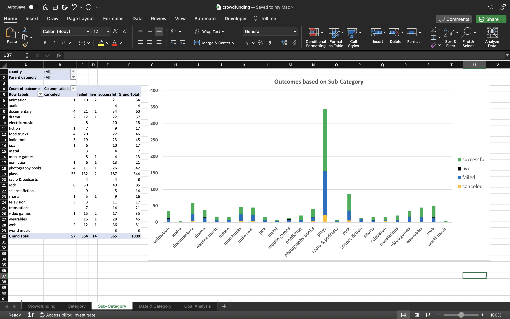

The dates in the `deadline` and `launched_at` columns use Unix timestamps. Fortunately for us, <a href="https://www.extendoffice.com/documents/excel/2473-excel-timestamp-to-date.html" target="_blank">this formula</a> can be used to convert these timestamps to a normal date.
* Create a new column named `Date Created Conversion` next to the `deadline` column on the `Crowdfunding` worksheet. Then covert the data contained in `lanched_at` into Excel's date format by using the following formula: 
```excel
=(((L2/60)/60)/24)+DATE(1970,1,1)
```
* Create a new column named `Date Ended Conversion` next to the `Date Created Conversion` column that converts the data contained in `deadline` into Excel's date format by using the following formula: 
```excel
=(((M2/60)/60)/24)+DATE(1970,1,1)
```
Then, create a new sheet titled `Date & Category` with a pivot table that has a column of `outcome`, rows of `Date Created Conversion`, values based on the count of `outcome`, and filters based on `Parent category` and `Years`. 

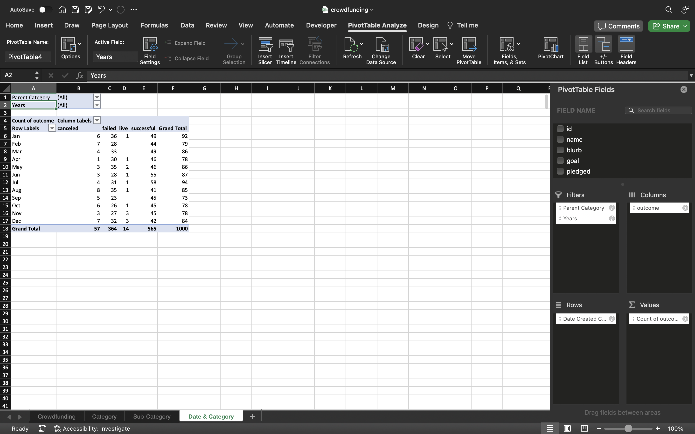

Now, create a pivot-chart line graph that visualizes this new table. Select any cell with the pivot table. Then navigate to the `Insert` tab and select `PivotChart`. After inserting the chart, change the chart type to a `2-D Line`. 

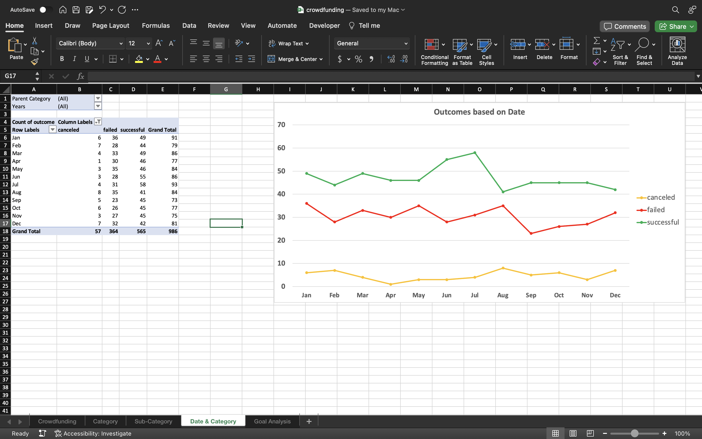
## Crowdfunding Goal Analysis 
Create a new sheet titled `Goal Analysis` with 8 columns:
* `Goal`
* `Number Successful`
* `Number Failed`
* `Number Canceled`
* `Total Projects`
* `Percentage Successful`
* `Percentage Failed`
* `Percentage Canceled`

In the `Goal` column, create 12 rows with the following headers:
* Less than 1000
* 1000 to 4999
* 5000 to 9999
* 10000 to 14999
* 15000 to 19999
* 20000 to 24999
* 25000 to 29999
* 30000 to 34999
* 35000 to 39999
* 40000 to 44999
* 45000 to 49999
* Greater than or equal to 50000

Using the `COUNTIFS()` formula, we will count how many successful, failed, and canceled projects were created with goals within the ranges listed above. We will populate the `Number Successful`, `Number Failed`, and `Number Canceled` columns with these data points.

Then, we are going to add up each of the values in the `Number Successful`, `Number Failed`, and `Number Canceled` columns to populate the `Total Projects` column. Then, using a mathematical formula, we will find the percentage of projects that were successful, failed, or canceled per goal range. 

Next, we will create a line chart that graphs the relationship between  a goal amount and its chances of success, failure, or cancellation. 


## Statistical Analysis
Most people would use the number of campaign backers to assess the success of a crowdfunding campaign. Creating a summary statistics table is one of the most efficient ways that data scientists can characterize quantitative metrics, such as the number of campaign backers.

For gaining an in-depth understanding of campaign backers, we are going to evaluate the number of backers of successful and unsuccessful campaigns by creating **our own** summary statistics table.

First start by creating a new worksheet titled `Statistical Analysis`, and then proceed to create the following columns starting at Column H: `Outcome`, `backers_count`, `Z-score successful_backers_count`, `Probability_distribution` for successful campaigns, and repeat these columns for unsuccessful campaigns as `Outcome`, `backers_count`, `Z-score failed_backers_count`, `Probability_distribution`.

To capture all instances of `successful` outcomes in Column H, we will implement the following formula:
```excel
=FILTER(Crowdfunding!G:G, Crowdfunding!G:G="successful")
```
We will now apply this formula to obtain the `backers_count`:
```excel
=FILTER(Crowdfunding!H:H, Crowdfunding!G:G="successful")
```
Next, we will use the same formula for `failed` outcomes, modifying only the last word in the formula. 

We will then commence the construction of our summary statistics table in Column A. Create three new columns:
* `Statistics`
* `Successful`
* `Failed` 

Then, create 6 rows with the following headings:
* `Mean`
* `Median`
* `Minimum`
* `Maximum`
* `Variance`
* `Standard Deviation`

After creating the six rows with the specified headings, the next step is to compute the respective statistical measures for our dataset using Excel formulas. Below are the Excel formulas that can be used for each heading under the `Successful` column:
1. **Mean**:
```excel
=AVERAGE(I:I)
```
2. **Median**:
```excel
=MEDIAN(I:I)
```
3. **Minimum**:
```excel
=MIN(I:I)
```
4. **Maximum**
```excel
=MAX(I:I)
```
5. **Variance**:
```excel
=VAR(I:I)
```
6. **Standard Deviation**:
```excel
=STDEV(I:I)
```

After computing the statistical measures for the `Successful` column as detailed above, you can apply the same Excel formulas to the `Unsuccessful` column. Simply replace the column reference in each formula with the column that corresponds to the `Failed` data.


Now, that our summary statistics table is ready, we can proceed to populate the values for the Z-score and probability distribution for both successful and unsuccessful outcomes. To calculate the `Z-score successful_backers_count`, we use the following formula in Excel:
```excel
=STANDARDIZE(I2,$B$7,$B$12)
```
For computing the `probability_distribution`, the formula is:
```excel
=NORM.S.DIST(J2,TRUE)
```
Next, we'll extend these formulas down the column to apply them to all relevant data points. The same process will be repeated for the unsuccessful data, with the only modification being the change in column references to align with the unsuccessful data.

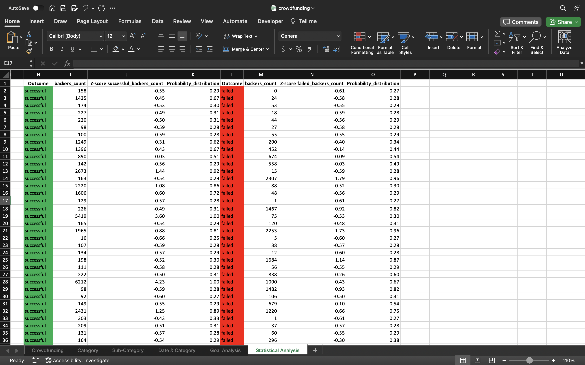

Now, let's create a `Summary by Mean` table for understanding the distribution of our data, particularly to identify the central tendency and to highlight any potential outliers that may impact the overall analysis. To construct this table in Excel, starting from cell A18, we will outline the following row headings: `Mean + 1SD:`, `Mean`, `Mean - 1SD:`, `Z-SCORE < -2.68 (lower outlier):`, and `Z-SCORE > 2.68 (upper outlier):`. For the `Mean + 1SD:` value in the successful column, the formula is straightforward:
```excel
=B7+12
```
We can use a cell reference to B7 to populate the `Mean` value for the successful outcomes. To determine the `Mean - 1SD:`, simply subtract the standard deviation from the mean:
```excel
=B7-B12
```
To count the instances where the Z-score is less than -2.68, indicating significantly lower data points than the mean, we use:
```excel
=COUNTIF(J:J, "<-2.68")
```
Conversely, to tally the occurrences of a Z-score greater than 2.68, which points to significantly higher data points, then formula is:
```excel
=COUNTIF(J:J, ">2.68")
```
We will apply the same set of formulas to the `Unsuccessful` column, adjusting the cell references accordingly to reflect the data specific to the unsuccessful outcomes. 

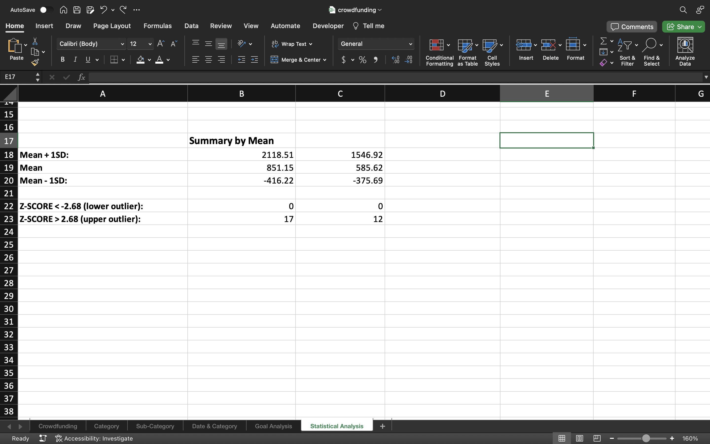

Now, let's create another table titled `Summary by Median` that calculates the quartiles, interquartile range (IQR), and identifies potential outliers using the IQR method. Start by labeling 6 row headings: `First Quartile`, `Second Quartile`, `Third Quartile`, `Interquartile Range`, `Q1 - (1.5 * IQR) lower boundary`, and `Q3 + (1.5 * IQR) upper boundary`. First we will calculate the first quartile of the data located in column I. To calculate the `First Quartile` in the successful column, we will apply the following formula:
```excel
=QUARTILE.EXC(I:I,1)
```
Now, we will calculate the median of the data in column I. For the `Second Quartile` use:
```excel
=QUARTILE.EXC(I:I,2)
```
Then, we will find the third quartile value for the data in column I. For `Third Quartile` input:
```excel
=QUARTILE.EXC(I:I,3)
```
Next, we will find the interquartile range by taking the difference between the third and first quartile. To calculate the `Interquartile Range` apply:
```excel
=B37-B35
```
Let's find the lower boundary beyond which data points could be considered outliers. To find the `Q1 - (1.5 * IQR) lower boundary` use:
```excel
=B35-(1.5*B38)
```
Then, we will find the upper boundary beyond which data points may be outliers. To find the `Q3 + (1.5 * IQR) upper boundary` use:
```excel
=B37+(1.5*B38)
```
Repeat the same process for the unsuccessful column, ensuring that you adjust the cell references accordingly. 

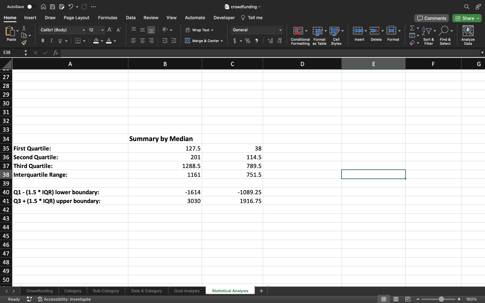

To visually represent the data we have compiled, we'll proceed to create eight charts on the `Statistical Analysis` worksheet. The initial two charts will display the average number of backers for both successful and unsuccessful outcomes, alongside the median. These will be illustrated using a 2D column chart:

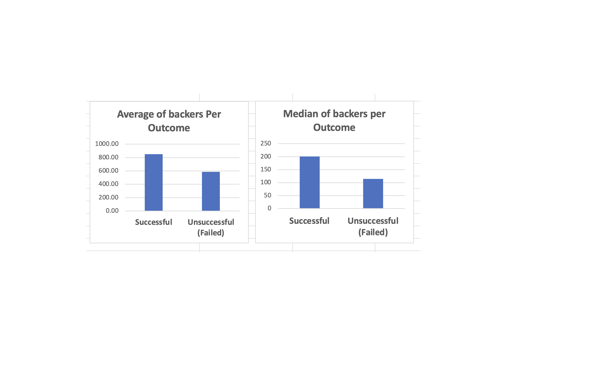

Next, we will construct two histogram charts. The first will depict the distribution of the original backers_count data for successful outcomes, and the second will illustrate the probability distribution of the successful backers_count:

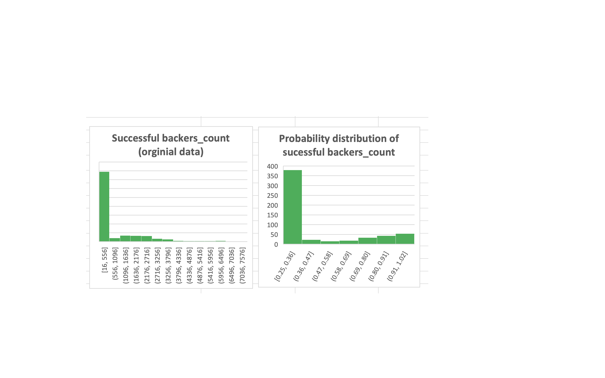

Now, we will construct two more histogram charts but for the unsuccessful outcomes:

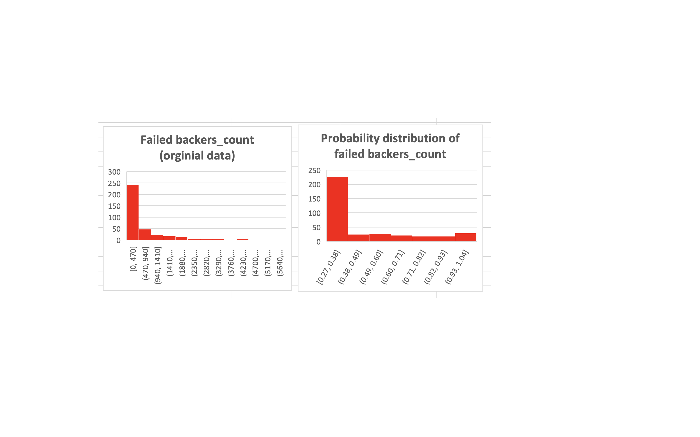

Finally, we will generate two box and whisker charts to visually identify any outliers within both the successful and unsuccessful outcomes:

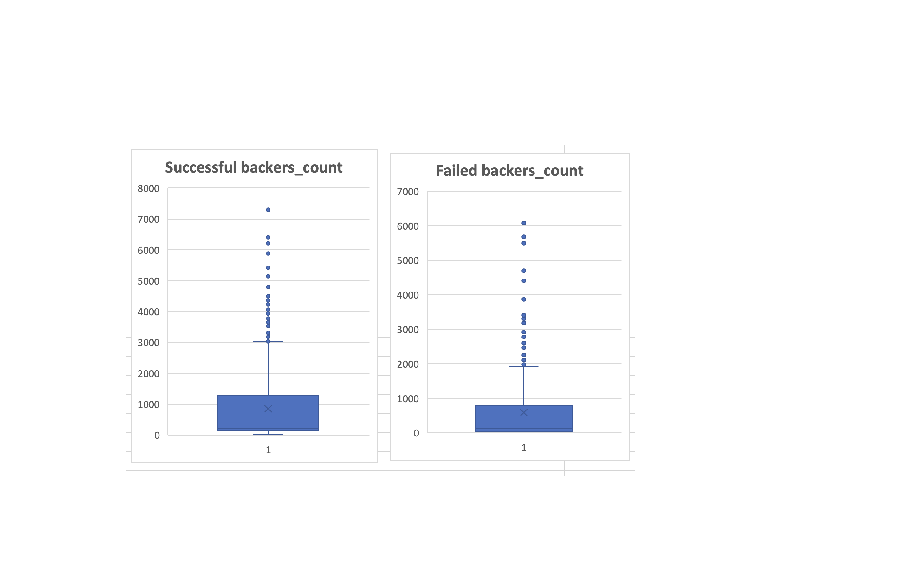

Here is an image of the final product:

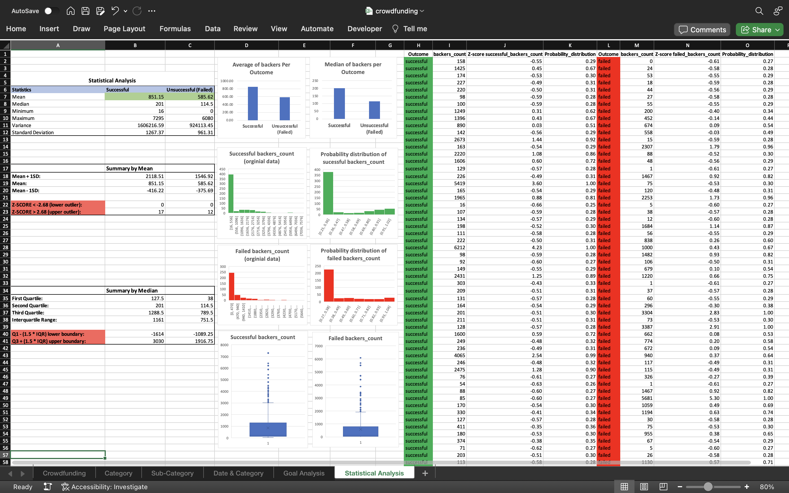

## Crowdfunding Campaign Insights
### Conclusions from Data Analysis:
* **Category Performance**: Analysis indicates that performance-based categories such as theater, music, film, and video boast higher success rates compared to others, with theater leading and film/video, and music closely tied.
* **Seasonal Trends**: Success rates across various parent categories peak during summer, diminishing significantly with the end of the season and the onset of fall.
* **Goal-Based Outcomes**: Campaigns with funding goals set between $15,000 and $30,000 exhibit the highest success, particularly those within the $15,000 to $24,999 range. A noticeable decline in success rates occurs as the goal amounts increase.
### Dataset Limitations:
* **Sample Size**: With only 1,000 projects, the dataset may not adequately represent the broader spectrum of crowdfunding campaigns, limiting the ability to generalize findings.
* **Category Bias**: A significant 70% of the projects are concentrated within three categories (theater, film and video, and music), skewing results in favor of these categories and potentially overshadowing others.
* **Goal Range Bias**: A majority of 85% of projects fall into just three goal ranges, which could bias the perceived success rates within these ranges.
### Potential Additional Visualizations:
* **Average Donations by Category**: A pivot table and chart reflecting average donations per category could provide deeper understanding of donor expectations within each category.
* **Percent Funded by Category**: Visualizing the percent funded relative to goals in each category might offer insights into which categories tend to receive more generous funding.
* **Backer Count by Category**: Analyzing the count of backers in each category through a pivot table and chart could inform expectations regarding participant numbers in crowdfunding campaigns by category.
### Summary of Data
Upon analyzing the statistical metrics, it becomes evident that the median offers a more reliable summary of the central tendency for both successful and unsuccessful crowdfunding campaigns, as compared to the mean. This inference is drawn from the observation that the mean is substantially higher than the median in both categories, indicative of a right-skewed distribution where the presence of outliers inflates the mean. Specifically, the successful campaigns demonstrate a mean of 851.15 against a median of 201, with 17 instances exceeding the upper outlier threshold. Unsuccessful campaigns also show a similar pattern with a mean of 585.62 as opposed to a median of 114.5 and 12 upper outliers. The data, therefore, suggests that the median, being less sensitive to extreme values, more accurately represents the typical number of backers and is less distorted by the variability introduced by the outliers.
### Variability in Campaign Success
The data indicates that there is more variability in the number of backers for successful campaigns compared to unsuccessful ones, as shown by the higher variance and standard deviation for successful campaigns:

* **Variance** for successful campaigns is 1,606,216.59 compared to 924,113.45 for unsuccessful campaigns.
* **Standard Deviation** for successful campaigns is 1,267.37 compared to 961.31 for unsuccessful campaigns.

These statistics suggest that successful campaigns have a wider spread of backer counts. This greater variability could be due to successful campaigns potentially reaching a larger and more diverse audience, which can lead to a broader range of backing behaviors. Campaigns that resonate with a wider audience might receive varying levels of funding, from small contributions to very large ones, hence the increased spread.

For unsuccessful campaigns, the lower variability implies that there is less fluctuation in the number of backers they attract. This could be because unsuccessful campaigns fail to gain substantial traction, leading to a more homogenous group of backers contributing at similar levels.

This interpretation aligns with the intuitive understanding of crowdfunding dynamics, where successful campaigns might go viral or hit a chord with a wide audience, resulting in a highly variable backer count. In contrast, unsuccessful campaigns may not experience this level of exposure or engagement, leading to more uniformity in their backer numbers.

 