# Lesson: The Problem of Pie

## Introduction

Pie charts are commonly used for showing percentages.  However, they are not the correct visualization for all data as they tend to misconstrue information. 

In this lesson, we will investigate the problems with pie charts and explore other options to tell our data story.

## Learning Outcomes

By the end of this lesson, you will be able to:

1. Explain the problems of using pie charts. 
2. Identify alternative visualizations for pie charts. 
3. Discuss when pie charts may be the appropriate choice. 

## The Problem of Pie

Pie charts are a common visualization when it comes to percentages and parts of a whole. However, there are many times when there are better-suited visualizations to be used. There are issues that commonly crop up that make it hard to work with a pie: 

* too many slices
* many slices similarly sized
* poor color choices
* slices not adding up to 100% 

Let's take a look at some of the problems with pie charts and how we can alleviate them.

### Too Much Data

One problem with pie charts is that too much data makes them unreadable. Consider this pie chart that shows the breakdown of [cuisines in restaurant reviews](https://www.kaggle.com/uciml/restaurant-data-with-consumer-ratings).

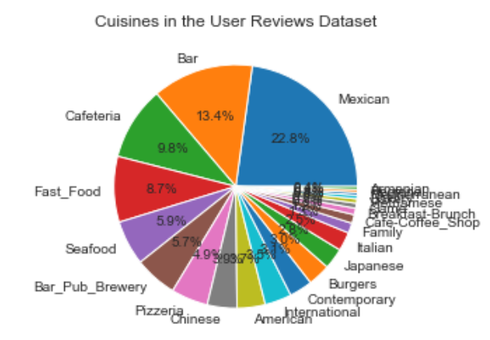

There are labels that are close together. There are labels on top of each other. There are many slices between 2% and 4% in size, making it hard to identify slices. There are too many slices of data to make this pie worthwhile. There are better ways to visualize this.

> Something else to watch out for in pie charts is that sometimes the percentages do not add up to 100%. If the representation is truly calling for a parts-of-a-whole representation, the whole number should add up to 100%.

### Comparing Angles or Areas

The nature of pie charts is that it is a parts-of-a-whole presentation, representing percentages. It can be hard to decipher what pieces of the pie are larger than others. Consider this pie chart representation of the number of animals in [the UCIML Zoo Classification dataset](https://www.kaggle.com/uciml/zoo-animal-classification):

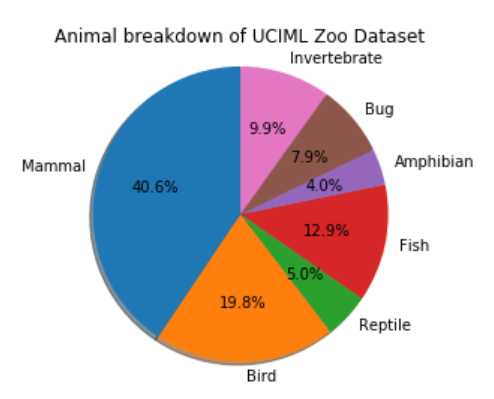

If the pie chart were presented without the labels, it might be hard to see the difference between some of these values.

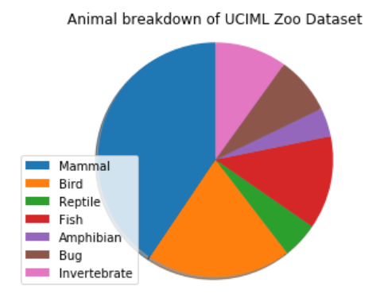

In cases where the slice labels are removed, the colors may be identified by a legend. Now, you need to match the color in the legend to the color of the slice and then guess at the percentage. Can you see how this got really complicated and frustrating really fast?

To make things more complicated, the first pie chart in this section is a 3D pie chart, with a shadow to add depth. Adding a shadow and adding depth to a chart that is already confusing is adding more complexity to the visualization and more complexity in trying to make a decision.

### Even Harder with Color Blindness

If colors aren't properly selected, color-blind users may see a whole pie instead of slices. Consider the following pie that is using red and green, which can be hard to decipher if you have red-green color blindness.

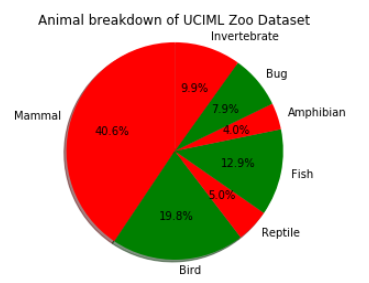

This is what it looks like if presented to a red-blind viewer:

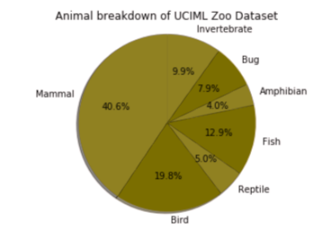

This is what it looks like if presented to a green-blind viewer:

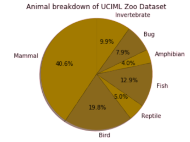

This is what it looks like if presented to a monochromatic viewer:

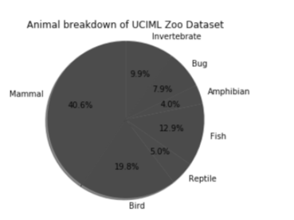

If you are uncertain of how a visualization appears to a blind user, you can use [the Coblis Color Blindness Simulator](https://www.color-blindness.com/coblis-color-blindness-simulator/) for guidance.

## Alternatives to Pie Charts

When displaying pieces of a whole, there are other visualizations to consider. 

This is our hard-to-process pie chart:

### Donut Charts

If you are trying to represent parts-of-a-whole, a donut chart might be an option. However, keep in mind that it is susceptible to the same pain points as a pie chart.

This is our animal counts data in donut form:

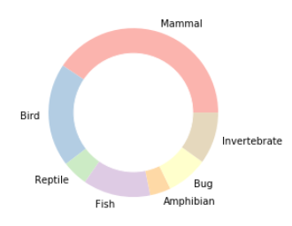

As we mention throughout this lesson, there are plenty of other visualizations out there that may tell the story. Some folks may find a donut to make sense when following the prescribed guidelines:

- There are few slices - no more than 5-10 data points - to represent.
- The values differ. If they are all similar, it will be hard to recognize which slice is the slice in question.
- The slices are clearly labeled.
- The percentages add up to 100%.

### Tabular Data

Sometimes, it might make more sense to present the data as a table.

<table>
  <caption style="font-weight:bold;">Table x. Animal Breakdown for the UCIML Zoo Classification</caption>
  <thead>
    <tr>
      <th>Class_Name</th>
      <th>Number_Of_Animal_Species_In_Class</th>
    </tr>
  </thead>
  <tbody>
    <tr>
      <td>Mammal</td>
      <td>41</td>
    </tr>
    <tr>
      <td>Bird</td>
      <td>20</td>
    </tr>
    <tr>
      <td>Reptile</td>
      <td>5</td>
    </tr>
    <tr>
      <td>Fish</td>
      <td>13</td>
    </tr>
    <tr>
      <td>Amphibian</td>
      <td>4</td>
    </tr>
    <tr>
      <td>Bug</td>
      <td>8</td>
    </tr>
    <tr>
      <td>Invertebrate</td>
      <td>10</td>
    </tr>
  </tbody>
</table>

### Treemap

Another visualization to show parts of a whole is a treemap. Instead of being represented as a pie with slices, the data is presented as nested rectangles. This is a treemap of our animal counts:

Treemaps are susceptible to having too much data, much like a pie chart. When working with treemaps, data visualization guidelines suggest no more than ten values represented.

### Bar charts

Bar charts represent data with rectangles known as bars. These bars may be vertical, with groupings along the x-axis and values plotted against the y-axis, or horizontal, with groupings along the y-axis and values plotted against the x-axis. When the orientation isn't specified, the default orientation for a bar chart is vertical.

This is a bar chart of our animal counts:

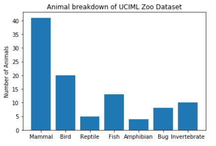

This is a horizontal bar chart of our animal counts:

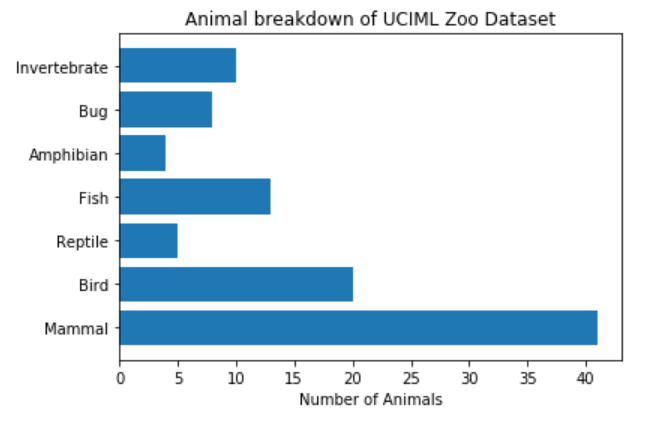

### Stem Plots and Lollipop Charts

Stem plots and lollipop charts are another representation of breakdowns. They are two names for the same graph. Instead of using rectangles - like a bar chart, stem plots and lollipop charts have a linear body with a marker at the end of the line. 

Much like bar charts, stem plots and lollipop charts have horizontal and vertical orientations.

Here is a stem plot of our animal counts, with the marker at the end as an asterisk `*`:

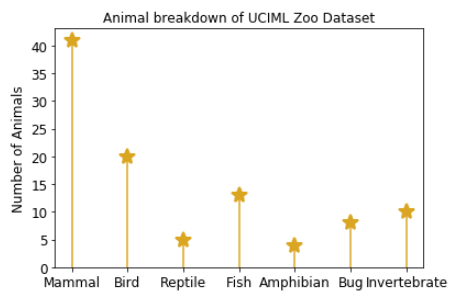

A horizontal stem plot or lollipop chart looks like this:

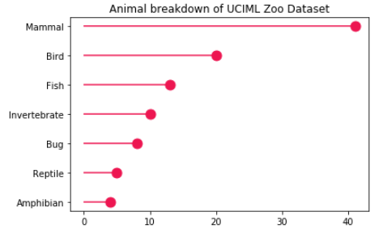

## When to Use a Pie Chart

With all of these alternatives to tell the story of data, is a pie chart ever an acceptable visualization? Yes, it can be an acceptable visualization when:

- There are few slices - no more than 5-10 data points - to represent.
- The values differ. If they are all similar, it will be hard to recognize which slice is the slice in question.
- The slices are clearly labeled.
- The percentages add up to 100%.

However, keep in mind that it can be harder for our minds to process pieces of a whole using a pie. Other visualizations make the comparisons easier to see and with less processing required.

## Conclusion

Many problems can arise from using a pie chart.  Sometimes there's too much data to represent. Sometimes too many labels on one visual lead to confusion. Sometimes, a pie chart is just right. However, you can use many other visualizations to tell the same story more clearly when your data story isn't as easy as pie. 
