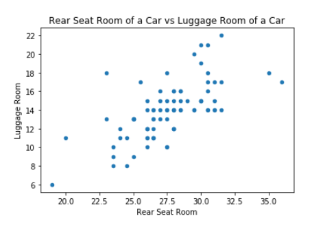

# Quiz: Questioning Data

This is the quiz bank for all questions related to Questioning Data.

## Questioning Data

### LO 1: Ask meaningful questions when presented data. 
### LO 2: Explain outliers. 
### LO 3: Discuss solutions for how to handle too much data. 

## Correlation and Causation

### LO 1: Describe correlation. 

*Which correlation is demonstrated in this scatter plot between MPG City and MPG Highway?

**a. positive correlation**
b. negative correlation
c. no correlation

--------

*Which correlation is demonstrated in this scatter plot between Rear Seat Room and Luggage Room?

a. positive correlation
b. negative correlation
**c. no correlation**

------

*Which correlation is demonstrated in this scatter plot between Fuel tank capacity and MPG Highway?

a. positive correlation
**b. negative correlation**
c. no correlation

----

We have omitted the trend lines for this example.

* Which correlation is demonstrated in this scatter plot between Engine Size and Horsepower?

**a. positive correlation**
b. negative correlation
c. no correlation

### LO 2: Define causation. 

*Which of these factors determines cause-and-effect?

**a. causation**
b. correlation

------

*Which of these is **not** part of the criteria for causation?

a. plausibility
b. analogy
**c. bias**
d. temporality

-----
### LO 3: Explain the meaning behind the saying "correlation does not imply causation". 
### LO 4: Discuss the criteria to asses for proving causation. 
