# Lesson: Data Relationships

## Introduction

Data is rarely as simple as one **entity** - a real-world object that represents data.  Many data representations require more than one entity to illustrate the concept. 

In this lesson, we will explore the different relationship types and create visualizations of those relationships with entity resource diagrams. 

## Learning Outcomes

By the end of this lesson, you will be able to:

1. Identify the four main types of data relationships. 
2. Read an entity-relationship diagram. 

## Types of Relationships

When it comes to data relating to other pieces of data, there are 4 main types of relationships to understand:

- one-to-one
- self-referencing
- one-to-many
- many-to-many

In our last lesson, we talked about modeling our music collection.  We will be referring to our music collection as we explore some of these relationships.

### One-to-One Relationships

Let's revisit our music album data model.  Something else a music album has is its publisher, a label.  Our updated data model looks like this:

```
MusicAlbum
---------
Performer
AlbumName
ReleaseYear
Tracks
Publisher
```

A Publisher is a separate entity.  Its data model could look like this:

```
Publisher
---------
PublisherName
```

A music album has one publisher. One music album has one publisher.  This is what is known as a **one-to-one relationship**.

But how do we link from one data model to another?  This is where we introduce the concepts of IDs.  An **ID** is a way of making a record unique.  The **primary key** is the attribute or attributes that will make a row unique - the primary identifier.  This attribute is typically stored as an integer or a unique identifier.

If we are using IDs to link our data models, we need to update our data models.  Our updated models are:

```
Publisher
---------
PublisherID
PublisherName
```

```
MusicAlbum
---------
Performer
AlbumName
ReleaseYear
Tracks
PublisherID
```

Now that we have attributes we can connect on, we can draw a line between PublisherID of MusicAlbum to PublisherID of Publisher.  Some systems will label the relationship lines with the number 1 to indicate it is a one-to-one relationship.  This is what the relationship looks like in an ERD:

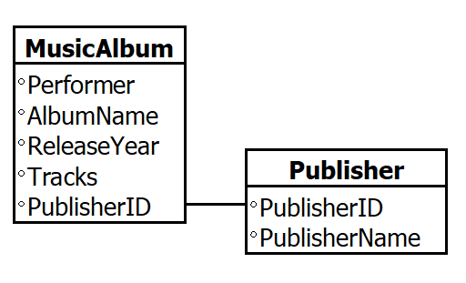

### Self-Referencing Relationships

The publisher of an album is its own entity.  Something to know about publishers is that they sometimes belong to another publisher.  For example, EMI Music is owned by Sony.  We can keep track of publisher parent relationships with our publisher entity.  Since the publisher parent may also be a publisher, we will link to its publisher ID.

Our updated model looks like this:

```
Publisher
---------
PublisherID
PublisherName
ParentPublisherID
```

Since a publisher would have one parent, this is another example of a one-to-one relationship.  Though what happens to the company at the top?  They may be their own parent.  This relationship is known as a **self-referencing relationship**.

This relationship would look like this in an ERD:

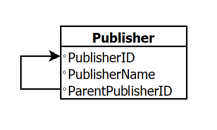

### One-to-Many Relationships

We need to deal with our MusicAlbum data model a bit further.  We have a music album that has a collection of tracks.  Our data models should be updated with IDs to make it easier to link our albums to their tracks.  Since the tracks are typically not shared across albums, we can tie tracks directly to their respective albums.  Our updated data models look like this:

```
MusicAlbum
---------
AlbumID
Performer
AlbumName
ReleaseYear
PublisherID
```

```
Track
-----
AlbumID
TrackNumber
TrackName
TrackLength
```

One album with many tracks is known as a **one-to-many relationship**.  Some database diagram tools will identify the relationships with the number 1 where the one part of the relationship happens.  As for the many part, some tools will represent the many with an infinity symbol, as in this example:

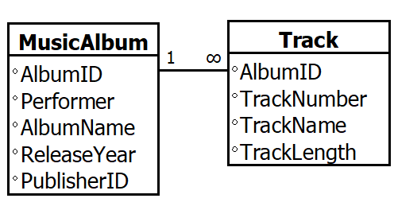

Another way to represent many is with crow's feet, as in this example:

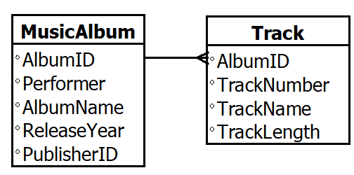

### Many-to-Many Relationships

A performer can have many albums.  An album can have many performers.  This relationship has gotten complex.  Let's represent our data in data models, with ID fields to make it easy to track unique records for each model. Our Performer model looks like this:

```
Performer
---------
PerformerID
PerformerName
```

Since our data models represent single items, we need to find a way to explain their relationships.  We will create a table in between MusicAlbum and Performer that bridges the relationship between the two.  This is called a **bridge table**.

This allows us to move the many relationship to the bridge table rather than between the tables directly.  An album can have multiple performers - this is a one-to-many relationship.  A single performer may appear on multiple albums - this is a one-to-many relationship.  The many-to-many relationship between MusicAlbum and Performer is broken into more manageable relationships.

Our data models look more like this:

```
MusicAlbum
---------
AlbumID
AlbumName
ReleaseYear
PublisherID
```

```
MusicAlbumPerformers
--------------------
AlbumID
PerformerID
```

This is typical behavior for many-to-many relationships.  We break them up in to groups that are easier to query.

A bridge table's data model will act as a link between two known items, serving the purpose of bridging them together.  It is seen as the missing piece to fill the gap in complex many-to-many relationships.

The ERD for this looks like this:

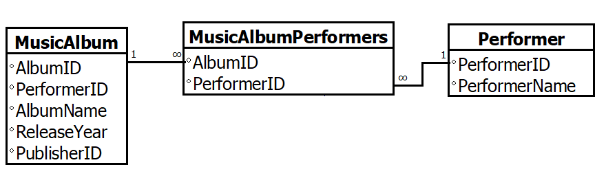

## Entity-Relationship Diagrams

The documentation from data modeling can be expanded into entity-relationship diagrams - not only showing the entities and attributes but also showing the relationships with lines between entities indicating the type of relationship.

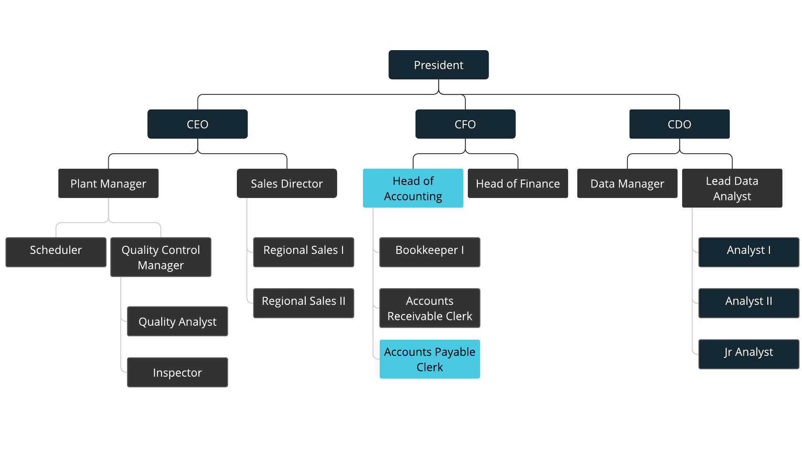

Data can have a **one-to-one relationship** where one thing is related to one other thing. For example, an employee may have one department. In our example, the Accounts Payable Clerk reports to the Head of Accounting.  The Accounts Payable Clerk belongs to one department - Accounting.

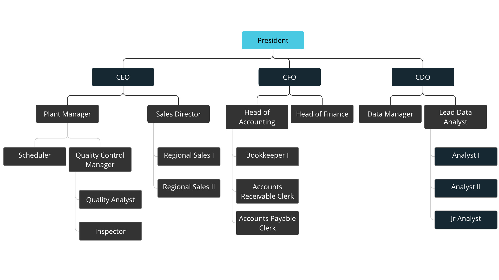

The entity-relationship diagram can have a single table in a one-to-one relationship. There is a line between the related fields - in the case of an employee, the manager ID refers back to the employee ID.  There is a number 1 by each of those fields to indicate a one-to-one relationship.  The relationship between employee and manager is a one-to-one relationship - one employee has one manager.

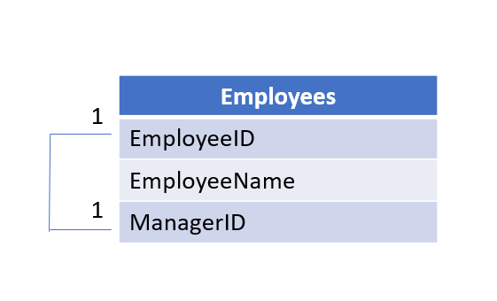

When the manager is at the top of the chain, the manager's own manager is themself.  This is a **self-referencing relationship**.

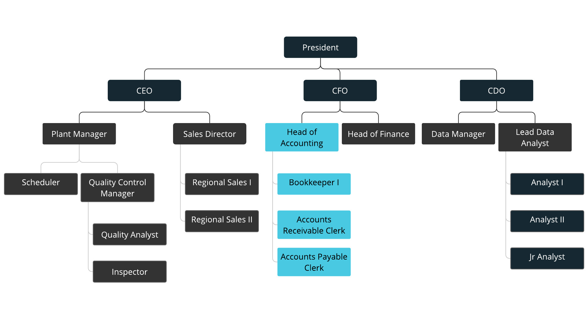

The ERD for a self-referencing relationship is a single table referring back to itself.

In terms of businesses, we can also see **one-to-many relationships**.  For example, one department may have many positions.  One manager may have many employees.

The entity-relationship diagram may involve two tables (entities) in a one-to-many relationship. There is a line between the related fields on each of the entities. In this example, the department ID of a position refers back to the department ID of the department.  There is a number 1 by the fields where there is one value and the infinity symbol where the value may appear many times.

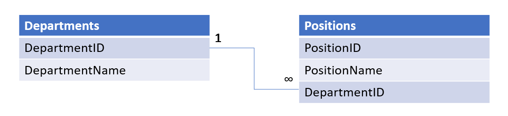

> When two tables are involved, one-to-many relationships are common.  One-to-one relationships may also exist between two tables.

Then there's the most complicated of these relationships, the **many-to-many relationship**.  This is complicated because it isn't a simple "one to"  or " to one" type of relationship.  Consider the example of a company having multiple committees - such as a social committee, fitness committee, and an environment committee.  These could be ways for employees to get involved and help grow the company culture.  Multiple employees can be on multiple committees. 

Since many employees can be on many committees and many committees can have many employees, we cannot easily draw lines between employees and committees and be done.  This kind of relationship can get hectic to manage.  However, we can introduce a third table to maintain the relationships between the employees and the committees.  This middle table is known as a **bridge table**.  It bridges the gap between the Employees and Committees tables.

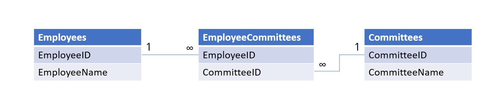

The relationships between the Employee table and the bridge table become a one-to-many relationship, and the relationships between the Committees table and the bridge table is also a one-to-many relationship.

Another way to denote the "many" side of a relationship is with three lines that are structured like crow's feet.  In fact, they are called **crow's feet**.  The many-to-many ERD with crow's feet has crow's feet with the middle toe pointed at the related field and the inside and outside toes at the edges of the field box.  This crow's feet approach can also be applied to the "many" part of a one-to-many relationship. 


## Conclusion

When we create data models, we get a glimpse of the landscape of our decision's potential impact.  When we consider data relationships, we may earn a better understanding of the spread of the impact.  Entity Relationship Diagrams are a standard tool for understanding what you are working with and what the data may represent.  In the next exercise, you will get to practice creating an ERD.
