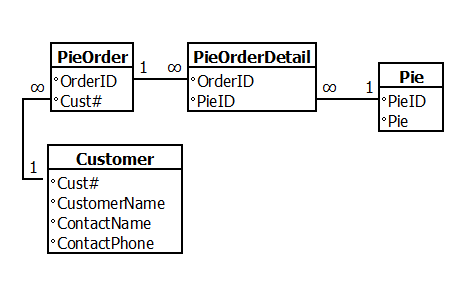
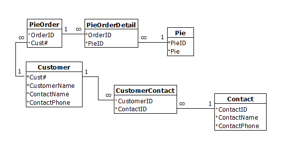

# Lesson: Data Normalization

## Introduction
When you create data models and explain relationships, you may find yourself breaking data down into smaller, more understandable chunks.  

In this lesson, we will explore this process known as normalization.

## Learning Outcomes

By the end of this lesson, you will be able to:

1. Define data normalization. 
2. Identify the normalization forms. 

## What is Data Normalization?

Data normalization is a way to organize data in a database with many benefits. By normalizing our data, we end up minimizing duplicated data. We split out shared data into its own spot so that it can be maintained without having to be maintained in multiple spots. By minimizing duplicated data, we are also saving on space for storage. Data normalization allows us to reduce the complexity of the data, making more sense of the data.

### Starting with Raw Data

For this example, we run a bakery that specializes in pies. One of our customers is a company that likes to send pies to their customers for Pi Day (March 14). They sent in their order with the following data:

<table>
  <thead>
    <tr>
      <th>Cust#</th>
      <th>Customer Name</th>
      <th>Contact Name</th>
      <th>Contact Phone</th>
      <th>Pies</th>      
    </tr>
  </thead>
  <tbody>
    <tr>
      <td>0311</td>
      <td>Goose's Garden Center</td>
      <td>Mary Contrary</td>
      <td>440-555-1212</td>
      <td>Pecan, Pumpkin, Key Lime</td>
    </tr>
    <tr>
      <td>5240</td>
      <td>Mushroom World</td>
      <td>Juan Fungi</td>
      <td>419-555-1212</td>
      <td>Apple, Pecan, Banana Cream</td>
    </tr>
  </tbody>
</table>

This is our raw data. It is mostly unorganized and not easy to search. When working with raw data, it is common for data to be presented in spreadsheets with data similar to this - where multiple values appear in a single column.

## Normalization Forms

There are different layers of normalization, called **normalization forms**. Each layer of normalization attempts to clean data and make it easier to work with. There are many forms of normalization. We will cover the first three, with a note on why we cover the third.

> There is a normalization form called Zero Normal Form. This is the unorganized, not normalized data. This is typically one giant table with all the data.

### First Normal Form

First Normal Form is the first normalization form. It is abbreviated as 1NF. The criteria for 1NF includes:

- Each column must be **atomic**. A column should contain a single value.
- There should be no repeating groups.

In our sample data, we have Pie1, Pie2, and Pie3. These are repeating groups. To simplify our data into 1NF, we need to eliminate our repeating groups. Our data in 1NF looks like this:

<table>
  <thead>
    <tr>
      <th>Cust#</th>
      <th>Customer Name</th>
      <th>Contact Name</th>
      <th>Contact Phone</th>
      <th>Pie</th>      
    </tr>
  </thead>
  <tbody>
    <tr>
      <td>0311</td>
      <td>Goose's Garden Center</td>
      <td>Mary Contrary</td>
      <td>440-555-1212</td>
      <td>Pecan</td>      
    </tr>
    <tr>
      <td>0311</td>
      <td>Goose's Garden Center</td>
      <td>Mary Contrary</td>
      <td>440-555-1212</td>
      <td>Pumpkin</td>      
    </tr>
    <tr>
      <td>0311</td>
      <td>Goose's Garden Center</td>
      <td>Mary Contrary</td>
      <td>440-555-1212</td>
      <td>Key Lime</td>      
    </tr>
    <tr>
      <td>5240</td>
      <td>Mushroom World</td>
      <td>Juan Fungi</td>
      <td>419-555-1212</td>
      <td>Apple</td>    
    </tr>
    <tr>
      <td>5240</td>
      <td>Mushroom World</td>
      <td>Juan Fungi</td>
      <td>419-555-1212</td>
      <td>Pecan</td>    
    </tr>
    <tr>
      <td>5240</td>
      <td>Mushroom World</td>
      <td>Juan Fungi</td>
      <td>419-555-1212</td>
      <td>Banana Cream</td>    
    </tr>
  </tbody>
</table>

Our 1NF table still has a lot of data repetition. There are more data normalization forms to help us eliminate that.

### Second Normal Form

Second Normal Form (2NF) is the next step in the normalization. The criteria to achieve 2NF are:

- Data must be normalized to 1NF.
- Any data not fully related to the primary key of the table gets moved to its own table.

Once you have data in 1NF, then the next step is to break up data so that record data that isn't fully related to the record key is broken in its own table(s). If record data is only partially related to the record key, it can be refactored. 

As our table represents pie orders and not necessarily customers, we need to break this up a bit. We will add a column called `OrderID` for our pie order. This will be our primary key to identify our orders.

Consider the columns in our pie order table:

<table>
  <caption>Pie Order</caption>
  <thead>
    <tr>
      <th>Column Name</th>
      <th>Directly related to the primary key?<th>
    </tr>    
  </thead>
  <tbody>
    <tr>
      <td>OrderID</td>
      <td>This is our primary key.</td>
    </tr>
    <tr>
      <td>Cust#</td>
      <td>Yes - this is who placed the order.</td>
    </tr>
    <tr>
      <td>CustomerName</td>
      <td>No - this is related to the customer.</td>
    </tr>
    <tr>
      <td>Contact Name</td>
      <td>No - this is related to the customer.</td>
    </tr>
    <tr>
      <td>Contact Phone</td>
      <td>No - this is related to the customer.</td>      
    </tr>
    <tr>
      <td>Pie</td>
      <td>No - as there can be multiple pies in an order, this is an order item.</td>
    </tr>
  </tbody>
</table>

So to achieve 2NF, we have to break up our tables. Since we need a way to link the pie to the customer, we are adding an ID for the pie table and using that as the Pie table's primary key - its record identifier.

<table>
  <caption>Pie</caption>
  <thead>
    <tr>
      <th>PieID</th>
      <th>Pie</th>
    </tr>
  </thead>
  <tbody>
    <tr>
      <td>1</td>
      <td>Pecan</td>
    </tr>
    <tr>
      <td>2</td>
      <td>Pumpkin</td>
    </tr>
    <tr>
      <td>3</td>
      <td>Key Lime</td>
    </tr>
    <tr>
      <td>4</td>
      <td>Apple</td>
    </tr>
    <tr>
      <td>5</td>
      <td>Banana Cream</td>
    </tr>
  </tbody>
</table>

<table>
  <caption>Customer</caption>
  <thead>
    <tr>
      <th>Cust#</th>
      <th>Customer Name</th>
      <th>Contact Name</th>
      <th>Contact Phone</th>
    </tr>
  </thead>
  <tbody>
    <tr>
      <td>0311</td>
      <td>Goose's Garden Center</td>
      <td>Mary Contrary</td>
      <td>440-555-1212</td>
    </tr>
    <tr>
      <td>5240</td>
      <td>Mushroom World</td>
      <td>Juan Fungi</td>
      <td>419-555-1212</td>
    </tr>
  </tbody>
</table>

<table>
  <caption>Pie Order</caption>
  <thead>
    <tr>
      <th>OrderID</th>
      <th>Cust#</th>
    </tr>
  </thead>
  <tbody>
    <tr>
      <td>1</td>
      <td>0311</td>
    </tr>
    <tr>
      <td>2</td>
      <td>5240</td>
    </tr>
  </tbody>
</table>

We have pies, customers, and pie orders. How do we tie pies to pie orders? For this, we create a bridge table. This is our pie order detail table:

<table>
  <caption>Pie Order Detail</caption>
  <thead>
    <tr>
      <th>OrderID</th>
      <th>PieID</th>
    </tr>
  </thead>
  <tbody>
    <tr>
      <td>1</td>
      <td>1</td>
    </tr>
    <tr>
      <td>1</td>
      <td>2</td>
    </tr>
    <tr>
      <td>1</td>
      <td>3</td>
    </tr>
    <tr>
      <td>2</td>
      <td>4</td>
    </tr>
    <tr>
      <td>2</td>
      <td>1</td>
    </tr>
    <tr>
      <td>2</td>
      <td>5</td>
    </tr>
  </tbody>
</table>

Our data relationships look like this:

### Third Normal Form

For many data applications, 2NF is far enough for data simplification. However, when it comes to data analysis and cleaning data to be in a state known as tidy data, we need to get our data into third normal form (3NF).

In order to get into 3NF, the following criteria must be met:

- Data must be normalized to 2NF.
- There are no functional dependencies.

What is a **functional dependency**? If a change in a column value causes other column values to have to change as well, this is known as a functional dependency. When columns depend on each other and a change means other changes are involved, this can cause maintenance headaches.

We need to look at our Customer table a bit further:

<table>
  <caption>Customer</caption>
  <thead>
    <tr>
      <th>Cust#</th>
      <th>Customer Name</th>
      <th>Contact Name</th>
      <th>Contact Phone</th>
    </tr>
  </thead>
  <tbody>
    <tr>
      <td>0311</td>
      <td>Goose's Garden Center</td>
      <td>Mary Contrary</td>
      <td>440-555-1212</td>
    </tr>
    <tr>
      <td>5240</td>
      <td>Mushroom World</td>
      <td>Juan Fungi</td>
      <td>419-555-1212</td>
    </tr>
  </tbody>
</table>

What if Mary Contrary is no longer our contact at the Garden Center? If we change the contact name, we may also need to change our contact's phone number. It may be easy to forget to update both columns. For this reason, we are going to break our contact out to another table.

<table>
  <caption>Customer</caption>
  <thead>
    <tr>
      <th>Cust#</th>
      <th>Customer Name</th>      
    </tr>
  </thead>
  <tbody>
    <tr>
      <td>0311</td>
      <td>Goose's Garden Center</td>      
    </tr>
    <tr>
      <td>5240</td>
      <td>Mushroom World</td>      
    </tr>
  </tbody>
</table>

<table>
  <caption>Contact</caption>
  <thead>
    <tr>
      <th>Contact ID</th>
      <th>Contact Name</th>
      <th>Contact Phone</th>
    </tr>
  </thead>
  <tbody>
    <tr>
      <td>1</td>
      <td>Mary Contrary</td>
      <td>440-555-1212</td>
    </tr>    
    <tr>
      <td>2</td>
      <td>Juan Fungi</td>
      <td>419-555-1212</td>
    </tr>    
  </tbody>
</table>

<table>
  <caption>Customer Contact</caption>
  <thead>
    <tr>
      <th>CustomerID</th>
      <th>ContactID</th>
    </tr>
  </thead>
  <tbody>
    <tr>
      <td>0311</td>
      <td>1</td>
    </tr>
    <tr>
      <td>5240</td>
      <td>2</td>
    </tr>
  </tbody>
</table>

The relationship diagram looks like this:

### Other Normalization Forms

For most applications, 3NF is as far as you need to go for tidy data that is workable. However, if you find yourself enjoying the normalization process and want to look into more normalization, there are still more forms to explore:

- Boyce-Codd Normal Form (BCNF) - also known as 3.5 Normal Form
- 4th Normal Form (4NF)
- 5th Normal Form (5NF)
- Proposed 6th Normal Form (6NF)

## Conclusion

Working from one table of data may make it hard to see the big picture.  By using data normalization to organize a single table of data into more logical, easier-to-maintain chunks of data, we get a better view of our data landscape and the impact of our decisions.  In the following exercise, you will get to practice normalization.
