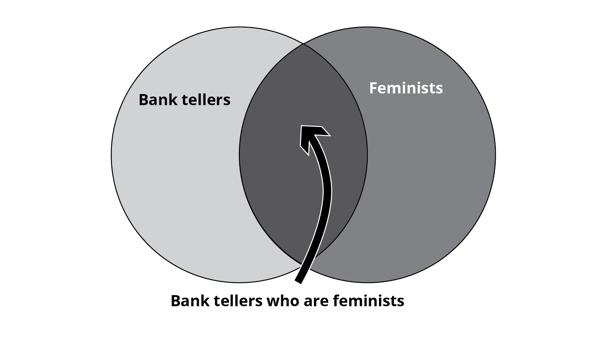
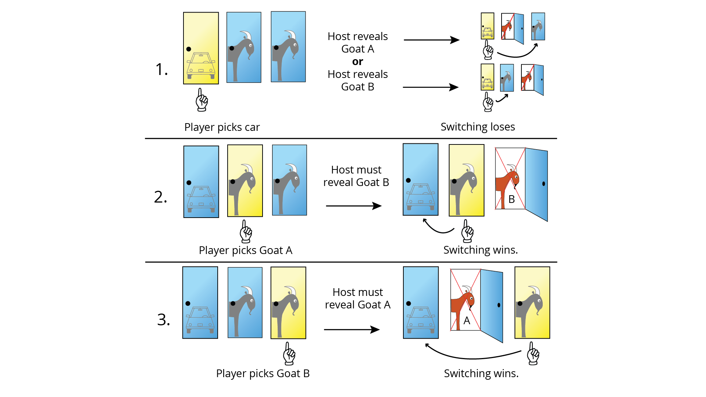

# Lesson: Statistical Thinking

## Introduction

Inextricably linked to data literacy is the discipline of **statistics**. According to [Wikipedia](https://en.wikipedia.org/wiki/Statistics), statistics focuses on "the collection, organization, analysis, interpretation, and presentation of data." Because interpretation is a crucial element of statistics, data can easily be misused and misrepresented. Often, this is intentional.

In business, law, and politics, raw data is frequently contorted to support an agenda. We can collect more data than ever before in the modern world, but properly dealing with data requires training. As an aspiring technology professional, you will inevitably have to work with data, so it's crucial to present data effectively and critically evaluate the analyses of others. This lesson will explain why developing this mindset of statistical thinking can be challenging but rewarding.

## Learning Outcomes

By the end of this lesson, you will be able to:

1. Describe how statistical thinking affects professional and personal lives.
2. Explain why humans are prone to statistically flawed reasoning.

## Importance of Statistical Thinking

Modern technology allows us to collect an unprecedented amount of data. Virtually everything you do in an online environment is tracked and stored somewhere. But data by itself isn't necessarily useful; it takes skilled analysis to ask the right questions, turn raw data into a story that a general audience can understand, formulate recommendations, and support them with evidence. Furthermore, the growing abundance of data isn't confined to the professional realm. We see data and statistics more and more in our personal lives also. Whether it's journalism, healthcare, finance, or some other area, thinking statistically is a tremendous advantage. For example, when you see an advertisement, statistical thinking may allow you to notice misleading visualizations designed to exaggerate the product's effects. Or when you hear about a new research study that produced some incredible result, it would certainly be helpful to consider the sample size, level of significance, and effect size before jumping to any conclusions.

For those reasons, statistical thinking is becoming more important for everyone to develop, not just those who work with data professionally. That's what this and the next several lessons will focus on.

## Gaps in Human Cognition

One unfortunate obstacle to statistical thinking is human nature itself. Humans, for various reasons, don't tend to have good statistical intuition, which is why so many people—even the most highly educated—can draw dubious conclusions, fall prey to deceptive advertising, or make poor financial decisions.

Over the course of human evolution, we became better adapted for survival, not necessarily to be good statisticians. Hunter-gatherers on the savannah didn't worry about the nuances of sampling or statistical significance. Instead, they had to deal with life or death problems. Suppose you eat a strange berry and get sick. Would it be safer to just never try it again or to conduct 100 more trials to see whether it was really toxic or merely a fluke?

Our brains are built for pattern recognition. This certainly has its advantages, but it does make us prone to detecting patterns that aren't really there. Randomness plays a large role in many things, and humans tend to draw conclusions from samples too small to support those conclusions. We tend to focus on the short-term, whereas probability deals with long-term frequencies. This is why if the weather forecast predicts a 10% chance of rain, many people will say the forecast was "wrong" if it does actually rain. They mentally round a low probability, like 10%, to 0%. In reality, a 10% chance of rain means the forecast should be "wrong" one in ten times. But people don't generally keep track of these forecasts over a long period of time to assess their performance. They just remember the one time the forecast was "wrong."

This tendency to see nonexistent patterns also results in a misconception popularly known as the __gambler's fallacy__. This is the notion that an outcome is more likely because it hasn't occurred recently, or vice versa. For example, some people may believe that if a roulette wheel has produced six odd numbers in a row, an even number is "overdue." In reality, the roulette wheel has no memory of its previous results. There is no way any spin could affect future spins (assuming no physical defects in the wheel itself, of course). Regardless of how many odd numbers you've observed in a row, the probability of getting an even number on the next spin remains the same.

Another example of a statistical concept that's difficult to intuitively grasp is conjunction, or the intersection of two events. The most famous example of the __conjunction fallacy__ is due to psychologists Amos Tversky and Daniel Kahneman, who constructed the following scenario in 1983:

>Linda is 31 years old, single, outspoken, and very bright. She majored in philosophy. As a student, she was deeply concerned with issues of discrimination and social justice, and also participated in anti-nuclear demonstrations.
>
>Which is more probable?
>
>I. Linda is a bank teller.
>
>II. Linda is a bank teller and is active in the feminist movement.

Multiple research studies have shown that people, on average, ascribe higher probability to choice II than to choice I. Upon your first reading, that may have been your initial reaction as well. But this is mathematically impossible.

As the diagram above shows, if Linda is both a bank teller and a feminist (choice II), she must be a bank teller to begin with, which means she meets the conditions for choice I. However, the reverse is not necessarily true; you could be a bank teller without being a feminist. Choice II represents a subset of choice I, which means it cannot have higher probability than choice I. Yet repeated studies have shown the high frequency of this mistake, even among students at prestigious universities.

Another famous example of a counterintuitive statistical result is the Monty Hall problem. Named after the host of a popular television game show, the scenario initially involves three closed doors. Behind one of the doors is a new car, while the other two doors have goats. You choose a door, and then the host opens one of the remaining doors that has a goat behind it. The host then gives you the opportunity to switch your initial choice with the remaining door. Is it better to switch?

This problem was popularized when it was submitted to a magazine column in 1990. Without statistical thinking, it can be strongly counterintuitive that switching does, in fact, provide a probabilistic advantage. After all, you chose a door at random, there's one remaining door after the host reveals a goat, so it must be a 50/50, right? Switching doors or staying couldn't possibly have any impact on your chances of winning the car, right?

To see why it's better to switch, consider the different possibilities, illustrated in the picture below. At the beginning, you have a 1/3 chance of picking the door with the car. In this case, the host can reveal either door, and the other remaining door would still have a goat behind it. This means that you win by staying with your initial choice, and you lose by switching.

However, there is a 2/3 chance you did not pick the winning door at first. In this case, after the host reveals a goat, you would win by switching and lose by staying.

In summary, 1/3 of the time you will win by staying, but 2/3 of the time you will win by switching. Since you won't know what's behind your chosen door until the game ends, it's always better to switch. Far from making no difference, switching doubles your probability of winning.

## Conclusion

In this lesson, we discussed the vital skill of statistical thinking. While especially valuable for anyone going into a technical field, the prevalence of statistics in our everyday lives makes it useful for all. It's a skill that requires conscious training to hone, as many human evolutionary and psychological factors aren't naturally aligned with it.
