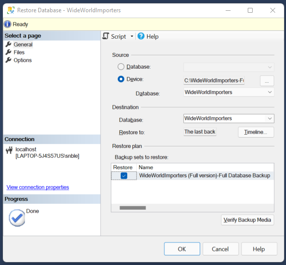

# Exercise: Setting Up Sample Data

## Introduction

So far, we have a database server (SQL Server) set up and a way to communicate with it thanks to SQL Server Management Studio (SSMS), and we have built our first query to explore working with SSMS. In this exercise, we will load our sample database - Wide World Importers.

## Download the Sample Database

One of the sample databases provided by Microsoft is the Wide World Importers database. We are using this database particularly because it has data relationships in enterprises.

1. Download [WideWorldImporters-Full.bak](https://github.com/Microsoft/sql-server-samples/releases/download/wide-world-importers-v1.0/WideWorldImporters-Standard.bak)
    1.  backup link to [WideWorldImporters-Full.bak](https://progressiveinsurance.sharepoint.com/:u:/s/grp_ADPLDCs/EcyQ0COVPbJFv8ecMcFX7qYBbVdOc02H_01_Ogju-jy0IA?e=iQ7fsk)
3. Save to the root of your C: drive

## Restore the Database in SSMS

We will restore the database in SSMS by restoring this backup file. The term "restore" can be confusing if you've never worked with this database before because it implies that the database previously existed. However,  we use the restore function for the first-time database installation and later if you mess something up (likely to happen!) and want to restore to the original state.

### Restoration Steps:

1. Open SSMS and connect to your localhost
2. In the Object Explorer pane, right-click on *Databases*
3. Select *Restore Database*
3. Under the Source section, select *Device* and click the ellipsis (...)
4. This will bring up the Select backup device window with the backup media type defaulted to "File" (which is what we want as we are restoring from a file)
5. Click the Add button, which brings up the Locate Backup File window
6. Navigate to the root of your C: drive and select your backup file
7. Click OK
8. In the Select backup device window, click OK

Note: This should result in a *Restore Database - WideWorldImporters* window that looks like this:


> The database name has defaulted to WideWorldImporters, which we want. If you want to rename your database, you can change it here.

10. Click OK to begin the restore process 

> You will see a Resorting message with a progress bar and, ultimately, a "Database WideWorldImporters restored successfully" message. 

11. Click OK to close the message

## Confirming the Database

Let's confirm that the database was created successfully.

1. Expand the Databases node, if it isn't already  

> The WideWorldImporters database should appear in this section. If seeing the database isn't enough confirmation, we can also query the data.

2. Right-click on the WideWorldImporters database 
3. Click *New Query*

> Notice that the Available Databases dropdown shows WideWorldImporters.  This is the currently selected database. Any queries in this tab run for the database specified in the database dropdown.

The bottom right corner also shows that the active database is WideWorldImporters.

4. Run the following query:

```sql
SELECT COUNT(*) FROM Sales.Orders
```

This query gives us the number of records on the Sales.Orders table.

You should see a result value of 73595.

## Conclusion

In this exercise, we restored our sample database to our SSMS instance. This database will be referenced in future lessons and activities. Please note that this database is HUGE! There are a lot of tables, but you will use a handful of these in this course. 
