# Lesson: Connecting Tables with JOINs

## Introduction

When working with relational data, data tends to be broken up into tables based on their entities. There are bridge tables to help manage the relationships between entities when the relationships get complicated. In this lesson, we look at the JOIN clause used to connect tables in SQL queries.

## Learning Outcomes

By the end of this lesson, you will be able to:

1. Distinguish between `INNER` and `OUTER` joins.
2. Identify the types of outer joins

## What are JOINs?

The `JOIN` clause is used to connect related tables. Most joins also use the `ON` clause, which states how to connect the tables. The joins we will focus on are:

* `INNER JOIN`
* `OUTER JOIN`
  * `LEFT`
  * `RIGHT`
  * `FULL`

They all involved the `JOIN` keyword; however, modifiers are used to identify the type of join to use.

## Understanding Keys and JOINs

When writing `JOIN` clauses, it helps to understand what keys are available on tables. **Primary keys** are the fields used as record identifiers/row identifiers for a table. **Foreign keys** are used to establish relationships between two tables. Typically, a foreign key is made up of a field on one table that is related directly to a primary key of another table.

You can see the keys for a table in SQL Server Management Studio by:

1. Open the Servers pane.
2. Drill down to table. For Wide World Importers, Sales.Invoices is a good example.
3. Under the table, expand the Keys folder.

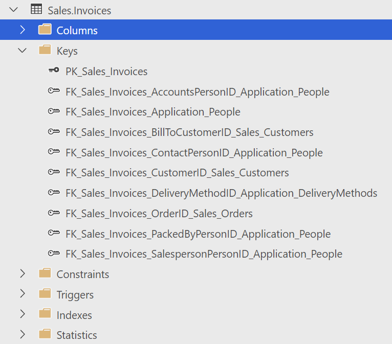

There are some common abbreviations you may see in key names:

* PK - short for primary key
* FK - short for foreign key, typically includes the tables and field names that are related

Having an **entity relationship diagram (ERD)**, also known as a database diagram, may make it easier to see those relationships.

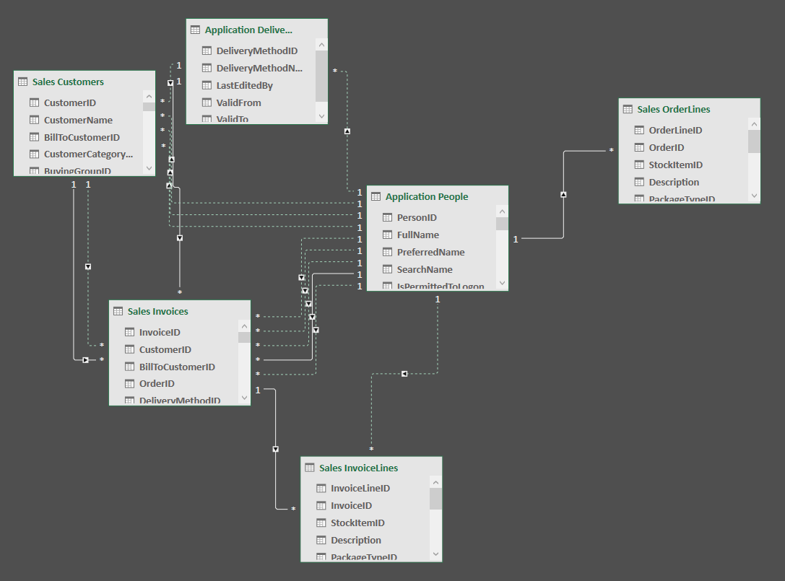

Click here to download the [WideWorldImporters-ERD Excel File (assets/files/WideWorldImproters-ERD.xlsx)](assets/files/WideWorldImporters-ERD.xlsx).

## INNER JOINs

When you want to get data from the intersection of two tables, you will use an `INNER JOIN`, sometimes written simply as `JOIN`.  The `INNER` keyword is optional, though using it helps for readability.

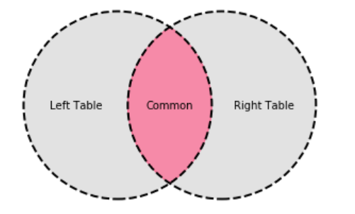

The `INNER JOIN` clause includes the table's name to join and an `ON` clause with the expression of how the tables are related.  The relationship in an `ON` clause is commonly already established through a foreign key relationship.

> If a foreign key relationship does not exist yet for this combination, you may want to ask your database administrator to consider adding the relationship to improve SQL query performance.

For example, we want to find all yellow stock items.  This is the relationship between stock items and colors:

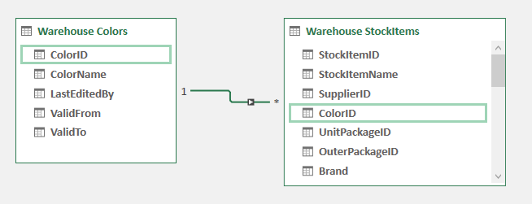

This is how we will approach the query:

1. Get the fields we want in the `SELECT` clause.
2. Put the first table we will query in the `FROM` clause.  Since we are querying for stock items, we will use Warehouse.StockItems as our primary table.
3. Add a `JOIN` clause for the warehouse colors table; joining the tables on the stock item's color ID must match the warehouse color table's color ID.  
4. Add a `WHERE` clause to filter where color name is 'Yellow'.

The query to get stock items that come in yellow, including the `INNER` keyword, is:

```sql
SELECT StockItemName 
FROM Warehouse.StockItems
INNER JOIN Warehouse.Colors ON Warehouse.StockItems.ColorID = Warehouse.Colors.ColorID
WHERE ColorName = 'Yellow'
```

The results are:

|StockItemName|
|--- |
|RC toy sedan car with remote control (Yellow) 1/50 scale|
|Ride on toy sedan car (Yellow) 1/12 scale|

The `INNER` keyword is optional, and the `JOIN` that can get the intersection between the warehouse colors and the stock items for all stock items that come in yellow can also be written as:

```sql
SELECT StockItemName 
FROM Warehouse.StockItems
JOIN Warehouse.Colors ON Warehouse.StockItems.ColorID = Warehouse.Colors.ColorID
WHERE ColorName = 'Yellow'
```

Suppose we want all stock items and their names where the color is not yellow.  That query looks like this:

```sql
SELECT StockItemName, ColorName 
FROM Warehouse.StockItems
JOIN Warehouse.Colors ON Warehouse.StockItems.ColorID = Warehouse.Colors.ColorID
WHERE ColorName != 'Yellow'
```

This query returns 126 rows.

That query could also be written as:

```sql
SELECT StockItemName, ColorName FROM Warehouse.StockItems
JOIN Warehouse.Colors ON Warehouse.StockItems.ColorID = Warehouse.Colors.ColorID
WHERE ColorName <> 'Yellow'
```

> `!=` and `<>` are two ways to say "not equal" in SQL.  However `<>` is the only one that is SQL standards-compliant. `!=` is specific to SQL Server.

## Using aliases to reduce ambiguity

Now suppose we want to include the color ID in our results.  Consider this query:

```sql
SELECT ColorID, StockItemName, ColorName 
FROM Warehouse.StockItems
JOIN Warehouse.Colors ON Warehouse.StockItems.ColorID = Warehouse.Colors.ColorID
WHERE ColorName <> 'Yellow'
```

Try running that SQL statement in a query window against Wide World Importers.  You should get the following error message:

```text
Started executing query at Line 1
Msg 209, Level 16, State 1, Line 1
Ambiguous column name 'ColorID'.
Total execution time: 00:00:00.001
```

Since ColorID appears on both the stock items table and the color table, SQL does not know which one to return.  When a column name appears on two tables, you need to qualify the column name by referring to the table name directly or to the table alias if aliases are used.

We could write this query as:

```sql
SELECT Warehouse.StockItems.ColorID, StockItemName, ColorName 
FROM Warehouse.StockItems
JOIN Warehouse.Colors ON Warehouse.StockItems.ColorID = Warehouse.Colors.ColorID
WHERE ColorName <> 'Yellow'
```

If we wanted to alias our tables, then clarifying ambiguity looks more like this:

```sql
SELECT WS.ColorID, StockItemName, ColorName 
FROM Warehouse.StockItems WS
JOIN Warehouse.Colors C ON WS.ColorID = C.ColorID
WHERE ColorName <> 'Yellow'
```

## Working with COALESCE and JOINs

Suppose we want to get a list of yellow stock items and their stock groups.  A SQL query can have multiple `JOIN` clauses.  The `JOIN` order matters - you can only join to tables already existing in the query.

The approach we will take is:

1. Select the stock group name and stock item name.
2. Our primary table will be the stock items table. Put that in the `FROM` clause.
3. `JOIN` colors - we need colors so that we can filter based on the color name.
4. We cannot add the stock groups yet - they do not connect directly to any of the given tables.  However, stock groups do connect to the stock item stock groups table.  `JOIN` the stock item stock groups table with the stock items table on stock item ID.
5. `JOIN` the stock groups table on the stock group iD on the stock item stock groups table.
6. Add the `WHERE` clause for Yellow items.

Let's look at these stock items and their groups with the following query:

```sql
SELECT StockGroupName, StockItemName
FROM Warehouse.StockItems
JOIN Warehouse.Colors ON Warehouse.StockItems.ColorID = Warehouse.Colors.ColorID
JOIN Warehouse.StockItemStockGroups ON Warehouse.StockItemStockGroups.StockItemID = Warehouse.StockItems.StockItemID
JOIN Warehouse.StockGroups ON Warehouse.StockGroups.StockGroupID = Warehouse.StockItemStockGroups.StockGroupID
WHERE ColorName = 'Yellow'
```

The results are:

|StockGroupName|StockItemName|
|--- |--- |
|Novelty Items|RC toy sedan car with remote control (Yellow) 1/50 scale|
|Toys|RC toy sedan car with remote control (Yellow) 1/50 scale|
|Novelty Items|Ride on toy sedan car (Yellow) 1/12 scale|
|Toys|Ride on toy sedan car (Yellow) 1/12 scale|

Seeing that these stock items are 2 items, each with 2 stock group names, can we combine this?  We can use `COALESCE` to bring them into a group list.  `COALESCE` works on a variable, a delimiter, and a field to add. If we wanted to do that for a single toy, the code would look like this:

```sql
-- Using COALESCE to combine groups
DECLARE @GroupList VARCHAR(100)

SELECT @GroupList = COALESCE(@GroupList + ', ','') + StockGroupName
FROM Warehouse.StockItems
JOIN Warehouse.Colors ON Warehouse.StockItems.ColorID = Warehouse.Colors.ColorID
JOIN Warehouse.StockItemStockGroups ON Warehouse.StockItemStockGroups.StockItemID = Warehouse.StockItems.StockItemID
JOIN Warehouse.StockGroups ON Warehouse.StockGroups.StockGroupID = Warehouse.StockItemStockGroups.StockGroupID
WHERE ColorName = 'Yellow' AND  StockItemName ='Ride on toy sedan car (Yellow) 1/12 scale'

SELECT @GroupList
```

The output - the group list for the yellow ride-on toy sedan car 1/12 scale - is:

```text
Novelty Items, Toys
```

## Using STRING_AGG with JOIN

As of SQL Server 2016, we can use `STRING_AGG()` to aggregate strings into delimited strings.  So to get the group list for each of the yellow stock items, we can take the following approach:

1. Get the stock item name and call `STRING_AGG()` on the stock group name, delimiting with a comma and a space.
2. Use stock items table as the primary table in the `FROM` clause.
3. `JOIN` colors because we want to filter on the color name.
4. `JOIN` stock item groups because we need the bridge between stock items and groups.
5. `JOIN` stock groups because we want the group names.
6. Add the `WHERE` clause for Yellow.
7. Group by the stock item name.

The query looks like this:

```sql
SELECT StockItemName, STRING_AGG(StockGroupName,', ')
FROM Warehouse.StockItems
JOIN Warehouse.Colors ON Warehouse.StockItems.ColorID = Warehouse.Colors.ColorID
JOIN Warehouse.StockItemStockGroups ON Warehouse.StockItemStockGroups.StockItemID = Warehouse.StockItems.StockItemID
JOIN Warehouse.StockGroups ON Warehouse.StockGroups.StockGroupID = Warehouse.StockItemStockGroups.StockGroupID
WHERE ColorName = 'Yellow' 
GROUP BY StockItemName
```

The results look like this:

|StockItemName|(No column name)|
|--- |--- |
|RC toy sedan car with remote control (Yellow) 1/50 scale|Novelty Items, Toys|
|Ride on toy sedan car (Yellow) 1/12 scale|Novelty Items, Toys|

We could make the output cleaner by including an alias for the groups:

```sql
SELECT StockItemName, STRING_AGG(StockGroupName,', ') GroupNames
FROM Warehouse.StockItems
JOIN Warehouse.Colors ON Warehouse.StockItems.ColorID = Warehouse.Colors.ColorID
JOIN Warehouse.StockItemStockGroups ON Warehouse.StockItemStockGroups.StockItemID = Warehouse.StockItems.StockItemID
JOIN Warehouse.StockGroups ON Warehouse.StockGroups.StockGroupID = Warehouse.StockItemStockGroups.StockGroupID
WHERE ColorName = 'Yellow' 
GROUP BY StockItemName
```

The results look like this:

|StockItemName|GroupNames|
|--- |--- |
|RC toy sedan car with remote control (Yellow) 1/50 scale|Novelty Items, Toys|
|Ride on toy sedan car (Yellow) 1/12 scale|Novelty Items, Toys|

## JOINing the same table multiple times

There are times where a table may have multiple relationships with another table.  Consider our stock items relationship with the package types table:

|Field on Warehouse.StockItems|Field on Warehouse.PackageTypes|
|--- |--- |
|UnitPackageID|PackageTypeID|
|OuterPackageID|PackageTypeID|

When you have to refer to the same table for different relationships, there are two things you need to know:

* You will need separate `JOIN` clauses for each of the different relationships.
* You will need to alias your table based on the relationship.  Use a name that makes sense and removes ambiguity from your query.

Suppose we want to look at how our yellow items are packaged for both the unit package and the outer package.

This is our approach:

1. Get the stock item name and put it in the `SELECT` clause.
2. Use stock items table as the primary table in the `FROM` clause.
3. `JOIN` colors because we want to filter on the color name.
4. `JOIN` package types on the unit package ID from the stock items table.  We want to alias this table something easy to associate, so we are setting the alias to UnitPackageType.
5. Add the field UnitPackageType.PackageTypeName to the `SELECT` field list and alias the field to UnitPackage.
6. `JOIN` package types on the outer package ID from the stock items table.  We want to alias this table something easy to associate, so we are setting the alias to OuterPackageType.
7. Add the field OuterPackageType.PackageTypeName to the `SELECT` field list and alias the field to OuterPackage.
8. Add the `WHERE` clause for Yellow.

The query looks like this:

```sql
SELECT StockItemName, UnitPackageType.PackageTypeName AS UnitPackage, OuterPackageType.PackageTypeName AS OuterPackage
FROM Warehouse.StockItems
JOIN Warehouse.Colors ON Warehouse.StockItems.ColorID = Warehouse.Colors.ColorID
JOIN Warehouse.PackageTypes AS UnitPackageType ON UnitPackageType.PackageTypeID = Warehouse.StockItems.UnitPackageID
JOIN Warehouse.PackageTypes AS OuterPackageType ON OuterPackageType.PackageTypeID = Warehouse.StockItems.OuterPackageID
WHERE ColorName = 'Yellow'
```

The results are:

|StockItemName|UnitPackage|OuterPackage|
|--- |--- |--- |
|RC toy sedan car with remote control (Yellow) 1/50 scale|Each|Each|
|Ride on toy sedan car (Yellow) 1/12 scale|Each|Each|

## JOIN with HAVING

In our aggregates lesson, we showed how to use the `HAVING` clause to filter on the aggregations.  The following is an example of how we have multiple join clause with a `HAVING` clause.

We want the orders from 2016 less than $1000, ordered by total, then order number. 

The query looks like this:

```sql
SELECT Sales.Orders.OrderID, 
    SUM((Quantity * UnitPrice) + (Quantity * UnitPrice * TaxRate/100)) AS OrderTotal
FROM Sales.OrderLines
JOIN Sales.Orders ON Sales.Orders.OrderID = Sales.OrderLines.OrderID
WHERE YEAR(OrderDate) = 2016
GROUP BY Sales.Orders.OrderID
HAVING SUM((Quantity * UnitPrice) + (Quantity * UnitPrice * TaxRate/100)) < 1000.00
ORDER BY OrderTotal, Sales.Orders.OrderID
```

That same query with the INNER keyword looks like this:

```sql
SELECT Sales.Orders.OrderID, 
    SUM((Quantity * UnitPrice) + (Quantity * UnitPrice * TaxRate/100)) AS OrderTotal
FROM Sales.OrderLines
INNER JOIN Sales.Orders ON Sales.Orders.OrderID = Sales.OrderLines.OrderID
WHERE YEAR(OrderDate) = 2016
GROUP BY Sales.Orders.OrderID
HAVING SUM((Quantity * UnitPrice) + (Quantity * UnitPrice * TaxRate/100)) < 1000.00
ORDER BY OrderTotal, Sales.Orders.OrderID
```

There are 2883 results.

Earlier in this lesson, when we ran the query for stock items whose color was not yellow, we only got back the intersection piece - which means that the stock item had to have a color set in order to appear in the results.

Try running this query and seeing if there are any NULL values:

```sql
SELECT StockItemName, Warehouse.StockItems.ColorID 
FROM Warehouse.StockItems
INNER JOIN Warehouse.Colors ON Warehouse.StockItems.ColorID = Warehouse.Colors.ColorID
WHERE ColorName <> 'Yellow'
```

An inner join only focuses on the records in the intersection.  This is what the inner join returns:

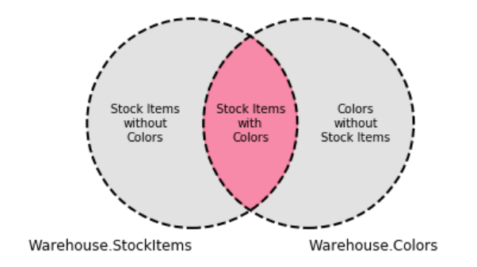

Let's see if outer joins can help us see all the stock items and colors, regardless of color status.

## OUTER JOINs

Outer joins involve the intersection of two tables plus the entirety of one or both of the tables.  The entirety of which table or tables is determined by the type of join.  If your data contains null values and you need to deal with both the intersection and the entirety of at least one table, outer joins are what you are looking for.

There are 3 outer joins to know about:

* `LEFT OUTER JOIN`
* `RIGHT OUTER JOIN`
* `FULL OUTER JOIN`

> The OUTER keyword may be omitted.

### LEFT JOIN

The `LEFT OUTER JOIN` - simplified as `LEFT JOIN` - joins the table in the `FROM` clause or another table existing in the query with the table in the `JOIN` clause based on an `ON` expression.  It gets everything that is shared in common in the intersection as well as everything from the table on the left hand of the expression, which should be the table in the `FROM` clause or another table existing in the query.

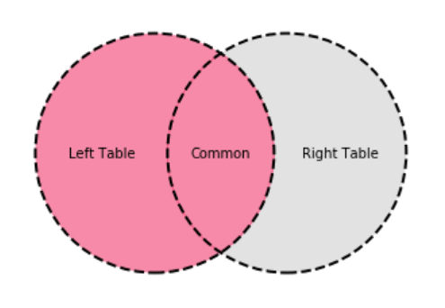

Let's look at this for stock items and colors.  A left join should get us all stock items, regardless of whether they have a color.

This is a Venn diagram to show how the `LEFT JOIN` will work:

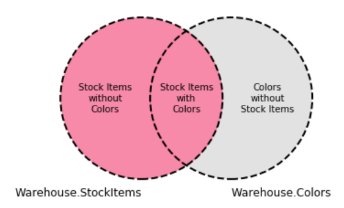

This is the query that gets the first of the stock items and their colors.

```sql
SELECT TOP 5 StockItemName, ColorName
FROM Warehouse.StockItems AS StockItems 
LEFT JOIN Warehouse.Colors AS Colors ON StockItems.ColorID = Colors.ColorID
```

The results are:

|StockItemName|ColorName|
|--- |--- |
|USB missile launcher (Green)|NULL|
|USB rocket launcher (Gray)|Steel Gray|
|Office cube periscope (Black)|Black|
|USB food flash drive - sushi roll|NULL|
|USB food flash drive - hamburger|NULL|

The results include values where the color is null.  When `NULL`s are involved, you can filter on them in the `WHERE` clause with `IS NULL` or `IS NOT NULL`.  

> In this example, if we wanted all stock items without colors, we could simply filter on Warehouse.StockItems.ColorID being `NULL` and then not have to join the colors table.  

However, many of these cases do not have a `NULL` field on the table and would need their `NULL` values filtered out in the `WHERE` clause.  A way we can do this with `LEFT OUTER JOIN` is to include an expression in the `WHERE` clause ensuring that the right table's join value is `NULL`.

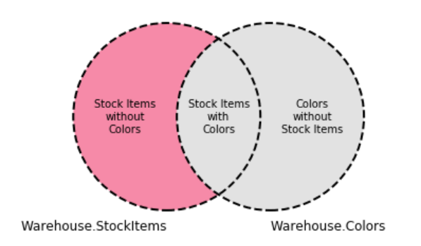

That query looks like this:

```sql
SELECT TOP 5 StockItemName, ColorName
FROM Warehouse.StockItems AS StockItems 
LEFT OUTER JOIN Warehouse.Colors AS Colors ON StockItems.ColorID = Colors.ColorID
WHERE Colors.ColorID IS NULL
```

The results are:

|StockItemName|ColorName|
|--- |--- |
|USB missile launcher (Green)|NULL|
|USB food flash drive - sushi roll|NULL|
|USB food flash drive - hamburger|NULL|
|USB food flash drive - hot dog|NULL|
|USB food flash drive - pizza slice|NULL|

### RIGHT JOIN

The RIGHT OUTER JOIN - simplified as RIGHT JOIN - joins a table to another table already existing in the query with the table in the JOIN clause based on an ON expression.  It gets everything that is shared in common in the intersection as well as everything from the table on the right hand of the expression, which should be the table that is being joined.

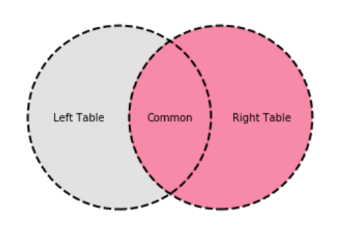

Let's look at this for stock items and colors.  A right join should get us all colors, regardless of whether they have a stock item.  The intersection between the tables, as well as all of the other color records, will appear in the results.

This is a Venn diagram to show how the RIGHT JOIN will work:

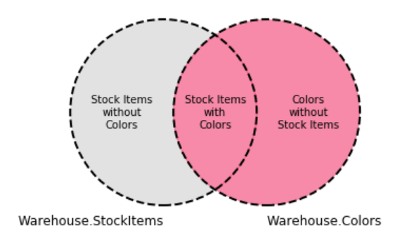

This is the query that gets the first of the stock items and their colors.

```sql
SELECT TOP 5 StockItemName, ColorName
FROM Warehouse.StockItems AS StockItems 
RIGHT JOIN Warehouse.Colors AS Colors ON StockItems.ColorID = Colors.ColorID
```

The results are:

|StockItemName|ColorName|
|--- |--- |
|NULL|Azure|
|NULL|Beige|
|Office cube periscope (Black)|Black|
|DBA joke mug - mind if I join you? (Black)|Black|
|DBA joke mug - daaaaaa-ta (Black)|Black|

The results include values where the stock item is `NULL`.  Suppose we only want colors without stock items.  We can do this with `RIGHT OUTER JOIN` with an expression in the `WHERE` clause, ensuring that the left table's join value is `NULL`.

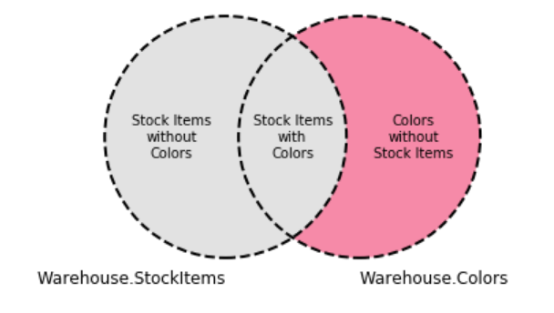

That query looks like this:

```sql
SELECT TOP 5 StockItemName, ColorName
FROM Warehouse.StockItems AS StockItems 
RIGHT OUTER JOIN Warehouse.Colors AS Colors ON StockItems.ColorID = Colors.ColorID
WHERE StockItems.ColorID IS NULL
```

The results are:

|StockItemName|ColorName|
|--- |--- |
|NULL|Azure|
|NULL|Beige|
|NULL|Charcoal|
|NULL|Chartreuse|
|NULL|Cyan|

The results here show only colors without stock items.

### FULL JOIN

The FULL OUTER JOIN - simplified as FULL JOIN - joins a table to another table already existing in the query with the table in the JOIN clause based on an ON expression.  It gets everything that is shared in common in the intersection as well as everything from both tables.

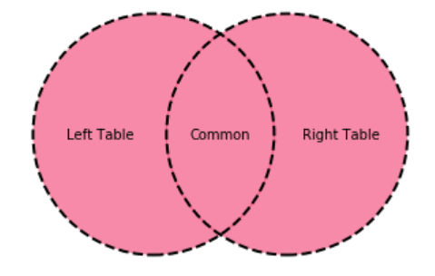

Let's look at this for stock items and colors.  A full join should get us all colors, regardless of whether they have a stock item, all stock items regardless of whether they have a color, and the intersection where there are stock items with colors.  

This is a Venn diagram to show how the FULL JOIN will work:

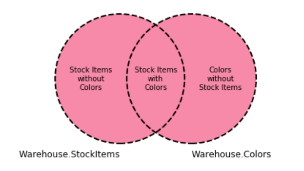

This is the query that gets the first of the stock items and their colors.

```sql
SELECT TOP 5 StockItemName, ColorName
FROM Warehouse.StockItems AS StockItems 
FULL JOIN Warehouse.Colors AS Colors ON StockItems.ColorID = Colors.ColorID
```

The results are:

|StockItemName|ColorName|
|--- |--- |
|USB missile launcher (Green)|NULL|
|USB rocket launcher (Gray)|Steel Gray|
|Office cube periscope (Black)|Black|
|USB food flash drive - sushi roll|NULL|
|USB food flash drive - hamburger|NULL|

The results include values where the stock item name may be null or the color name may be null.  Suppose you only want to see values where one of the keys is null.  That will get you the left table without the intersection and the right table without the intersection.  So we do not want the common values.  We do not want the intersection of the tables.

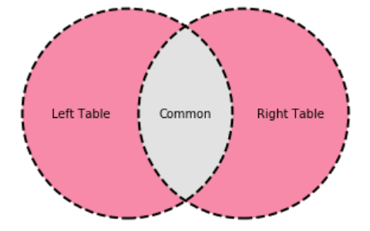

What we want are stock items without colors and colors without stock items.  The Venn diagram looks like this:

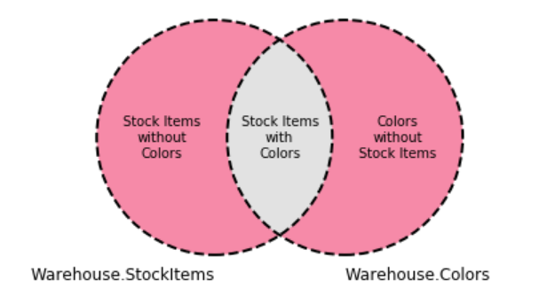

The query to get only stock items without colors or colors without stock items looks like this:

```sql
SELECT TOP 100 StockItemName, ColorName
FROM Warehouse.StockItems AS StockItems 
FULL OUTER JOIN Warehouse.Colors AS Colors ON StockItems.ColorID = Colors.ColorID
WHERE StockItems.ColorID IS NULL OR Colors.ColorID IS NULL
```

There are 100 results from this query.

## Conclusion

In this lesson, we showed how the `INNER` join is the intersection, and the `OUTER` joins work with combinations of tables and intersections, the combinations of the left, right, and both tables and the intersection, and we explored how `NULL` comes into play in `OUTER JOINs.
